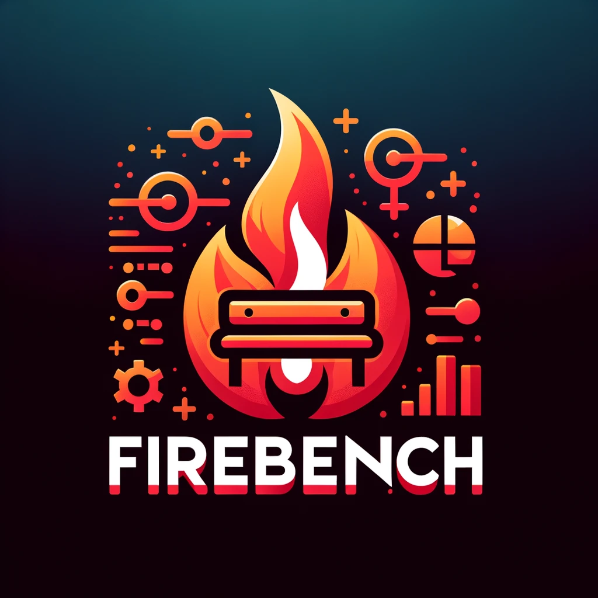

# FireBench

<div style="text-align: center;">
    
</div>

<div style="height: 20px;"></div> <!-- Adds a blank space -->

[](https://github.com/wirc-sjsu/firebench/actions/workflows/ci.yml)
[](https://github.com/wirc-sjsu/firebench/actions/workflows/pages/pages-build-deployment)
[](https://codecov.io/github/wirc-sjsu/firebench)
[](https://github.com/wirc-sjsu/firebench/actions/workflows/security.yml)

[](https://github.com/wirc-sjsu/firebench/actions/workflows/pylint.yml)
[](https://github.com/wirc-sjsu/firebench/actions/workflows/black.yml)

[](https://doi.org/10.5281/zenodo.15477459)

FireBench is an open-source Python library for systematic, transparent, and reproducible
benchmarking and intercomparison of fire models. It provides standardized model-output formats,
benchmark datasets, metrics, normalization, scorecards, and command-line workflows.

## Quick Start

```bash
git clone https://github.com/wirc-sjsu/firebench.git
cd firebench
python -m venv .venv
source .venv/bin/activate
python -m pip install .
firebench list
```

For environment setup, benchmark data, target selection, and complete workflows, use the
[FireBench documentation](https://firebench.readthedocs.io/en/latest/).

## Documentation

- [Getting Started](https://firebench.readthedocs.io/en/latest/getting_started/index.html)
- [Run the Caldor benchmark](https://firebench.readthedocs.io/en/latest/tutorials/cli_caldor_benchmark.html)
- [Prepare standard model output](https://firebench.readthedocs.io/en/latest/standard_format.html)
- [Reference and Concepts](https://firebench.readthedocs.io/en/latest/reference/index.html)

Questions and ideas are welcome in [GitHub Discussions](https://github.com/wirc-sjsu/firebench/discussions).
See the [contribution guide](docs/contribute.md) to contribute code, data, documentation, or workflows.
