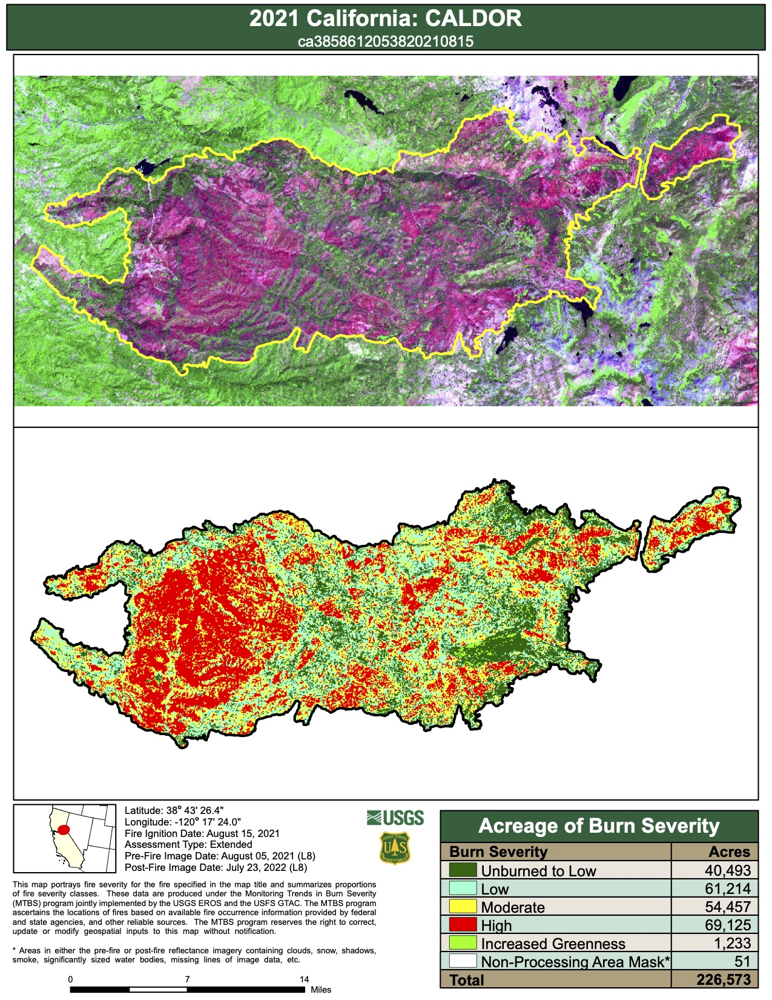
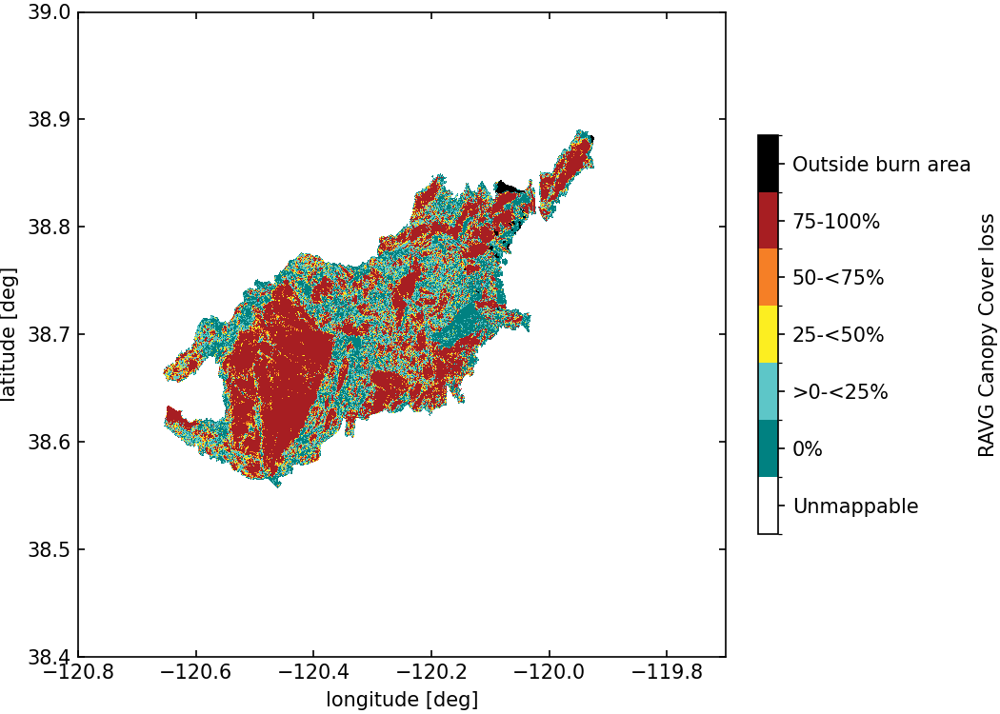
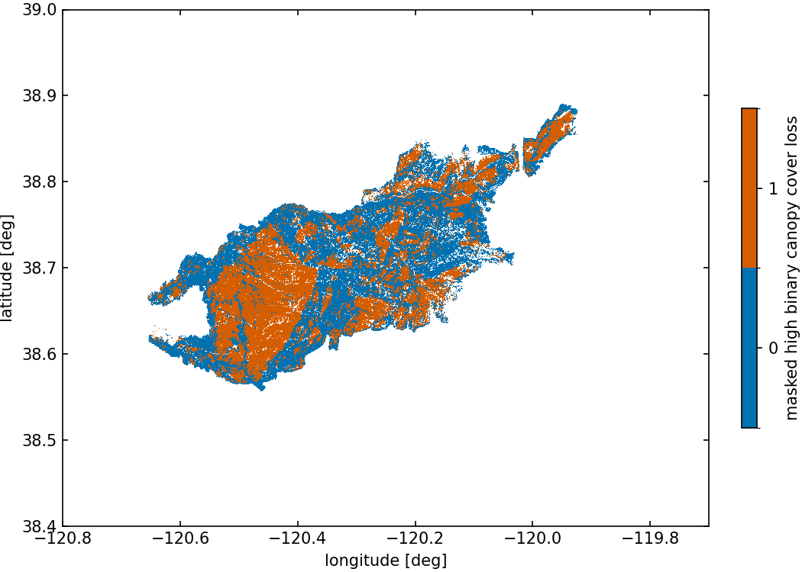
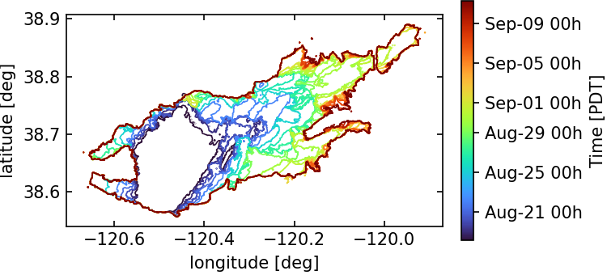
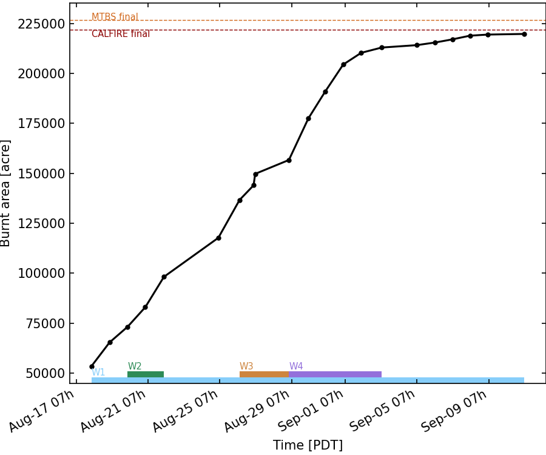

# 2021 Caldor Fire

**Version**: 2026.0a <br>
**Case ID**: FB001 <br>
**FireBench IO std version**: >= 0.2 <br>
**Date of last update**: 12/19/2025 

## Contributors
- Aurélien Costes, [Wildfire Interdisciplinary Research Center](https://www.wildfirecenter.org/), San Jose State University, [aurelien.costes@sjsu.edu](mailto:aurelien.costes@sjsu.edu), [ORCID](https://orcid.org/0000-0003-4543-5107)

## Description

This collection of benchmarks uses the public ressources about the 2021 Caldor Fire.
It contains observation datasets for:
- Building damaged (CALFIRE)
- Burn severity (MTBS)
- Burn severity (RAVG)
- Canopy bottom height (LANDFIRE)
- Canopy bulk density (LANDFIRE)
- Canopy cover loss (RAVG)
- Canopy height (LANDFIRE)
- Infrared fire perimeters (NIROPS)
- Live basal area change (RAVG)
- Weather stations (Synoptic)

## Buildings damage

### Dataset

The data has been collected using **CAL FIRE Damage Inspection (DINS) Data** (version of 2025/11/05).
The original csv file containing multiple fires has been processed to extract the building damaged from the Caldor Fire only. The dataset contains the position (lat, lon) of buildings in the area of influence from the fire. The state of buildings is one of the following:
- 'No Damage',
- 'Affected (1-9%)',
- 'Minor (10-25%)',
- 'Major (26-50%)',
- 'Destroyed (>50%)',
- 'Inaccessible'.


The sha256 of the original source file is: *0190a5a51aafafa20270fe046a7ae17a53697b1fb218ff8096a3d8ebbc9ef983*.

If the evaluated model does not explicitly represent individual buildings, the model should consider every building within a cell to share the cell value for building damage (deterministic models) or share the median of bulding damage distribution (probabilistic models).

Figure 1 shows the spatial distribution of building damage for the Caldor Fire.

<p style="text-align: center;">
    <strong>
        Fig. 1
    </strong>
    :
    <em>
        Buildings damage map
    </em>
</p>

Figure 2 shows the distribution of building damage for the Caldor Fire. The following Table shows the number of strucure in each damage category.
Damage category        | Counts [-]  
---------------------- | ----------------- 
No Damage              | 3356
Affected (1-9%)        |   56
Minor (10-25%)         |   18
Major (26-50%)         |    7
Destroyed (>50%)       | 1005
Inaccessible           |    2
Total                  | 4444


<p style="text-align: center;">
    <strong>
        Fig. 2
    </strong>
    :
    <em>
        Distribution of buildings damage
    </em>
</p>

### Processing of dataset

*Performed at obs dataset level*

The data from the original CSV was standardized without any modification.
The column names from the original csv file were corrected from "* Damage" to "Damage" and "* Incident Name" to "Incident Name" to simplify processing.

#### Binary classes of building damaged

*Performed at benchmark run level*

In order to performe some calculations, the building damaged classes can be aggrageted to form binary classes. The `Inaccessible` is ignored. The following aggragtion method is used:
- `unburnt` binary class contains `No Damage`, `Affected (1-9%)`, and `Minor (10-25%)`,
- `burnt` binary class contains `Major (26-50%)`, and `Destroyed (>50%)`.

### Benchmarks

See Key Performance Indicator (KPI) and normalization defintions [here](../../metrics/index.md).

#### Binary Structure Loss Accuracy

**Short IDs**: BD01 <br>
**KPI**: Binary Structure Loss Accuracy <br>
**Normalization**: Linear Bounded Normalization with $a=0$, $b=1$ <br>
**Name in Score Card**: Binary Structure Loss Accuracy <br>
This benchmark is performed on the binary classes for damaged buildings.

#### Binary Structure Loss Precision

**Short IDs**: BD02 <br>
**KPI**: Binary Structure Loss Precision <br>
**Normalization**: Linear Bounded Normalization with $a=0$, $b=1$ <br>
**Name in Score Card**: Binary Structure Loss Precision <br>
This benchmark is performed on the binary classes for damaged buildings.

#### Binary Structure Loss Recall

**Short IDs**: BD03 <br>
**KPI**: Binary Structure Loss Recall <br>
**Normalization**: Linear Bounded Normalization with $a=0$, $b=1$ <br>
**Name in Score Card**: Binary Structure Loss Recall <br>
This benchmark is performed on the binary classes for damaged buildings.

#### Binary Structure Loss Specificity

**Short IDs**: BD04 <br>
**KPI**: Binary Structure Loss Specificity <br>
**Normalization**: Linear Bounded Normalization with $a=0$, $b=1$ <br>
**Name in Score Card**: Binary Structure Loss Specificity <br>
This benchmark is performed on the binary classes for damaged buildings.

#### Binary Structure Loss Negative Predictive Value

**Short IDs**: BD05<br>
**KPI**: Binary Structure Loss Negative Predictive Value <br>
**Normalization**: Linear Bounded Normalization with $a=0$, $b=1$ <br>
**Name in Score Card**: Binary Structure Loss Negative Predictive Value <br>
This benchmark is performed on the binary classes for damaged buildings.

#### Binary Structure Loss F1 Score

**Short IDs**: BD06<br>
**KPI**: Binary Structure Loss F1 Score <br>
**Normalization**: Linear Bounded Normalization with $a=0$, $b=1$ <br>
**Name in Score Card**: Binary Structure Loss F1 Score <br>
This benchmark is performed on the binary classes for damaged buildings.


## Burn severity from MTBS

### Dataset

The data has been collected using [Monitoring Trends in Burning Severity](https://mtbs.gov/) (MTBS).
The original zip file contains burn severity, pre/post burn images, and final fire perimeter.
The source of the burn severity used in FireBench is the file `ca3858612053820210815_20210805_20220723_dnbr6.tif`. The source of the final fire perimeter is the kmz file `ca3858612053820210815_20210805_20220723.kmz`.

The burn severity categories, described with the corresponding index used in the dataset, are the following:
- 'no data': 0
- 'unburnt to low': 1
- 'low': 2
- 'moderate': 3
- 'high': 4
- 'increased greeness': 5

The hash of the original source files are: 
- zip file: 171b9604c0654d8612eaabcfcad93d2374762661ab34b4d62718630a13469841
- tif dnbr6: 33db74d3c5798c41ff3a4fc5ee57da9105fdc7a75d7f8af0d053d2f82cfdc0b6
- final perimeter kmz: 4ed7a0ee585f8118b65a29375a3d5ee8a69e85a95ee155205ba5d781289c6e2b

Figure 3 shows the MTBS map from the original source.


<p style="text-align: center;">
    <strong>
        Fig. 3
    </strong>
    :
    <em>
        Map of burn severity from MTBS. Source: MTBS (`ca3858612053820210815_map.pdf`)
    </em>
</p>

### Processing of dataset

*Performed at obs dataset level*

The burn severity array is extracted from the original file without any modification. The latitude and longitude array are reconstructed using proejction parameters (see `firebench.standardize.mtbs.standardize_mtbs_from_geotiff`). The final perimeter has been procress using QGIS. The original data (kmz file) has been imported and cleaned. Extra perimeters have been removed to only conserve the final fire perimeter. No modification to the polygons have been performed. Then, the multipolygons was exported to kml format and integrated in the dataset HDF5 file.

#### Binary classes for high severity

*Performed at benchmark run level*

To perform the high severity benchmarks using binary confusion matrix, we construct a binary field based of the high severity index. All the points will a buen severity equal to 4 ('high') will be assigned the value 1. The other points are assigned a value 0. This processing is done when the benchmark is performed.

### Benchmarks

See Key Performance Indicator (KPI) and normalization defintions [here](../../metrics/index.md).

#### Binary High Severity Accuracy

**Short IDs**: SV01<br>
**KPI**: Binary High Severity Accuracy <br>
**Normalization**: Linear Bounded Normalization with $a=0$, $b=1$ <br>
**Name in Score Card**: Binary High Severity Accuracy <br>
This benchmark is performed on the binary classes for high severity points (Binary High severity processed variable)

#### Binary High Severity Precision

**Short IDs**: SV02<br>
**KPI**: Binary High Severity Precision <br>
**Normalization**: Linear Bounded Normalization with $a=0$, $b=1$ <br>
**Name in Score Card**: Binary High Severity Precision <br>
This benchmark is performed on the binary classes for high severity points (Binary High severity processed variable)

#### Binary High Severity Recall

**Short IDs**: SV03<br>
**KPI**: Binary High Severity Recall <br>
**Normalization**: Linear Bounded Normalization with $a=0$, $b=1$ <br>
**Name in Score Card**: Binary High Severity Recall <br>
This benchmark is performed on the binary classes for high severity points (Binary High severity processed variable)

#### Binary High Severity Specificity

**Short IDs**: SV04<br>
**KPI**: Binary High Severity Specificity <br>
**Normalization**: Linear Bounded Normalization with $a=0$, $b=1$ <br>
**Name in Score Card**: Binary High Severity Specificity <br>
This benchmark is performed on the binary classes for high severity points (Binary High severity processed variable)

#### Binary High Severity Negative Predictive Value

**Short IDs**: SV05<br>
**KPI**: Binary High Severity Negative Predictive Value <br>
**Normalization**: Linear Bounded Normalization with $a=0$, $b=1$ <br>
**Name in Score Card**: Binary High Severity Negative Predictive Value <br>
This benchmark is performed on the binary classes for high severity points (Binary High severity processed variable)

#### Binary High Severity F1 Score

**Short IDs**: SV06<br>
**KPI**: Binary High Severity F1 Score <br>
**Normalization**: Linear Bounded Normalization with $a=0$, $b=1$ <br>
**Name in Score Card**: Binary High Severity F1 Score <br>
This benchmark is performed on the binary classes for high severity points (Binary High severity processed variable)

## Canopy cover loss 

### Dataset

The data has been collected using [Rapid Assessment of Vegetation Condition after Wildfire](https://burnseverity.cr.usgs.gov/ravg/) (RAVG).
The source of the canopy cover loss used in FireBench is the dataset over CONUS for 2021 `ravg_2021_cc5.tif`. The region around Caldor Fire has been processed and standardized using the following bounding box:
- south west: (38.4, -120.8)
- north east: (39.0, -119.7)

The canopy cover loss categories, described with the corresponding index used in the dataset, are the following:
- 'Unmappable': 0
- '0%': 1
- '>0-<25%': 2
- '25-<50%': 3
- '50-<75%': 4
- '75-100%': 5
- 'Outide burn area': 9

In addition, a bounding box has been used to remove the data from another fire (forced to `0`):
- south west: (38.6, -119.9)
- north east: (38.805, -119.7)

Figure 4 shows the processed RAVG dataset available in FireBench.


<p style="text-align: center;">
    <strong>
        Fig. 4
    </strong>
    :
    <em>
        Map of standardized canopy cover loss from RAVG for Caldor Fire.
    </em>
</p>

### Processing of dataset

*Performed at obs dataset level*

A bounding box has been used to remove the data from another fire (forced to `0`):
- south west: (38.6, -119.9)
- north east: (38.805, -119.7)

#### Masking using LANDFIRE dataset

*Performed at benchmark run level*

In order to perform evaluation of high canopy cover loss, a mask is defined using three LANDFIRE datasets:
- Canopy bulk density
- Canopy height
- Canopy bottom height

The variable `masked high binary canopy cover loss` used in various benchmarks is computed only where all LANDFIRE canopy variable (interpolated using nearest method on the RAVG grid) are strictly greater than 0 (presence of canopy fuel) and is defined as a binary variable:
- `1` if RAVG canopy cover loss value is `5`,
- `0` if RAVG canopy cover loss value is between `1` and `4`,
- `nan` otherwise.

Figure 5 shows the processed `masked high binary canopy cover loss` dataset used for related benchmarks.


<p style="text-align: center;">
    <strong>
        Fig. 5
    </strong>
    :
    <em>
        Map of standardized canopy cover loss from RAVG for Caldor Fire.
    </em>
</p>

### Benchmarks

See Key Performance Indicator (KPI) and normalization defintions [here](../../metrics/index.md).

#### Masked High Binary Canopy Cover Loss Accuracy

**Short IDs**: CC01<br>
**KPI**: Binary High Canopy Cover Loss Accuracy<br>
**Normalization**: Linear Bounded Normalization with $a=0$, $b=1$ <br>
**Name in Score Card**: Binary High Canopy Cover Loss Accuracy <br>
This benchmark is performed on the binary classes `masked high binary canopy cover loss`.

#### Masked High Binary Canopy Cover Precision

**Short IDs**: CC02<br>
**KPI**: Binary High Canopy Cover Loss Precision <br>
**Normalization**: Linear Bounded Normalization with $a=0$, $b=1$ <br>
**Name in Score Card**: Binary High Canopy Cover Loss Precision <br>
This benchmark is performed on the binary classes `masked high binary canopy cover loss`.

#### Masked High Binary Canopy Cover Recall

**Short IDs**: CC03<br>
**KPI**: Binary High Canopy Cover Loss Recall <br>
**Normalization**: Linear Bounded Normalization with $a=0$, $b=1$ <br>
**Name in Score Card**: Binary High Canopy Cover Loss Recall <br>
This benchmark is performed on the binary classes `masked high binary canopy cover loss`.

#### Masked High Binary Canopy Cover Specificity

**Short IDs**: CC04<br>
**KPI**: Binary High Canopy Cover Loss Specificity <br>
**Normalization**: Linear Bounded Normalization with $a=0$, $b=1$ <br>
**Name in Score Card**: Binary High Canopy Cover Loss Specificity <br>
This benchmark is performed on the binary classes `masked high binary canopy cover loss`.

#### Masked High Binary Canopy Cover Negative Predictive Value

**Short IDs**: CC05<br>
**KPI**: Binary High Canopy Cover Loss Negative Predictive Value <br>
**Normalization**: Linear Bounded Normalization with $a=0$, $b=1$ <br>
**Name in Score Card**: Binary High Canopy Cover Loss Negative Predictive Value <br>
This benchmark is performed on the binary classes `masked high binary canopy cover loss`.

#### Masked High Binary Canopy Cover F1 Score

**Short IDs**: CC06<br>
**KPI**: Binary High Canopy Cover Loss F1 Score <br>
**Normalization**: Linear Bounded Normalization with $a=0$, $b=1$ <br>
**Name in Score Card**: Binary High Canopy Cover Loss F1 Score <br>
This benchmark is performed on the binary classes `masked high binary canopy cover loss`.

## Infrared fire perimeters
### Dataset

The infrared fire perimeters have been gathered from [NIROPS](https://ftp.wildfire.gov/public/incident_specific_data/calif_n/2021_FEDERAL_Incidents/CA-ENF-024030_Caldor/IR/NIROPS/) dataset.
Every orginal file has been manually processed to extract only the perimeter. The time stamp of the perimeter has been defined from the imaging report (e.g. [Report for 2021/08/17](https://ftp.wildfire.gov/public/incident_specific_data/calif_n/2021_FEDERAL_Incidents/CA-ENF-024030_Caldor/IR/NIROPS/20210818/20210818_Caldor_IR_Topo_11x17.pdf)) using the `Imagery Date` and `Imagery Time`. The burn area obtained using the KML file and python tools has been verified against the `Interpreted Acreage` when specified in the reports. Each fire perimeter (see Fig. 6) is stored as a group within the HDF5 data file with an attributes containing the path of the KML file that contains the fire perimeter dataset.
The perimeters have been processed from August 17th (first IR perimeter available) to September 10th, when the burn area is 99% if the final burn area, as shown in Figure 7 (source: [CALFIRE](https://www.fire.ca.gov/incidents/2021/8/14/caldor-fire/)).
The final dataset contains 21 perimeters.

The following study periods (see Fig. 7) are defined in the following Table:

Name | Start time        | End time           | Duration      | Burn area [acre]
-----|-------------------|--------------------|---------------|-----------------
W1   | Aug 17 20h20 PDT  | Sep 10 23h34 PDT   | 24d  3h 14min | 166,256
W2   | Aug 19 20h45 PDT  | Aug 21 21h15 PDT   |  2d  0h 30min | 24,941
W3   | Aug 26 02h30 PDT  | Aug 28 20h30 PDT   |  2d 18h  0min | 19,992
W4   | Aug 28 20h30 PDT  | Sep  3 00h40 PDT   |  5d  4h 10min | 56,272

Figure 6 shows teach processed fire perimeter as a colored solid contour. The color of the contour displays the time stamp of the perimeter.


<p style="text-align: center;">
    <strong>
        Fig. 6
    </strong>
    :
    <em>
        Infrared fire perimeters from August 17th to September 10th.
    </em>
</p>

Figure 6 shows teach processed fire perimeter as a colored solid contour. The color of the contour displays the time stamp of the perimeter. The study periods are shown as colored rectangle at the bottom of the plot.


<p style="text-align: center;">
    <strong>
        Fig. 7
    </strong>
    :
    <em>
        Burn area derived from IR perimeters from August 17th to September 10th. Red dashed line shows the final burn area from CALFIRE. The orange dashed line shows the final burn area from MTBS final perimeter.
    </em>
</p>

### Benchmarks

See Key Performance Indicator (KPI) and normalization defintions [here](../../metrics/index.md).

#### Average Jaccard Index over study period

**Short IDs**: See Table<br>
**KPI**: Average Jaccard Index <br>
**Normalization**: Linear Bounded Normalization with $a=0$, $b=1$ <br>
**Name in Score Card**: See Table <br>
The first perimeter, at the start of the period, can be used as initial condition for the fire perimeter. The first perimeter is not used to compute any metric.
The area preserving project used is EPSG:5070.

The following Table gives the correspondance between the bencmark id and the study period:

ID   | Study period | Name in Score Card
-----|--------------|-------------------
FP01 | W1           | Average Jaccard Index W1
FP02 | W2           | Average Jaccard Index W2
FP03 | W3           | Average Jaccard Index W3
FP04 | W4           | Average Jaccard Index W4

#### Minimum Jaccard Index over study period

**Short IDs**: See Table<br>
**KPI**: Minimum Jaccard Index <br>
**Normalization**: Linear Bounded Normalization with $a=0$, $b=1$ <br>
**Name in Score Card**: See Table <br>
The first perimeter, at the start of the period, can be used as initial condition for the fire perimeter. The first perimeter is not used to compute any metric.
The area preserving project used is EPSG:5070.

The following Table gives the correspondance between the bencmark id and the study period:

ID   | Study period | Name in Score Card
-----|--------------|-------------------
FP05 | W1           | Minimum Jaccard Index W1
FP06 | W2           | Minimum Jaccard Index W2
FP07 | W3           | Minimum Jaccard Index W3
FP08 | W4           | Minimum Jaccard Index W4

#### Maximum Jaccard Index over study period

**Short IDs**: See Table<br>
**KPI**: Maximum Jaccard Index <br>
**Normalization**: Linear Bounded Normalization with $a=0$, $b=1$ <br>
**Name in Score Card**: See Table <br>
The first perimeter, at the start of the period, can be used as initial condition for the fire perimeter. The first perimeter is not used to compute any metric.
The area preserving project used is EPSG:5070.

The following Table gives the correspondance between the bencmark id and the study period:

ID   | Study period | Name in Score Card
-----|--------------|-------------------
FP09 | W1           | Minimum Jaccard Index W1
FP10 | W2           | Minimum Jaccard Index W2
FP11 | W3           | Minimum Jaccard Index W3
FP12 | W4           | Minimum Jaccard Index W4

#### Average Dice-Sorensen Index over study period

**Short IDs**: See Table<br>
**KPI**: Average Dice-Sorensen Index <br>
**Normalization**: Linear Bounded Normalization with $a=0$, $b=1$ <br>
**Name in Score Card**: See Table <br>
The first perimeter, at the start of the period, can be used as initial condition for the fire perimeter. The first perimeter is not used to compute any metric.
The area preserving project used is EPSG:5070.

The following Table gives the correspondance between the bencmark id and the study period:

ID   | Study period | Name in Score Card
-----|--------------|-------------------
FP13 | W1           | Average Dice-Sorensen Index W1
FP14 | W2           | Average Dice-Sorensen Index W2
FP15 | W3           | Average Dice-Sorensen Index W3
FP16 | W4           | Average Dice-Sorensen Index W4

#### Minimum Dice-Sorensen Index over study period

**Short IDs**: See Table<br>
**KPI**: Minimum Dice-Sorensen Index <br>
**Normalization**: Linear Bounded Normalization with $a=0$, $b=1$ <br>
**Name in Score Card**: See Table <br>
The first perimeter, at the start of the period, can be used as initial condition for the fire perimeter. The first perimeter is not used to compute any metric.
The area preserving project used is EPSG:5070.

The following Table gives the correspondance between the bencmark id and the study period:

ID   | Study period | Name in Score Card
-----|--------------|-------------------
FP17 | W1           | Minimum Dice-Sorensen Index W1
FP18 | W2           | Minimum Dice-Sorensen Index W2
FP19 | W3           | Minimum Dice-Sorensen Index W3
FP20 | W4           | Minimum Dice-Sorensen Index W4

#### Maximum Dice-Sorensen Index over study period

**Short IDs**: See Table<br>
**KPI**: Maximum Dice-Sorensen Index <br>
**Normalization**: Linear Bounded Normalization with $a=0$, $b=1$ <br>
**Name in Score Card**: See Table <br>
The first perimeter, at the start of the period, can be used as initial condition for the fire perimeter. The first perimeter is not used to compute any metric.
The area preserving project used is EPSG:5070.

The following Table gives the correspondance between the bencmark id and the study period:

ID   | Study period | Name in Score Card
-----|--------------|-------------------
FP21 | W1           | Minimum Dice-Sorensen Index W1
FP22 | W2           | Minimum Dice-Sorensen Index W2
FP23 | W3           | Minimum Dice-Sorensen Index W3
FP24 | W4           | Minimum Dice-Sorensen Index W4

#### Final Burn Area Bias

**Short IDs**: See Table<br>
**KPI**: Burn Area Bias <br>
**Normalization**: Symmetric Exponential Open Normalization ($m$ value in Table)<br>
**Name in Score Card**: See Table <br>
The first perimeter, at the start of the period, can be used as initial condition for the fire perimeter.
The bias is calculated on the last perimeter of the stgudy period as the difference between the model and the observed burn area.
A bias of $m$ acre, representing $B_{50}$% of burn area during the study period, will lead to a score of 50.00. The value of $m$ represents the benchmark difficulty (smaller $m$ means higher difficulty) and must be chosen by the community.

The following Table gives the correspondance between the bencmark id and the study period:

ID   | Study period | Name in Score Card | $m$    | $B_{50}$
-----|--------------|--------------------|--------|---------
FP25 | W1           | Burn Area Bias W1  | 80,000 | 48%
FP26 | W2           | Burn Area Bias W2  | 5,000  | 20%
FP27 | W3           | Burn Area Bias W3  | 5,000  | 25%
FP28 | W4           | Burn Area Bias W4  | 17,000 | 30%

#### Burn Area RMSE

**Short IDs**: See Table<br>
**KPI**: Burn Area RMSE <br>
**Normalization**: Symmetric Exponential Open Normalization ($m$ value in Table)<br>
**Name in Score Card**: See Table <br>
The first perimeter, at the start of the period, can be used as initial condition for the fire perimeter.
A bias of $m$ acre, representing $B_{50}$% of burn area during the study period, will lead to a score of 50.00. The value of $m$ represents the benchmark difficulty (smaller $m$ means higher difficulty) and must be chosen by the community.

The following Table gives the correspondance between the bencmark id and the study period:

ID   | Study period | Name in Score Card | $m$    | $B_{50}$
-----|--------------|--------------------|--------|---------
FP29 | W1           | Burn Area RMSE W1  | 80,000 | 48%
FP30 | W2           | Burn Area RMSE W2  | 5,000  | 20%
FP31 | W3           | Burn Area RMSE W3  | 5,000  | 25%
FP32 | W4           | Burn Area RMSE W4  | 17,000 | 30%

## Weather stations

### Dataset

Weather stations datasets have been gathered from [Synoptics](https://synopticdata.com).
All the stations available in the following bounding box have be processed:
- south west: (38.4, -120.8)
- north east: (39.0, -119.7)

The following variables have been processed (following FireBench namespace):
- air_temperature
- relative_humidity
- solar_radiation
- fuel_moisture_content_10h
- wind_direction
- wind_gust
- wind_speed

```{note}
If you want to have more variable processed, or require new benchmarks for existing variable, please reach out to the FireBench team to integrate these changes in the future version of the benchmarks.
```

Some stations don't have data for the period W1 and have been excluded from the dataset. 
The list of excluded stations for missing data in study period is:
403_PG, 412_PG, 413_PG, F9934.
Also, some stations did not meet data quality criterion and have been excliuded from the dataset. 
The list of excluded stations for data quality reasons is:
AV833, BLCC1, C9148, COOPDAGN2, COOPMINN2, FOIC1, FPDC1, G0658, GEOC1, LNLC1, PFHC1, SBKC1, SLPC1, STAN2, UTRC1, WDFC1, XOHC1.

Sensor height data has been extracted following the sensor height priority rules defined here.
The current version of knowledge about sensor heights for the case weather stations are:
- 10 stations with complete dataset (sensor height found in source file)
- 98 stations with missing metadata
- 21 stations skipped
- 81 datasets with sensor height metadata
- 0 datasets from trusted stations from FireBench database
- 0 datasets from trusted history from FireBench database
- 5 datasets from FireBench provider default database
- 394 datasets using FireBench default metadata

Therefore, 81 datasets are considered trusted and will be used in benchmarks `trusted source only`.
All 399 datasets are used in benchmarks "all sources".

```{note}
If you have information about sensor height and want to help increase the number of trusted datasets, please contact the FireBench Team.
```

Weather stations are stored in the HDF5 file using their STID.

### Benchmarks

See Key Performance Indicator (KPI) and normalization defintions [here](../../metrics/index.md).

#### Air temperature MAE

**Short IDs**: See Table<br>
**KPI**: Air temperature MAE <br>
**Normalization**: Symmetric Exponential Open Normalization ($m$ value in Table)<br>
**Name in Score Card**: See Table <br>
The Mean Average Error is calculated for each station for both model and observational dataset for a specified period. Then we apply summary statistics (*e.g.*, min, mean, Q3) accross all available weather stations before applying the normalization.
The normalization parameter $m$ sets which MAE gives a Score of 50. It represents the difficulty of the benchmark.

The following Table gives the correspondance between the bencmark id and the study period:

ID    | Study period | Summary stats func |  Name in Score Card     | $m$     | trusted source only
------|--------------|--------------------|-------------------------|---------|--------------------
WX001 | W1           | MAE                | Air temp MAE min W1 TSO        |   5.0 degC            | False
WX002 | W1           | MAE                | Air temp MAE mean W1 TSO       |   5.0 degC            | False
WX003 | W1           | MAE                | Air temp MAE max W1 TSO        |   5.0 degC            | False
WX004 | W1           | MAE                | Air temp MAE min W1            |   5.0 degC            | True
WX005 | W1           | MAE                | Air temp MAE mean W1           |   5.0 degC            | True
WX006 | W1           | MAE                | Air temp MAE max W1            |   5.0 degC            | True
WX007 | W1           | RMSE               | Air temp RMSE min W1 TSO       |   5.0 degC            | False
WX008 | W1           | RMSE               | Air temp RMSE mean W1 TSO      |   5.0 degC            | False
WX009 | W1           | RMSE               | Air temp RMSE max W1 TSO       |   5.0 degC            | False
WX010 | W1           | RMSE               | Air temp RMSE min W1           |   5.0 degC            | True
WX011 | W1           | RMSE               | Air temp RMSE mean W1          |   5.0 degC            | True
WX012 | W1           | RMSE               | Air temp RMSE max W1           |   5.0 degC            | True
WX013 | W1           | Bias               | Air temp Bias min W1 TSO       |   5.0 degC            | False
WX014 | W1           | Bias               | Air temp Bias mean W1 TSO      |   5.0 degC            | False
WX015 | W1           | Bias               | Air temp Bias max W1 TSO       |   5.0 degC            | False
WX016 | W1           | Bias               | Air temp Bias min W1           |   5.0 degC            | True
WX017 | W1           | Bias               | Air temp Bias mean W1          |   5.0 degC            | True
WX018 | W1           | Bias               | Air temp Bias max W1           |   5.0 degC            | True
WX019 | W2           | MAE                | Air temp MAE min W2 TSO        |   5.0 degC            | False
WX020 | W2           | MAE                | Air temp MAE mean W2 TSO       |   5.0 degC            | False
WX021 | W2           | MAE                | Air temp MAE max W2 TSO        |   5.0 degC            | False
WX022 | W2           | MAE                | Air temp MAE min W2            |   5.0 degC            | True
WX023 | W2           | MAE                | Air temp MAE mean W2           |   5.0 degC            | True
WX024 | W2           | MAE                | Air temp MAE max W2            |   5.0 degC            | True
WX025 | W2           | RMSE               | Air temp RMSE min W2 TSO       |   5.0 degC            | False
WX026 | W2           | RMSE               | Air temp RMSE mean W2 TSO      |   5.0 degC            | False
WX027 | W2           | RMSE               | Air temp RMSE max W2 TSO       |   5.0 degC            | False
WX028 | W2           | RMSE               | Air temp RMSE min W2           |   5.0 degC            | True
WX029 | W2           | RMSE               | Air temp RMSE mean W2          |   5.0 degC            | True
WX030 | W2           | RMSE               | Air temp RMSE max W2           |   5.0 degC            | True
WX031 | W2           | Bias               | Air temp Bias min W2 TSO       |   5.0 degC            | False
WX032 | W2           | Bias               | Air temp Bias mean W2 TSO      |   5.0 degC            | False
WX033 | W2           | Bias               | Air temp Bias max W2 TSO       |   5.0 degC            | False
WX034 | W2           | Bias               | Air temp Bias min W2           |   5.0 degC            | True
WX035 | W2           | Bias               | Air temp Bias mean W2          |   5.0 degC            | True
WX036 | W2           | Bias               | Air temp Bias max W2           |   5.0 degC            | True
WX037 | W3           | MAE                | Air temp MAE min W3 TSO        |   5.0 degC            | False
WX038 | W3           | MAE                | Air temp MAE mean W3 TSO       |   5.0 degC            | False
WX039 | W3           | MAE                | Air temp MAE max W3 TSO        |   5.0 degC            | False
WX040 | W3           | MAE                | Air temp MAE min W3            |   5.0 degC            | True
WX041 | W3           | MAE                | Air temp MAE mean W3           |   5.0 degC            | True
WX042 | W3           | MAE                | Air temp MAE max W3            |   5.0 degC            | True
WX043 | W3           | RMSE               | Air temp RMSE min W3 TSO       |   5.0 degC            | False
WX044 | W3           | RMSE               | Air temp RMSE mean W3 TSO      |   5.0 degC            | False
WX045 | W3           | RMSE               | Air temp RMSE max W3 TSO       |   5.0 degC            | False
WX046 | W3           | RMSE               | Air temp RMSE min W3           |   5.0 degC            | True
WX047 | W3           | RMSE               | Air temp RMSE mean W3          |   5.0 degC            | True
WX048 | W3           | RMSE               | Air temp RMSE max W3           |   5.0 degC            | True
WX049 | W3           | Bias               | Air temp Bias min W3 TSO       |   5.0 degC            | False
WX050 | W3           | Bias               | Air temp Bias mean W3 TSO      |   5.0 degC            | False
WX051 | W3           | Bias               | Air temp Bias max W3 TSO       |   5.0 degC            | False
WX052 | W3           | Bias               | Air temp Bias min W3           |   5.0 degC            | True
WX053 | W3           | Bias               | Air temp Bias mean W3          |   5.0 degC            | True
WX054 | W3           | Bias               | Air temp Bias max W3           |   5.0 degC            | True
WX055 | W4           | MAE                | Air temp MAE min W4 TSO        |   5.0 degC            | False
WX056 | W4           | MAE                | Air temp MAE mean W4 TSO       |   5.0 degC            | False
WX057 | W4           | MAE                | Air temp MAE max W4 TSO        |   5.0 degC            | False
WX058 | W4           | MAE                | Air temp MAE min W4            |   5.0 degC            | True
WX059 | W4           | MAE                | Air temp MAE mean W4           |   5.0 degC            | True
WX060 | W4           | MAE                | Air temp MAE max W4            |   5.0 degC            | True
WX061 | W4           | RMSE               | Air temp RMSE min W4 TSO       |   5.0 degC            | False
WX062 | W4           | RMSE               | Air temp RMSE mean W4 TSO      |   5.0 degC            | False
WX063 | W4           | RMSE               | Air temp RMSE max W4 TSO       |   5.0 degC            | False
WX064 | W4           | RMSE               | Air temp RMSE min W4           |   5.0 degC            | True
WX065 | W4           | RMSE               | Air temp RMSE mean W4          |   5.0 degC            | True
WX066 | W4           | RMSE               | Air temp RMSE max W4           |   5.0 degC            | True
WX067 | W4           | Bias               | Air temp Bias min W4 TSO       |   5.0 degC            | False
WX068 | W4           | Bias               | Air temp Bias mean W4 TSO      |   5.0 degC            | False
WX069 | W4           | Bias               | Air temp Bias max W4 TSO       |   5.0 degC            | False
WX070 | W4           | Bias               | Air temp Bias min W4           |   5.0 degC            | True
WX071 | W4           | Bias               | Air temp Bias mean W4          |   5.0 degC            | True
WX072 | W4           | Bias               | Air temp Bias max W4           |   5.0 degC            | True

## Requirements

The following sections list the datasets requirements to run the different benchmarks. When the benchmark script is run, each requirement is validated on the HDF5 file passed as input (from the model ouput/data the user wants to evaluate). If a requirement is met, each corresponding benchmark is run.
Each requirement lists the required datasets/groups (as path) as well as mandatory attributs for each dataset/group.
The current version of FireBench does not integrate more complex checks (e.g., array size, dtype).


Requirement            | Benchmarks 
---------------------- | ----------------- 
R01                    | BD01 to BD06
R02                    | SV01 to SV06
R03                    | FP01, FP05, FP09, FP13, FP17, FP21, FP25, FP29
R04                    | FP02, FP06, FP10, FP14, FP18, FP22, FP26, FP30
R05                    | FP03, FP07, FP11, FP15, FP19, FP23, FP27, FP31
R06                    | FP04, FP08, FP12, FP16, FP20, FP24, FP28, FP32
R07                    | CC01 to CC06
R08                    | WX001 to WX072
R09                    | WX073 to WX144
R10                    | WX145 to WX216
R11                    | WX001 to WX072
R12                    | WX001 to WX072

### R01
Mandatory group/dataset| Mandatory attirbutes 
---------------------- | --------------------
`/points/building_damaged/building_damage` | units

### R02
Mandatory group/dataset| Mandatory attirbutes 
---------------------- | --------------------
`/spatial_2d/Caldor_MTBS`| crs
`/spatial_2d/Caldor_MTBS/fire_burn_severity`| units, _FillValue
`/spatial_2d/Caldor_MTBS/position_lat`| units
`/spatial_2d/Caldor_MTBS/position_lon`| units

### R03
Mandatory group/dataset| Mandatory attirbutes 
---------------------- | --------------------
`/polygons/Caldor_2021-08-18T20:30-07:00`| rel_path, time
`/polygons/Caldor_2021-08-19T20:45-07:00`| rel_path, time
`/polygons/Caldor_2021-08-20T20:20-07:00`| rel_path, time
`/polygons/Caldor_2021-08-21T21:15-07:00`| rel_path, time
`/polygons/Caldor_2021-08-24T22:07-07:00`| rel_path, time
`/polygons/Caldor_2021-08-26T03:30-06:00`| rel_path, time
`/polygons/Caldor_2021-08-26T22:15-06:00`| rel_path, time
`/polygons/Caldor_2021-08-27T00:22-06:00`| rel_path, time
`/polygons/Caldor_2021-08-28T21:30-06:00`| rel_path, time
`/polygons/Caldor_2021-08-29T22:32-07:00`| rel_path, time
`/polygons/Caldor_2021-08-30T21:09-07:00`| rel_path, time
`/polygons/Caldor_2021-08-31T21:08-07:00`| rel_path, time
`/polygons/Caldor_2021-09-01T21:12-07:00`| rel_path, time
`/polygons/Caldor_2021-09-03T00:40-07:00`| rel_path, time
`/polygons/Caldor_2021-09-04T23:29-07:00`| rel_path, time
`/polygons/Caldor_2021-09-05T23:41-07:00`| rel_path, time
`/polygons/Caldor_2021-09-06T23:09-07:00`| rel_path, time
`/polygons/Caldor_2021-09-07T22:40-07:00`| rel_path, time
`/polygons/Caldor_2021-09-08T22:33-07:00`| rel_path, time
`/polygons/Caldor_2021-09-10T23:34-07:00`| rel_path, time

Files (KML) at path defined in `rel_path` attributes must exist.

### R04
Mandatory group/dataset| Mandatory attirbutes 
---------------------- | --------------------
`/polygons/Caldor_2021-08-20T20:20-07:00`| rel_path, time
`/polygons/Caldor_2021-08-21T21:15-07:00`| rel_path, time

Files (KML) at path defined in `rel_path` attributes must exist.

### R05
Mandatory group/dataset| Mandatory attirbutes 
---------------------- | --------------------
`/polygons/Caldor_2021-08-26T22:15-06:00`| rel_path, time
`/polygons/Caldor_2021-08-27T00:22-06:00`| rel_path, time
`/polygons/Caldor_2021-08-28T21:30-06:00`| rel_path, time

Files (KML) at path defined in `rel_path` attributes must exist.

### R06
Mandatory group/dataset| Mandatory attirbutes 
---------------------- | --------------------
`/polygons/Caldor_2021-08-29T22:32-07:00`| rel_path, time
`/polygons/Caldor_2021-08-30T21:09-07:00`| rel_path, time
`/polygons/Caldor_2021-08-31T21:08-07:00`| rel_path, time
`/polygons/Caldor_2021-09-01T21:12-07:00`| rel_path, time
`/polygons/Caldor_2021-09-03T00:40-07:00`| rel_path, time

Files (KML) at path defined in `rel_path` attributes must exist.

### R07
Mandatory group/dataset| Mandatory attirbutes 
---------------------- | --------------------
`/spatial_2d/ravg_cc`| crs
`/spatial_2d/ravg_cc/ravg_canopy_cover_loss`| units, _FillValue
`/spatial_2d/ravg_cc/position_lat`| units
`/spatial_2d/ravg_cc/position_lon`| units

### R08
Verify that model and observational datasets contains the same weather station groups with the following datasets:
Mandatory group/dataset| Mandatory attirbutes 
---------------------- | --------------------
`/time_series/station_<name>/time`| None
`/time_series/station_<name>/air_temperature`| None

### R09
Verify that model and observational datasets contains the same weather station groups with the following datasets:
Mandatory group/dataset| Mandatory attirbutes 
---------------------- | --------------------
`/time_series/station_<name>/time`| None
`/time_series/station_<name>/relative_humidity`| None

### R10
Verify that model and observational datasets contains the same weather station groups with the following datasets:
Mandatory group/dataset| Mandatory attirbutes 
---------------------- | --------------------
`/time_series/station_<name>/time`| None
`/time_series/station_<name>/wind_speed`| None

### R11
Verify that model and observational datasets contains the same weather station groups with the following datasets:
Mandatory group/dataset| Mandatory attirbutes 
---------------------- | --------------------
`/time_series/station_<name>/time`| None
`/time_series/station_<name>/wind_direction`| None

### R12
Verify that model and observational datasets contains the same weather station groups with the following datasets:
Mandatory group/dataset| Mandatory attirbutes 
---------------------- | --------------------
`/time_series/station_<name>/time`| None
`/time_series/station_<name>/fuel_moisture_content_10h`| None


## Aggregation Schemes

This section describes the weights used to aggregate KPI unit scores. More information about aggregation methods [here](../../metrics/score.md). If aggregation scheme `0` is specified, then no aggregation is performed. Therefore, group scores and total score are not computed.

### Group definition

All benchmarks have a default weight of 1 in each group. If custom weights are applied, refer to custom weight Table. 

Weight precedence:
- Default benchmark weight: 1
- Group benchmark overrides: apply to all schemes unless overridden
- Scheme benchmark overrides: apply only within that scheme and override everything else 

Group                       | Benchmark ID
--------------------------- | ------------
Building Damage             | BD01 to BD06
Burn Severity               | SV01 to SV06
Fire Perimeter W1           | FP01, FP05, FP09, FP13, FP17, FP21, FP25, FP29
Fire Perimeter W2           | FP02, FP06, FP10, FP14, FP18, FP22, FP26, FP30
Fire Perimeter W3           | FP03, FP07, FP11, FP15, FP19, FP23, FP27, FP31
Fire Perimeter W4           | FP04, FP08, FP12, FP16, FP20, FP24, FP28, FP32
Canopy Cover Loss           | CC01 to CC06
Air temperature W1          | WX001 to WX018
Air temperature W2          | WX019 to WX036
Air temperature W3          | WX037 to WX054
Air temperature W4          | WX055 to WX072
Relative humidity 10h W1    | WX073 to WX090
Relative humidity 10h W2    | WX091 to WX108
Relative humidity 10h W3    | WX109 to WX126
Relative humidity 10h W4    | WX127 to WX144
Wind speed W1               | WX145 to WX162
Wind speed W2               | WX163 to WX180
Wind speed W3               | WX181 to WX198
Wind speed W4               | WX199 to WX216
Wind direction W1           | WX217 to WX162
Wind direction W2           | WX019 to WX180
Wind direction W3           | WX019 to WX198
Wind direction W4           | WX019 to WX216
Fuel Moisture 10h W1        | WX019 to WX072
Fuel Moisture 10h W2        | WX019 to WX072
Fuel Moisture 10h W3        | WX019 to WX072
Fuel Moisture 10h W4        | WX019 to WX072

**Group benchmark override**

The custom weight defined in the following Table overrides the default weight from the Group Definition Table.

Group                  | Benchmark ID  | Weight
---------------------- | ------------  | ------
Fire Perimeter W1      | FP25, FP29    | 2
Fire Perimeter W2      | FP26, FP30    | 2
Fire Perimeter W3      | FP27, FP31    | 2
Fire Perimeter W4      | FP28, FP32    | 2

### Scheme A

Scheme A contains all the groups with default weights. It can be used to evaluate complete model performance with balanced weighting.

Group                  | Group Weight 
---------------------- | ------------
Building Damage        | 1 
Burn Severity          | 1     
Fire Perimeter W1      | 1
Fire Perimeter W2      | 1
Fire Perimeter W3      | 1
Fire Perimeter W4      | 1

### Scheme B

Scheme B contains only the building damage group. It is used to evaluate the model only on building damage benchmarks.

Group                  | Group Weight 
---------------------- | ------------
Building Damage        | 1 

### Scheme FP

Scheme FP contains only the fire perimeter groups. It is used to evaluate the model only on fire perimeter benchmarks for all of the study periods. 

Group                  | Group Weight 
---------------------- | ------------
Fire Perimeter W1      | 1
Fire Perimeter W2      | 1
Fire Perimeter W3      | 1
Fire Perimeter W4      | 1

### Scheme FP-CW1

Scheme FP-CW1 applies an alternative benchmark weighting for fire perimeter groups. It uses the number of days for each study period as the weight. 

Group                  | Group Weight 
---------------------- | ------------
Fire Perimeter W1      | 24.1
Fire Perimeter W2      | 2.0
Fire Perimeter W3      | 2.75
Fire Perimeter W4      | 5.2

**Scheme benchmark override**

This scheme also modifies the weights applied to the benchmarks. It gives more weight to the average Jaccard and Dice-Sorensen index compared the min/max indices. It also adds more weight to the burn area benchmarks.

Group                  | Benchmark ID  | Weight
---------------------- | ------------  | ------
Fire Perimeter W1      | FP01, FP13    | 2
|                      | FP25, FP29    | 4
Fire Perimeter W2      | FP02, FP14    | 2
|                      | FP26, FP30    | 4
Fire Perimeter W3      | FP03, FP15    | 2
|                      | FP27, FP31    | 4
Fire Perimeter W4      | FP04, FP16    | 2
|                      | FP28, FP32    | 4

### Scheme S

Scheme S contains only the burn severity group. It is used to evaluate the model only on building severity from MTBS benchmarks.

Group                  | Group Weight 
---------------------- | ------------
Burn Severity          | 1     

## Notes

- **Benchmark identifiers** consist of a *case ID* and a *short ID*, for example `FB001-BD01`. Throughout the documentation, the *short ID* alone (e.g. `BD01`) is used when the benchmark case is unambiguous, in order to improve readability. The *full identifier* (`FB001-BD01`) is used whenever the case context must be explicit, such as when comparing benchmarks across different cases.
- Each file hash has been performed using `firebench.standardize.calculate_sha256`.
- Collection of forecasts or reanalysis are authorized for benchmarks period (e.g. for fire perimeters) but have to be detailed in the model report attached to the report sent back to FireBench team for collection and validation of results.

## Acknowledgment 

We gratefully acknowledge [Synoptic](https://synopticdata.com) for granting permission to redistribute selected weather-station data as part of the FireBench benchmarking framework.