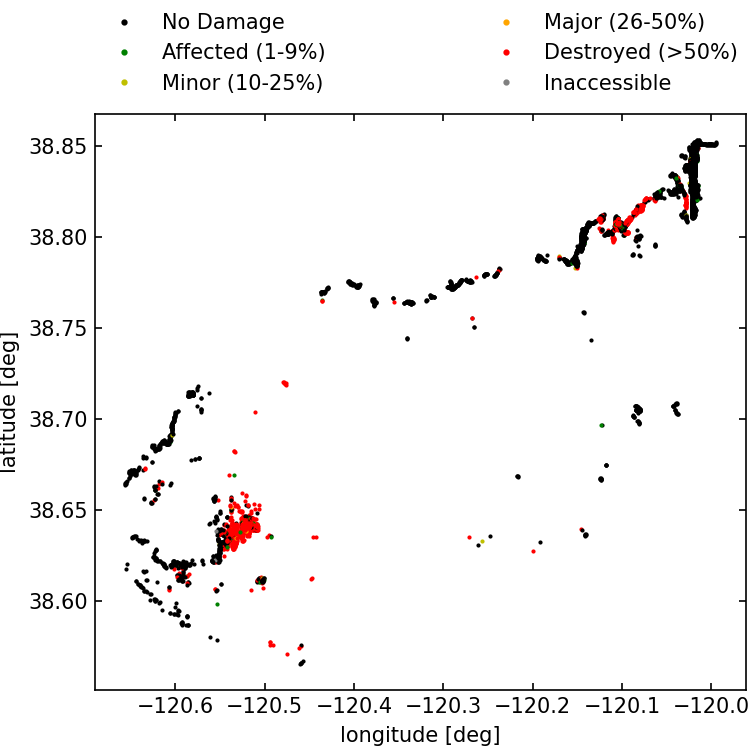
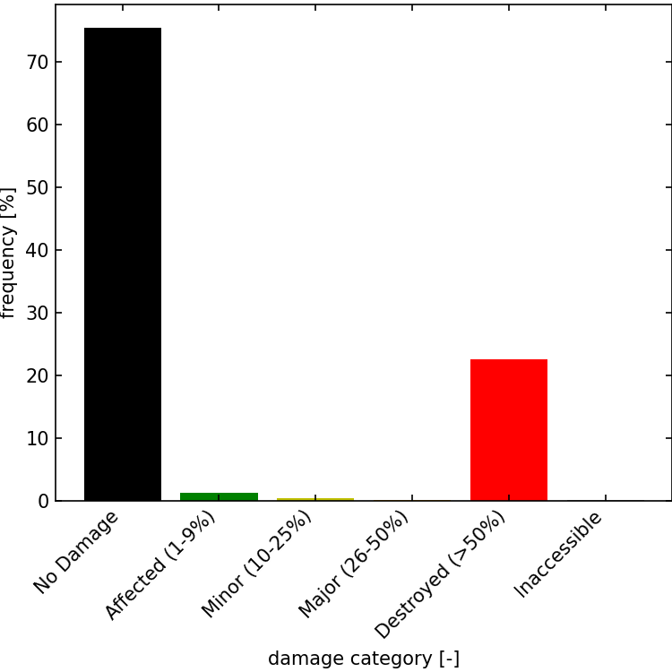

# 2021 Caldor Fire

**Version**: 1.0a <br>
**Case ID**: FB001 <br>
**FireBench IO std version**: >= 0.2 <br>
**Date of last update**: 11/19/2025 

## Contributors
- Aurélien Costes, [Wildfire Interdisciplinary Research Center](https://www.wildfirecenter.org/), San Jose State University, [aurelien.costes@sjsu.edu](mailto:aurelien.costes@sjsu.edu), [ORCID](https://orcid.org/0000-0003-4543-5107)

## Description

This collection of benchmarks uses the public ressources about the 2021 Caldor Fire.
It contains observation datasets for:
- Nearby weather stations (nb of associated benchmarks)
- Infrared fire perimeters
- Burn severity
- Building damaged
- (Plume top height)
- (Smoke concentration ground)

## Buildings damage benchmarks

### Dataset

The data has been collected using **CAL FIRE Damage Inspection (DINS) Data** (version of 2025/11/05).
The original csv file containing multiple fires has been processed to extract the building damaged from the Caldor Fire only. The dataset contains the position (lat, lon) of buildings in the area of influence from the fire. The state of buildings is one of the following:
- 'No Damage',
- 'Affected (1-9%)',
- 'Minor (10-25%)',
- 'Major (26-50%)',
- 'Destroyed (>50%)',
- 'Inaccessible'.

The column names from the original csv file have been corrected from "* Damage" to "Damage" and "* Incident Name" to "Incident Name". 
The hash of the original source file is: *0190a5a51aafafa20270fe046a7ae17a53697b1fb218ff8096a3d8ebbc9ef983*.

If the evaluated model does not explicitly represent individual buildings, the model should consider every building within a cell to share the cell value for building damage (deterministic models) or share the median of bulding damage distribution (probabilistic models).

Figure 1 shows the spatial distribution of building damage for the Caldor Fire.

<p style="text-align: center;">
    <strong>
        Fig. 1
    </strong>
    :
    <em>
        Buildings damage map
    </em>
</p>

Figure 2 shows the distribution of building damage for the Caldor Fire. The following table shows the number of strucure in each damage category.
Damage category        | Counts [-]  
---------------------- | ----------------- 
No Damage              | 3356
Affected (1-9%)        |   56
Minor (10-25%)         |   18
Major (26-50%)         |    7
Destroyed (>50%)       | 1005
Inaccessible           |    2
Total                  | 4444


<p style="text-align: center;">
    <strong>
        Fig. 2
    </strong>
    :
    <em>
        Distribution of buildings damage
    </em>
</p>

### Processing of dataset

#### Binary classes of building damaged
In order to performe some calculations, the building damaged classes can be aggrageted to form binary classes. The `Inaccessible` is ignored. The following aggragtion method is used:
- `unburnt` binary class contains `No Damage`, `Affected (1-9%)`, and `Minor (10-25%)`,
- `burnt` binary class contains `Major (26-50%)`, and `Destroyed (>50%)`.

### Benchmarks

See Key Performance Indicator (KPI) defintion [here](../../metrics/index.md).

#### FB001-BD01

**KPI**: Binary Structure Loss Accuracy <br>
This benchmark is performed on the binary classes for damaged buildings.

#### FB001-BD02

**KPI**: Binary Structure Loss Precision <br>
This benchmark is performed on the binary classes for damaged buildings.

#### FB001-BD03

**KPI**: Binary Structure Loss Recall <br>
This benchmark is performed on the binary classes for damaged buildings.

#### FB001-BD04

**KPI**: Binary Structure Loss Specificity <br>
This benchmark is performed on the binary classes for damaged buildings.

#### FB001-BD05

**KPI**: Binary Structure Loss Negative Predictive Value <br>
This benchmark is performed on the binary classes for damaged buildings.

#### FB001-BD06

**KPI**: Binary Structure Loss F1 Score <br>
This benchmark is performed on the binary classes for damaged buildings.


## Requirements

The following sections list the datasets requirements to run the different benchmarks. When the benchmark script is run, each requirement is validated. If a requirement is met, each corresponding benchmark is run.
Each requirement lists the required datasets (as path) as well as mandatory attributs for each dataset.

*Example*
```
- /path/of/dataset: attribut1, attribut2
```

Requirement            | Benchmarks 
---------------------- | ----------------- 
R01                    | FB001-BD01, FB001-BD02, FB001-BD03, FB001-BD04, FB001-BD05, FB001-BD06

### R01

- `/points/building_damaged/building_damage`: units