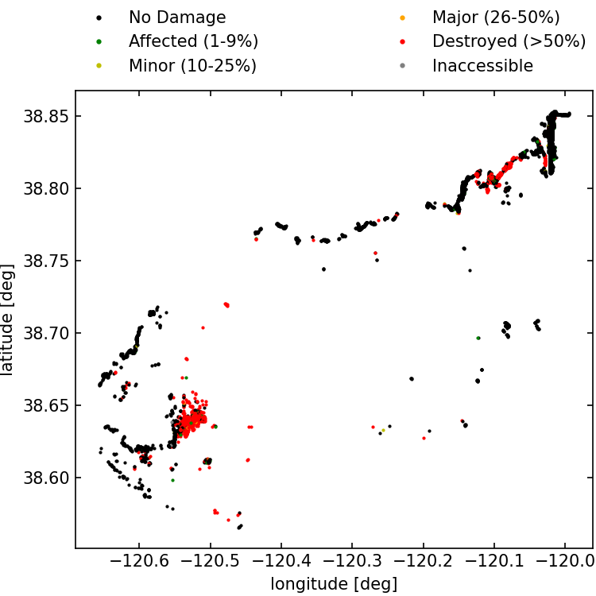
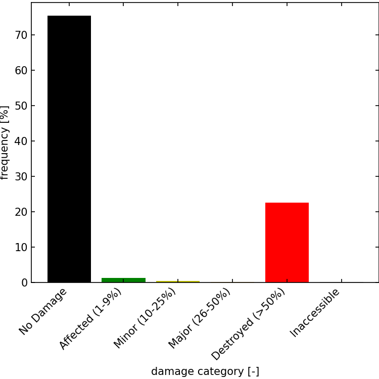
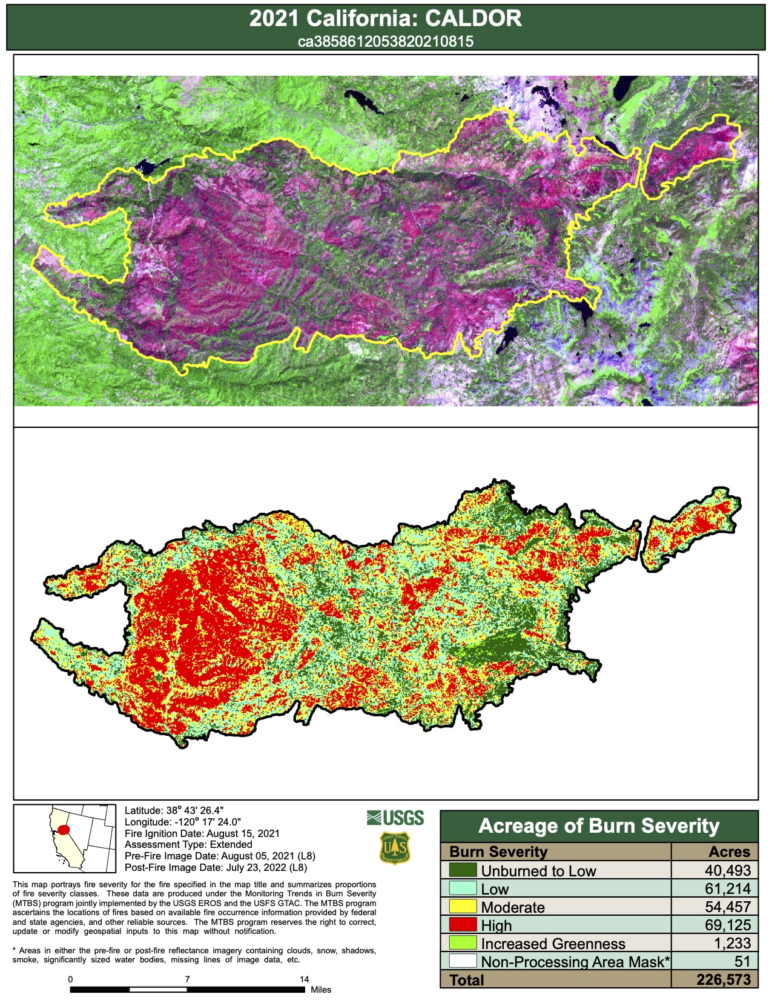
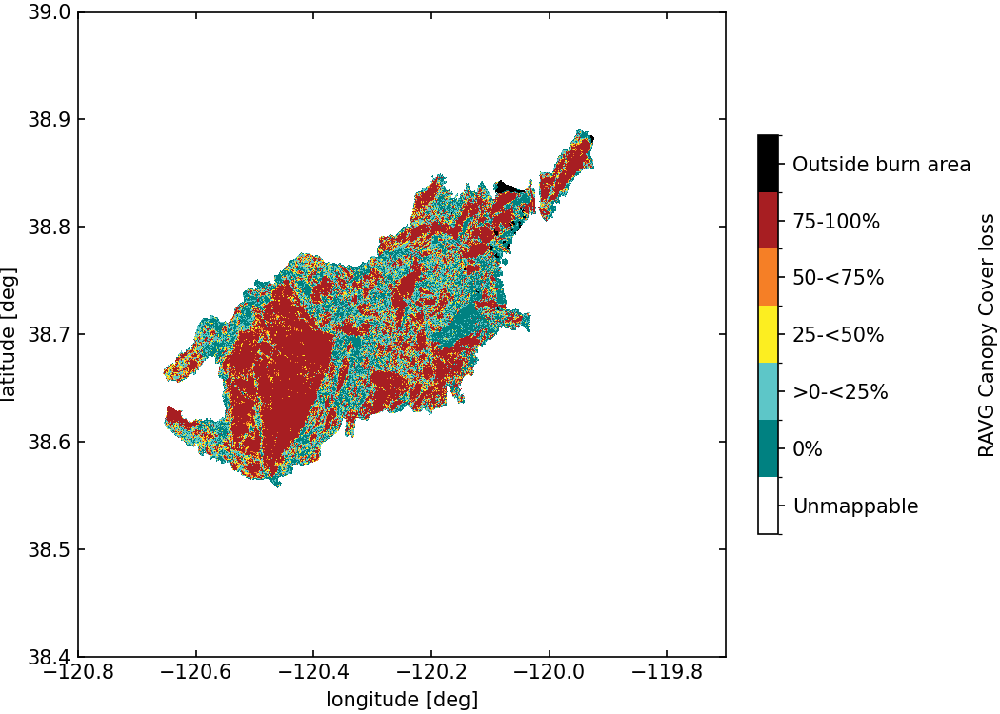
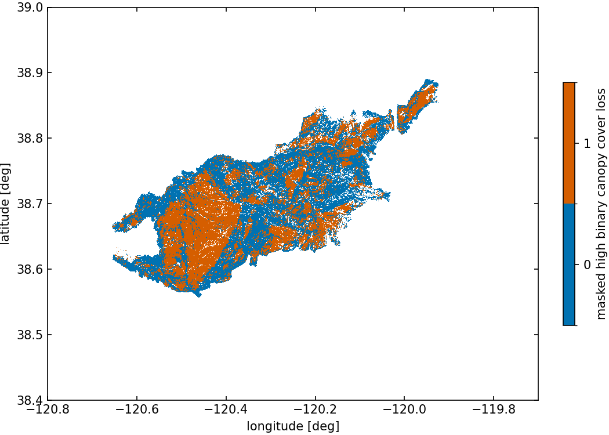
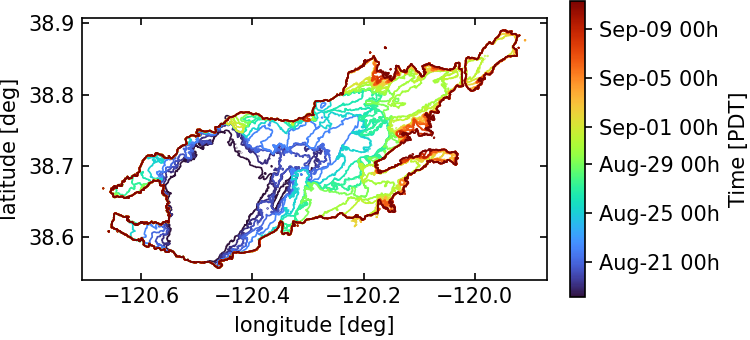
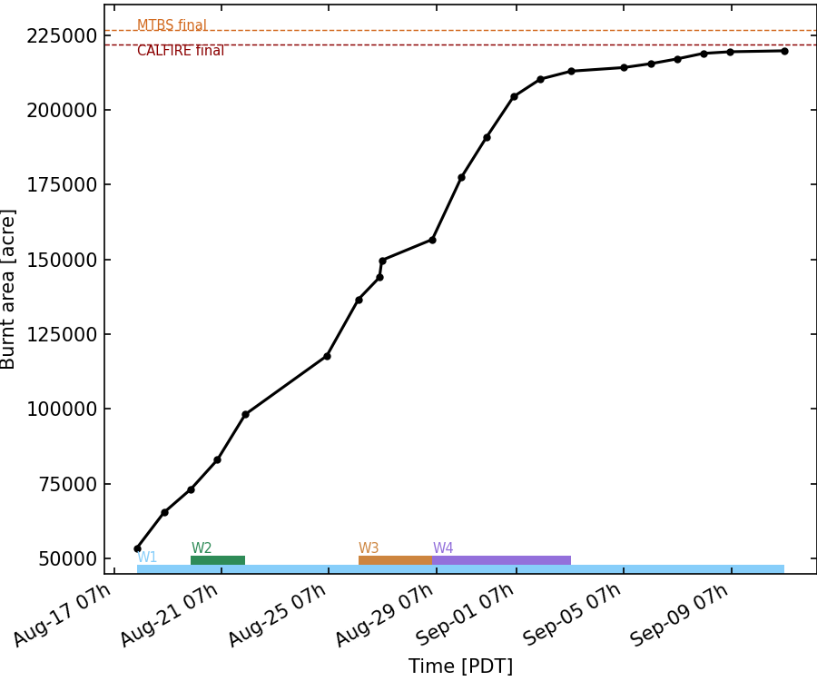

# 2021 Caldor Fire

**Version**: 2026.2 <br>
**Case ID**: FB001 <br>
**FireBench IO std version**: >= 1.0 <br>
**Date of last update**: 05/18/2026

## Contributors
- Aurélien Costes, [Wildfire Interdisciplinary Research Center](https://www.wildfirecenter.org/), San Jose State University, [aurelien.costes@sjsu.edu](mailto:aurelien.costes@sjsu.edu), [ORCID](https://orcid.org/0000-0003-4543-5107)
- Angel Farguell Caus, [Wildfire Interdisciplinary Research Center](https://www.wildfirecenter.org/), San Jose State University, [angel.farguellcaus@sjsu.edu](mailto:angel.farguellcaus@sjsu.edu), [ORCID](https://orcid.org/0000-0003-2395-220X)
- Adam Kochanski, [Wildfire Interdisciplinary Research Center](https://www.wildfirecenter.org/), San Jose State University, [adam.kochanski@sjsu.edu](mailto:adam.kochanski@sjsu.edu), [ORCID](https://orcid.org/0000-0001-7820-2831)

## Description

This collection of benchmarks uses the public resources about the 2021 Caldor Fire.
It contains over 300 benchmarks on various datasets.
It contains observation datasets for:
- Building damaged (CALFIRE)
- Burn severity (MTBS)
- Burn severity (RAVG)
- Canopy bottom height (LANDFIRE)
- Canopy bulk density (LANDFIRE)
- Canopy cover loss (RAVG)
- Canopy height (LANDFIRE)
- Infrared fire perimeters (NIROPS)
- Live basal area change (RAVG)
- Weather stations (Synoptic)

## Buildings damage

### Dataset

The data has been collected using **CAL FIRE Damage Inspection (DINS) Data** (version of 2025/11/05).
The original CSV file containing multiple fires has been processed to extract only the buildings damaged by the Caldor Fire. The dataset includes the positions (lat, lon) of buildings within the area of influence of the fire. The state of buildings is one of the following:
- 'No Damage',
- 'Affected (1-9%)',
- 'Minor (10-25%)',
- 'Major (26-50%)',
- 'Destroyed (>50%)',
- 'Inaccessible'.


The sha256 of the source file is: *0190a5a51aafafa20270fe046a7ae17a53697b1fb218ff8096a3d8ebbc9ef983*.

If the evaluated model does not explicitly represent individual buildings, it should treat all buildings within a cell as sharing the cell value for building damage (deterministic models) or the median of the building damage distribution (probabilistic models).

Figure 1 shows the spatial distribution of building damage for the Caldor Fire.

<p style="text-align: center;">
    <strong>
        Fig. 1
    </strong>
    :
    <em>
        Building damage map
    </em>
</p>

Figure 2 shows the distribution of building damage for the Caldor Fire. The following Table shows the number of structures in each damage category.
Damage category        | Counts [-]  
---------------------- | ----------------- 
No Damage              | 3356
Affected (1-9%)        |   56
Minor (10-25%)         |   18
Major (26-50%)         |    7
Destroyed (>50%)       | 1005
Inaccessible           |    2
Total                  | 4444


<p style="text-align: center;">
    <strong>
        Fig. 2
    </strong>
    :
    <em>
        Distribution of buildings damage
    </em>
</p>

### Processing of dataset

*Performed at obs dataset level*

The data from the original CSV file were standardized without modification.
The column names from the original csv file were corrected from "* Damage" to "Damage" and "* Incident Name" to "Incident Name" to simplify processing.

#### Binary classes of building damage

*Performed at benchmark run level*

To perform some calculations, the damaged building classes can be aggregated to form binary classes. The `Inaccessible` is ignored. The following aggregation method is used:
- `unburnt` binary class contains `No Damage`, `Affected (1-9%)`, and `Minor (10-25%)`,
- `burnt` binary class contains `Major (26-50%)`, and `Destroyed (>50%)`.

### Benchmarks

See Key Performance Indicator (KPI) and normalization definitions [here](../../metrics/index.md).

#### Binary Structure Loss Accuracy

**Short IDs**: BD01 <br>
**KPI**: Binary Structure Loss Accuracy <br>
**Normalization**: Linear Bounded Normalization with $a=0$, $b=1$ <br>
**Name in Score Card**: Binary Structure Loss Accuracy <br>
This benchmark is performed on the binary classes for damaged buildings.

#### Binary Structure Loss Precision

**Short IDs**: BD02 <br>
**KPI**: Binary Structure Loss Precision <br>
**Normalization**: Linear Bounded Normalization with $a=0$, $b=1$ <br>
**Name in Score Card**: Binary Structure Loss Precision <br>
This benchmark is performed on the binary classes for damaged buildings.

#### Binary Structure Loss Recall

**Short IDs**: BD03 <br>
**KPI**: Binary Structure Loss Recall <br>
**Normalization**: Linear Bounded Normalization with $a=0$, $b=1$ <br>
**Name in Score Card**: Binary Structure Loss Recall <br>
This benchmark is performed on the binary classes for damaged buildings.

#### Binary Structure Loss Specificity

**Short IDs**: BD04 <br>
**KPI**: Binary Structure Loss Specificity <br>
**Normalization**: Linear Bounded Normalization with $a=0$, $b=1$ <br>
**Name in Score Card**: Binary Structure Loss Specificity <br>
This benchmark is performed on the binary classes for damaged buildings.

#### Binary Structure Loss Negative Predictive Value

**Short IDs**: BD05<br>
**KPI**: Binary Structure Loss Negative Predictive Value <br>
**Normalization**: Linear Bounded Normalization with $a=0$, $b=1$ <br>
**Name in Score Card**: Binary Structure Loss Negative Predictive Value <br>
This benchmark is performed on the binary classes for damaged buildings.

#### Binary Structure Loss F1 Score

**Short IDs**: BD06<br>
**KPI**: Binary Structure Loss F1 Score <br>
**Normalization**: Linear Bounded Normalization with $a=0$, $b=1$ <br>
**Name in Score Card**: Binary Structure Loss F1 Score <br>
This benchmark is performed on the binary classes for damaged buildings.


## Burn severity from MTBS

### Dataset

The data has been collected using [Monitoring Trends in Burning Severity](https://mtbs.gov/) (MTBS).
The original zip file contains burn severity, pre/post burn images, and the final fire perimeter.
The source of the burn severity used in FireBench is the file `ca3858612053820210815_20210805_20220723_dnbr6.tif`. The source of the final fire perimeter is the kmz file `ca3858612053820210815_20210805_20220723.kmz`.

The burn severity categories, described with the corresponding index used in the dataset, are the following:
- 'no data': 0
- 'unburnt to low': 1
- 'low': 2
- 'moderate': 3
- 'high': 4
- 'increased greenness': 5

The hashes of the original source files are: 
- zip file: 171b9604c0654d8612eaabcfcad93d2374762661ab34b4d62718630a13469841
- tif dnbr6: 33db74d3c5798c41ff3a4fc5ee57da9105fdc7a75d7f8af0d053d2f82cfdc0b6
- final perimeter kmz: 4ed7a0ee585f8118b65a29375a3d5ee8a69e85a95ee155205ba5d781289c6e2b

Figure 3 shows the MTBS map from the original source.


<p style="text-align: center;">
    <strong>
        Fig. 3
    </strong>
    :
    <em>
        Map of burn severity from MTBS. Source: MTBS (`ca3858612053820210815_map.pdf`)
    </em>
</p>

### Processing of dataset

*Performed at obs dataset level*

The burn severity array is extracted from the original file without any modification. The latitude and longitude array are reconstructed using projection parameters (see `firebench.standardize.mtbs.standardize_mtbs_from_geotiff`). The final perimeter has been processed using QGIS. The original data (kmz file) has been imported and cleaned. Extra perimeters have been removed to conserve only the final fire perimeter. No modification to the polygons has been performed. Then, the multipolygons were exported to kml format and integrated into the dataset HDF5 file.

#### Binary classes for high severity

*Performed at benchmark run level*

To perform the high-severity benchmarks using a binary confusion matrix, we construct a binary field based on the high-severity index. All points will have a burn severity of 4 ('high') and will be assigned the value 1. The other points are assigned a value of 0. This processing is done when the benchmark is performed.

### Benchmarks

See Key Performance Indicator (KPI) and normalization definitions [here](../../metrics/index.md).

#### Binary High Severity Accuracy

**Short IDs**: SV01<br>
**KPI**: Binary High Severity Accuracy <br>
**Normalization**: Linear Bounded Normalization with $a=0$, $b=1$ <br>
**Name in Score Card**: Binary High Severity Accuracy <br>
This benchmark is performed on the binary classes for high severity points (Binary High severity processed variable)

#### Binary High Severity Precision

**Short IDs**: SV02<br>
**KPI**: Binary High Severity Precision <br>
**Normalization**: Linear Bounded Normalization with $a=0$, $b=1$ <br>
**Name in Score Card**: Binary High Severity Precision <br>
This benchmark is performed on the binary classes for high severity points (Binary High severity processed variable)

#### Binary High Severity Recall

**Short IDs**: SV03<br>
**KPI**: Binary High Severity Recall <br>
**Normalization**: Linear Bounded Normalization with $a=0$, $b=1$ <br>
**Name in Score Card**: Binary High Severity Recall <br>
This benchmark is performed on the binary classes for high severity points (Binary High severity processed variable)

#### Binary High Severity Specificity

**Short IDs**: SV04<br>
**KPI**: Binary High Severity Specificity <br>
**Normalization**: Linear Bounded Normalization with $a=0$, $b=1$ <br>
**Name in Score Card**: Binary High Severity Specificity <br>
This benchmark is performed on the binary classes for high severity points (Binary High severity processed variable)

#### Binary High Severity Negative Predictive Value

**Short IDs**: SV05<br>
**KPI**: Binary High Severity Negative Predictive Value <br>
**Normalization**: Linear Bounded Normalization with $a=0$, $b=1$ <br>
**Name in Score Card**: Binary High Severity Negative Predictive Value <br>
This benchmark is performed on the binary classes for high severity points (Binary High severity processed variable)

#### Binary High Severity F1 Score

**Short IDs**: SV06<br>
**KPI**: Binary High Severity F1 Score <br>
**Normalization**: Linear Bounded Normalization with $a=0$, $b=1$ <br>
**Name in Score Card**: Binary High Severity F1 Score <br>
This benchmark is performed on the binary classes for high severity points (Binary High severity processed variable)

## Canopy cover loss 

### Dataset

The data has been collected using [Rapid Assessment of Vegetation Condition after Wildfire](https://burnseverity.cr.usgs.gov/ravg/) (RAVG).
The source of the canopy cover loss used in FireBench is the dataset over CONUS for 2021, `ravg_2021_cc5.tif`. The region around the Caldor Fire has been processed and standardized using the following bounding box:
- south west: (38.4, -120.8)
- north east: (39.0, -119.7)

The canopy cover loss categories, described with the corresponding index used in the dataset, are the following:
- 'Unmappable': 0
- '0%': 1
- '>0-<25%': 2
- '25-<50%': 3
- '50-<75%': 4
- '75-100%': 5
- 'Outide burn area': 9

In addition, a bounding box has been used to remove the data from another fire (forced to `0`):
- south west: (38.6, -119.9)
- north east: (38.805, -119.7)

Figure 4 shows the processed RAVG dataset available in FireBench.


<p style="text-align: center;">
    <strong>
        Fig. 4
    </strong>
    :
    <em>
        Map of standardized canopy cover loss from RAVG for Caldor Fire.
    </em>
</p>

### Processing of dataset

*Performed at obs dataset level*

A bounding box has been used to remove the data from another fire (forced to `0`):
- south west: (38.6, -119.9)
- north east: (38.805, -119.7)

#### Masking using LANDFIRE dataset

*Performed at benchmark run level*

To perform an evaluation of high canopy cover loss, a mask is defined using three LANDFIRE datasets:
- Canopy bulk density
- Canopy height
- Canopy bottom height

The variable `masked high binary canopy cover loss` used in various benchmarks is computed only where all LANDFIRE canopy variables (interpolated using the nearest method on the RAVG grid) are strictly greater than 0 (presence of canopy fuel) and is defined as a binary variable:
- `1` if RAVG canopy cover loss value is `5`,
- `0` if RAVG canopy cover loss value is between `1` and `4`,
- `nan` otherwise.

Figure 5 shows the processed `masked high binary canopy cover loss` dataset used for related benchmarks.


<p style="text-align: center;">
    <strong>
        Fig. 5
    </strong>
    :
    <em>
        Map of standardized canopy cover loss from RAVG for Caldor Fire.
    </em>
</p>

### Benchmarks

See Key Performance Indicator (KPI) and normalization definitions [here](../../metrics/index.md).

#### Masked High Binary Canopy Cover Loss Accuracy

**Short IDs**: CC01<br>
**KPI**: Binary High Canopy Cover Loss Accuracy<br>
**Normalization**: Linear Bounded Normalization with $a=0$, $b=1$ <br>
**Name in Score Card**: Binary High Canopy Cover Loss Accuracy <br>
This benchmark is performed on the binary classes `masked high binary canopy cover loss`.

#### Masked High Binary Canopy Cover Precision

**Short IDs**: CC02<br>
**KPI**: Binary High Canopy Cover Loss Precision <br>
**Normalization**: Linear Bounded Normalization with $a=0$, $b=1$ <br>
**Name in Score Card**: Binary High Canopy Cover Loss Precision <br>
This benchmark is performed on the binary classes `masked high binary canopy cover loss`.

#### Masked High Binary Canopy Cover Recall

**Short IDs**: CC03<br>
**KPI**: Binary High Canopy Cover Loss Recall <br>
**Normalization**: Linear Bounded Normalization with $a=0$, $b=1$ <br>
**Name in Score Card**: Binary High Canopy Cover Loss Recall <br>
This benchmark is performed on the binary classes `masked high binary canopy cover loss`.

#### Masked High Binary Canopy Cover Specificity

**Short IDs**: CC04<br>
**KPI**: Binary High Canopy Cover Loss Specificity <br>
**Normalization**: Linear Bounded Normalization with $a=0$, $b=1$ <br>
**Name in Score Card**: Binary High Canopy Cover Loss Specificity <br>
This benchmark is performed on the binary classes `masked high binary canopy cover loss`.

#### Masked High Binary Canopy Cover Negative Predictive Value

**Short IDs**: CC05<br>
**KPI**: Binary High Canopy Cover Loss Negative Predictive Value <br>
**Normalization**: Linear Bounded Normalization with $a=0$, $b=1$ <br>
**Name in Score Card**: Binary High Canopy Cover Loss Negative Predictive Value <br>
This benchmark is performed on the binary classes `masked high binary canopy cover loss`.

#### Masked High Binary Canopy Cover F1 Score

**Short IDs**: CC06<br>
**KPI**: Binary High Canopy Cover Loss F1 Score <br>
**Normalization**: Linear Bounded Normalization with $a=0$, $b=1$ <br>
**Name in Score Card**: Binary High Canopy Cover Loss F1 Score <br>
This benchmark is performed on the binary classes `masked high binary canopy cover loss`.

## Infrared fire perimeters
### Dataset

The infrared fire perimeters were gathered from the NIFC NIROPS archive for incident
`CA-ENF-024030_Caldor`. The former incident-specific archive URLs are no longer published, so the
redistributed benchmark package is the durable source for these inputs.

Each original file was processed manually to extract only the perimeter. The perimeter timestamp
comes from `Imagery Date` and `Imagery Time` in its imaging report. KML-derived burn area was
verified against `Interpreted Acreage` when the report supplied it. Each perimeter (Figure 6) is an
HDF5 dataset whose attributes point to the corresponding KML file.

The series runs from August 17, the first available infrared perimeter, through September 10, when
the burn area reached 99% of the final area shown in Figure 7 (source:
[CAL FIRE](https://www.fire.ca.gov/incidents/2021/8/14/caldor-fire/)).
The final dataset contains 21 perimeters.

The following study periods (see Fig. 7) are defined in the following Table:

Name | Start time        | End time           | Duration      | Burn area [acre]
-----|-------------------|--------------------|---------------|-----------------
W1   | Aug 17 20h20 PDT  | Sep 10 23h34 PDT   | 24d  3h 14min | 166,256
W2   | Aug 19 20h45 PDT  | Aug 21 21h15 PDT   |  2d  0h 30min | 24,941
W3   | Aug 26 02h30 PDT  | Aug 28 20h30 PDT   |  2d 18h  0min | 19,992
W4   | Aug 28 20h30 PDT  | Sep  3 00h40 PDT   |  5d  4h 10min | 56,272

Figure 6 shows the processed fire perimeter as a colored solid contour. The color of the contour indicates the timestamp of the perimeter.


<p style="text-align: center;">
    <strong>
        Fig. 6
    </strong>
    :
    <em>
        Infrared fire perimeters from August 17th to September 10th.
    </em>
</p>


<p style="text-align: center;">
    <strong>
        Fig. 7
    </strong>
    :
    <em>
        Burn area derived from IR perimeters from August 17th to September 10th. The red dashed line shows the final burn area from CALFIRE. The orange dashed line shows the final burn area from the MTBS final perimeter.
    </em>
</p>

### Benchmarks

See Key Performance Indicator (KPI) and normalization definitions [here](../../metrics/index.md).

#### Average Jaccard Index over study period

**Short IDs**: See Table<br>
**KPI**: Average Jaccard Index <br>
**Normalization**: Linear Bounded Normalization with $a=0$, $b=1$ <br>
**Name in Score Card**: See Table <br>
The first perimeter at the start of the period can serve as an initial condition for the fire perimeter. The first perimeter is not used to compute any metric.
The area preserving project used is EPSG:5070.

The following Table gives the correspondence between the benchmark ID and the study period:

ID   | Study period | Name in Score Card
-----|--------------|-------------------
FP01 | W1           | Average Jaccard Index W1
FP02 | W2           | Average Jaccard Index W2
FP03 | W3           | Average Jaccard Index W3
FP04 | W4           | Average Jaccard Index W4

#### Minimum Jaccard Index over study period

**Short IDs**: See Table<br>
**KPI**: Minimum Jaccard Index <br>
**Normalization**: Linear Bounded Normalization with $a=0$, $b=1$ <br>
**Name in Score Card**: See Table <br>
The first perimeter at the start of the period can serve as an initial condition for the fire perimeter. The first perimeter is not used to compute any metric.
The area preserving project used is EPSG:5070.

The following Table gives the correspondence between the benchmark ID and the study period:

ID   | Study period | Name in Score Card
-----|--------------|-------------------
FP05 | W1           | Minimum Jaccard Index W1
FP06 | W2           | Minimum Jaccard Index W2
FP07 | W3           | Minimum Jaccard Index W3
FP08 | W4           | Minimum Jaccard Index W4

#### Maximum Jaccard Index over study period

**Short IDs**: See Table<br>
**KPI**: Maximum Jaccard Index <br>
**Normalization**: Linear Bounded Normalization with $a=0$, $b=1$ <br>
**Name in Score Card**: See Table <br>
The first perimeter at the start of the period can serve as an initial condition for the fire perimeter. The first perimeter is not used to compute any metric.
The area preserving project used is EPSG:5070.

The following Table gives the correspondence between the benchmark ID and the study period:

ID   | Study period | Name in Score Card
-----|--------------|-------------------
FP09 | W1           | Minimum Jaccard Index W1
FP10 | W2           | Minimum Jaccard Index W2
FP11 | W3           | Minimum Jaccard Index W3
FP12 | W4           | Minimum Jaccard Index W4

#### Average Dice-Sorensen Index over study period

**Short IDs**: See Table<br>
**KPI**: Average Dice-Sorensen Index <br>
**Normalization**: Linear Bounded Normalization with $a=0$, $b=1$ <br>
**Name in Score Card**: See Table <br>
The first perimeter at the start of the period can serve as an initial condition for the fire perimeter. The first perimeter is not used to compute any metric.
The area preserving project used is EPSG:5070.

The following Table gives the correspondence between the benchmark ID and the study period:

ID   | Study period | Name in Score Card
-----|--------------|-------------------
FP13 | W1           | Average Dice-Sorensen Index W1
FP14 | W2           | Average Dice-Sorensen Index W2
FP15 | W3           | Average Dice-Sorensen Index W3
FP16 | W4           | Average Dice-Sorensen Index W4

#### Minimum Dice-Sorensen Index over study period

**Short IDs**: See Table<br>
**KPI**: Minimum Dice-Sorensen Index <br>
**Normalization**: Linear Bounded Normalization with $a=0$, $b=1$ <br>
**Name in Score Card**: See Table <br>
The first perimeter at the start of the period can serve as an initial condition for the fire perimeter. The first perimeter is not used to compute any metric.
The area preserving project used is EPSG:5070.

The following Table gives the correspondence between the benchmark ID and the study period:

ID   | Study period | Name in Score Card
-----|--------------|-------------------
FP17 | W1           | Minimum Dice-Sorensen Index W1
FP18 | W2           | Minimum Dice-Sorensen Index W2
FP19 | W3           | Minimum Dice-Sorensen Index W3
FP20 | W4           | Minimum Dice-Sorensen Index W4

#### Maximum Dice-Sorensen Index over study period

**Short IDs**: See Table<br>
**KPI**: Maximum Dice-Sorensen Index <br>
**Normalization**: Linear Bounded Normalization with $a=0$, $b=1$ <br>
**Name in Score Card**: See Table <br>
The first perimeter at the start of the period can serve as an initial condition for the fire perimeter. The first perimeter is not used to compute any metric.
The area preserving project used is EPSG:5070.

The following Table gives the correspondence between the benchmark ID and the study period:

ID   | Study period | Name in Score Card
-----|--------------|-------------------
FP21 | W1           | Minimum Dice-Sorensen Index W1
FP22 | W2           | Minimum Dice-Sorensen Index W2
FP23 | W3           | Minimum Dice-Sorensen Index W3
FP24 | W4           | Minimum Dice-Sorensen Index W4

#### Final Burn Area Bias

**Short IDs**: See Table<br>
**KPI**: Burn Area Bias <br>
**Normalization**: Symmetric Exponential Open Normalization ($m$ value in Table)<br>
**Name in Score Card**: See Table <br>
The first perimeter, at the start of the period, can be used as initial condition for the fire perimeter.
The bias is calculated on the last perimeter of the study period as the difference between the model and the observed burn area.
The normalization parameter $m$ is 20% of the final observed burn area. Therefore, an absolute final-area bias equal to 20% of the observed area leads to a score of 50.00.

The following Table gives the correspondence between the benchmark ID and the study period:

ID   | Study period | Name in Score Card
-----|--------------|-------------------
FP25 | W1           | Burn Area Bias W1
FP26 | W2           | Burn Area Bias W2
FP27 | W3           | Burn Area Bias W3
FP28 | W4           | Burn Area Bias W4

#### Burn Area RMSE

**Short IDs**: See Table<br>
**KPI**: Burn Area RMSE <br>
**Normalization**: Symmetric Exponential Open Normalization ($m$ value in Table)<br>
**Name in Score Card**: See Table <br>
The first perimeter, at the start of the period, can be used as initial condition for the fire perimeter.
The normalization parameter $m$ is 20% of the root mean square (RMS) of the observed burn areas in the study period. Therefore, a burn-area RMSE equal to 20% of the observed-area RMS leads to a score of 50.00.

The following Table gives the correspondence between the benchmark ID and the study period:

ID   | Study period | Name in Score Card
-----|--------------|-------------------
FP29 | W1           | Burn Area RMSE W1
FP30 | W2           | Burn Area RMSE W2
FP31 | W3           | Burn Area RMSE W3
FP32 | W4           | Burn Area RMSE W4

## Weather stations

### Dataset

Weather stations datasets have been gathered from [Synoptics](https://synopticdata.com).
All the stations available in the following bounding box have been processed:
- south west: (38.4, -120.8)
- north east: (39.0, -119.7)

The following variables have been processed (following FireBench namespace):
- air_temperature
- relative_humidity
- solar_radiation
- fuel_moisture_content_10h
- wind_direction
- wind_gust
- wind_speed

```{note}
To propose another variable or benchmark, open a
[feature request](https://github.com/wirc-sjsu/firebench/issues/new?template=feature_request.md) with
the standard variable name, observation source, metric, and scientific rationale. Implementations
can be submitted through the public contribution workflow.
```

Some stations do not have data for period W1 and have been excluded from the dataset.
The list of excluded stations for missing data in the study period is:
403_PG, 412_PG, 413_PG, F9934.
Also, some stations did not meet the data quality criterion and have been excluded from the dataset. 
The list of excluded stations for data quality reasons is:
AV833, BLCC1, C9148, COOPDAGN2, COOPMINN2, FOIC1, FPDC1, G0658, GEOC1, LNLC1, PFHC1, SBKC1, SLPC1, STAN2, UTRC1, WDFC1, XOHC1.

Sensor height data has been extracted following the source-precedence rules in
[Weather Sensor Height and Trust](../../reference/weather_sensor_height.md).
The current version of knowledge about sensor heights for the case weather stations are:
- 10 stations with a complete dataset (sensor height found in the source file)
- 98 stations with missing metadata
- 21 stations skipped
- 81 datasets with sensor height metadata
- 0 datasets from trusted stations from the FireBench database
- 0 datasets from trusted history from the FireBench database
- 5 datasets from the FireBench provider default database
- 394 datasets using FireBench default metadata

Therefore, 81 datasets are considered trusted and will be used in the Trusted Sources Only (TSO)
station set. All 399 datasets are used in the all-sources station set. All sources includes the TSO
population; FireBench does not define an untrusted-only station set. TSO is the authoritative
scored mode, while all-sources KPIs are zero-weight diagnostics. See
[Weather Sensor Height and Trust](../../reference/weather_sensor_height.md) for the confidence
levels, model-height contract, and scientific limitations.

```{note}
To contribute sensor-height evidence, open a
[data request](https://github.com/wirc-sjsu/firebench/issues/new?template=data_request.md) and include
the station ID, sensor, height, units, effective dates, provider, and a public source URL.
```

Weather stations are stored in the HDF5 file using their STID.

### Benchmarks

See Key Performance Indicator (KPI) and normalization definitions [here](../../metrics/index.md).

#### Air temperature

**Short IDs**: See Table<br>
**KPI**: Air temperature MAE/RMSE/Bias <br>
**Normalization**: Symmetric Exponential Open Normalization ($m$ value in Table)<br>
**Name in Score Card**: See Table <br>
Each metric (MAE, RMSE, Bias) is calculated for each station for both model and observational dataset for a specified period. Then we apply summary statistics (*e.g.*, min, mean, and max) across  all available weather stations before applying the normalization.
Implementation of metrics are `firebench.metrics.stats.mae`, `firebench.metrics.stats.rmse`, `firebench.metrics.stats.bias`.
Datasets are converted into `degC` for comparison.
The normalization parameter $m$ sets which KPI value gives a Score of 50. It represents the difficulty of the benchmark.

The following Table gives the correspondence between the benchmark ID and the study period:

ID    | Study period | Summary stats func |  Name in Score Card     | $m$     | Station set
------|--------------|--------------------|-------------------------|---------|--------------------
WX001 | W1           | MAE                | Air temp MAE min W1 TSO        |   5.0 degC            | TSO
WX002 | W1           | MAE                | Air temp MAE mean W1 TSO       |   5.0 degC            | TSO
WX003 | W1           | MAE                | Air temp MAE max W1 TSO        |   5.0 degC            | TSO
WX004 | W1           | MAE                | Air temp MAE min W1            |   5.0 degC            | all sources
WX005 | W1           | MAE                | Air temp MAE mean W1           |   5.0 degC            | all sources
WX006 | W1           | MAE                | Air temp MAE max W1            |   5.0 degC            | all sources
WX007 | W1           | RMSE               | Air temp RMSE min W1 TSO       |   5.0 degC            | TSO
WX008 | W1           | RMSE               | Air temp RMSE mean W1 TSO      |   5.0 degC            | TSO
WX009 | W1           | RMSE               | Air temp RMSE max W1 TSO       |   5.0 degC            | TSO
WX010 | W1           | RMSE               | Air temp RMSE min W1           |   5.0 degC            | all sources
WX011 | W1           | RMSE               | Air temp RMSE mean W1          |   5.0 degC            | all sources
WX012 | W1           | RMSE               | Air temp RMSE max W1           |   5.0 degC            | all sources
WX013 | W1           | Bias               | Air temp Bias min W1 TSO       |   5.0 degC            | TSO
WX014 | W1           | Bias               | Air temp Bias mean W1 TSO      |   5.0 degC            | TSO
WX015 | W1           | Bias               | Air temp Bias max W1 TSO       |   5.0 degC            | TSO
WX016 | W1           | Bias               | Air temp Bias min W1           |   5.0 degC            | all sources
WX017 | W1           | Bias               | Air temp Bias mean W1          |   5.0 degC            | all sources
WX018 | W1           | Bias               | Air temp Bias max W1           |   5.0 degC            | all sources
WX019 | W2           | MAE                | Air temp MAE min W2 TSO        |   5.0 degC            | TSO
WX020 | W2           | MAE                | Air temp MAE mean W2 TSO       |   5.0 degC            | TSO
WX021 | W2           | MAE                | Air temp MAE max W2 TSO        |   5.0 degC            | TSO
WX022 | W2           | MAE                | Air temp MAE min W2            |   5.0 degC            | all sources
WX023 | W2           | MAE                | Air temp MAE mean W2           |   5.0 degC            | all sources
WX024 | W2           | MAE                | Air temp MAE max W2            |   5.0 degC            | all sources
WX025 | W2           | RMSE               | Air temp RMSE min W2 TSO       |   5.0 degC            | TSO
WX026 | W2           | RMSE               | Air temp RMSE mean W2 TSO      |   5.0 degC            | TSO
WX027 | W2           | RMSE               | Air temp RMSE max W2 TSO       |   5.0 degC            | TSO
WX028 | W2           | RMSE               | Air temp RMSE min W2           |   5.0 degC            | all sources
WX029 | W2           | RMSE               | Air temp RMSE mean W2          |   5.0 degC            | all sources
WX030 | W2           | RMSE               | Air temp RMSE max W2           |   5.0 degC            | all sources
WX031 | W2           | Bias               | Air temp Bias min W2 TSO       |   5.0 degC            | TSO
WX032 | W2           | Bias               | Air temp Bias mean W2 TSO      |   5.0 degC            | TSO
WX033 | W2           | Bias               | Air temp Bias max W2 TSO       |   5.0 degC            | TSO
WX034 | W2           | Bias               | Air temp Bias min W2           |   5.0 degC            | all sources
WX035 | W2           | Bias               | Air temp Bias mean W2          |   5.0 degC            | all sources
WX036 | W2           | Bias               | Air temp Bias max W2           |   5.0 degC            | all sources
WX037 | W3           | MAE                | Air temp MAE min W3 TSO        |   5.0 degC            | TSO
WX038 | W3           | MAE                | Air temp MAE mean W3 TSO       |   5.0 degC            | TSO
WX039 | W3           | MAE                | Air temp MAE max W3 TSO        |   5.0 degC            | TSO
WX040 | W3           | MAE                | Air temp MAE min W3            |   5.0 degC            | all sources
WX041 | W3           | MAE                | Air temp MAE mean W3           |   5.0 degC            | all sources
WX042 | W3           | MAE                | Air temp MAE max W3            |   5.0 degC            | all sources
WX043 | W3           | RMSE               | Air temp RMSE min W3 TSO       |   5.0 degC            | TSO
WX044 | W3           | RMSE               | Air temp RMSE mean W3 TSO      |   5.0 degC            | TSO
WX045 | W3           | RMSE               | Air temp RMSE max W3 TSO       |   5.0 degC            | TSO
WX046 | W3           | RMSE               | Air temp RMSE min W3           |   5.0 degC            | all sources
WX047 | W3           | RMSE               | Air temp RMSE mean W3          |   5.0 degC            | all sources
WX048 | W3           | RMSE               | Air temp RMSE max W3           |   5.0 degC            | all sources
WX049 | W3           | Bias               | Air temp Bias min W3 TSO       |   5.0 degC            | TSO
WX050 | W3           | Bias               | Air temp Bias mean W3 TSO      |   5.0 degC            | TSO
WX051 | W3           | Bias               | Air temp Bias max W3 TSO       |   5.0 degC            | TSO
WX052 | W3           | Bias               | Air temp Bias min W3           |   5.0 degC            | all sources
WX053 | W3           | Bias               | Air temp Bias mean W3          |   5.0 degC            | all sources
WX054 | W3           | Bias               | Air temp Bias max W3           |   5.0 degC            | all sources
WX055 | W4           | MAE                | Air temp MAE min W4 TSO        |   5.0 degC            | TSO
WX056 | W4           | MAE                | Air temp MAE mean W4 TSO       |   5.0 degC            | TSO
WX057 | W4           | MAE                | Air temp MAE max W4 TSO        |   5.0 degC            | TSO
WX058 | W4           | MAE                | Air temp MAE min W4            |   5.0 degC            | all sources
WX059 | W4           | MAE                | Air temp MAE mean W4           |   5.0 degC            | all sources
WX060 | W4           | MAE                | Air temp MAE max W4            |   5.0 degC            | all sources
WX061 | W4           | RMSE               | Air temp RMSE min W4 TSO       |   5.0 degC            | TSO
WX062 | W4           | RMSE               | Air temp RMSE mean W4 TSO      |   5.0 degC            | TSO
WX063 | W4           | RMSE               | Air temp RMSE max W4 TSO       |   5.0 degC            | TSO
WX064 | W4           | RMSE               | Air temp RMSE min W4           |   5.0 degC            | all sources
WX065 | W4           | RMSE               | Air temp RMSE mean W4          |   5.0 degC            | all sources
WX066 | W4           | RMSE               | Air temp RMSE max W4           |   5.0 degC            | all sources
WX067 | W4           | Bias               | Air temp Bias min W4 TSO       |   5.0 degC            | TSO
WX068 | W4           | Bias               | Air temp Bias mean W4 TSO      |   5.0 degC            | TSO
WX069 | W4           | Bias               | Air temp Bias max W4 TSO       |   5.0 degC            | TSO
WX070 | W4           | Bias               | Air temp Bias min W4           |   5.0 degC            | all sources
WX071 | W4           | Bias               | Air temp Bias mean W4          |   5.0 degC            | all sources
WX072 | W4           | Bias               | Air temp Bias max W4           |   5.0 degC            | all sources

#### Relative Humidity

**Short IDs**: See Table<br>
**KPI**: Relative humidity MAE/RMSE/Bias <br>
**Normalization**: Symmetric Exponential Open Normalization ($m$ value in Table)<br>
**Name in Score Card**: See Table <br>
Each metric (MAE, RMSE, Bias) is calculated for each station for both model and observational dataset for a specified period. Then we apply summary statistics (*e.g.*, min, mean, and max) across  all available weather stations before applying the normalization.
Implementation of metrics are `firebench.metrics.stats.mae`, `firebench.metrics.stats.rmse`, `firebench.metrics.stats.bias`.
Datasets are converted into `percent` for comparison.
The normalization parameter $m$ sets which KPI value gives a Score of 50. It represents the difficulty of the benchmark.

The following Table gives the correspondence  between the benchmark ID and the study period:

ID    | Study period | Summary stats func |  Name in Score Card     | $m$     | Station set
------|--------------|--------------------|-------------------------|---------|--------------------
WX073 | W1           | MAE                | RH MAE min W1 TSO              |  15.0 percent         | TSO
WX074 | W1           | MAE                | RH MAE mean W1 TSO             |  15.0 percent         | TSO
WX075 | W1           | MAE                | RH MAE max W1 TSO              |  15.0 percent         | TSO
WX076 | W1           | MAE                | RH MAE min W1                  |  15.0 percent         | all sources
WX077 | W1           | MAE                | RH MAE mean W1                 |  15.0 percent         | all sources
WX078 | W1           | MAE                | RH MAE max W1                  |  15.0 percent         | all sources
WX079 | W1           | RMSE               | RH RMSE min W1 TSO             |  15.0 percent         | TSO
WX080 | W1           | RMSE               | RH RMSE mean W1 TSO            |  15.0 percent         | TSO
WX081 | W1           | RMSE               | RH RMSE max W1 TSO             |  15.0 percent         | TSO
WX082 | W1           | RMSE               | RH RMSE min W1                 |  15.0 percent         | all sources
WX083 | W1           | RMSE               | RH RMSE mean W1                |  15.0 percent         | all sources
WX084 | W1           | RMSE               | RH RMSE max W1                 |  15.0 percent         | all sources
WX085 | W1           | Bias               | RH Bias min W1 TSO             |  15.0 percent         | TSO
WX086 | W1           | Bias               | RH Bias mean W1 TSO            |  15.0 percent         | TSO
WX087 | W1           | Bias               | RH Bias max W1 TSO             |  15.0 percent         | TSO
WX088 | W1           | Bias               | RH Bias min W1                 |  15.0 percent         | all sources
WX089 | W1           | Bias               | RH Bias mean W1                |  15.0 percent         | all sources
WX090 | W1           | Bias               | RH Bias max W1                 |  15.0 percent         | all sources
WX091 | W2           | MAE                | RH MAE min W2 TSO              |  15.0 percent         | TSO
WX092 | W2           | MAE                | RH MAE mean W2 TSO             |  15.0 percent         | TSO
WX093 | W2           | MAE                | RH MAE max W2 TSO              |  15.0 percent         | TSO
WX094 | W2           | MAE                | RH MAE min W2                  |  15.0 percent         | all sources
WX095 | W2           | MAE                | RH MAE mean W2                 |  15.0 percent         | all sources
WX096 | W2           | MAE                | RH MAE max W2                  |  15.0 percent         | all sources
WX097 | W2           | RMSE               | RH RMSE min W2 TSO             |  15.0 percent         | TSO
WX098 | W2           | RMSE               | RH RMSE mean W2 TSO            |  15.0 percent         | TSO
WX099 | W2           | RMSE               | RH RMSE max W2 TSO             |  15.0 percent         | TSO
WX100 | W2           | RMSE               | RH RMSE min W2                 |  15.0 percent         | all sources
WX101 | W2           | RMSE               | RH RMSE mean W2                |  15.0 percent         | all sources
WX102 | W2           | RMSE               | RH RMSE max W2                 |  15.0 percent         | all sources
WX103 | W2           | Bias               | RH Bias min W2 TSO             |  15.0 percent         | TSO
WX104 | W2           | Bias               | RH Bias mean W2 TSO            |  15.0 percent         | TSO
WX105 | W2           | Bias               | RH Bias max W2 TSO             |  15.0 percent         | TSO
WX106 | W2           | Bias               | RH Bias min W2                 |  15.0 percent         | all sources
WX107 | W2           | Bias               | RH Bias mean W2                |  15.0 percent         | all sources
WX108 | W2           | Bias               | RH Bias max W2                 |  15.0 percent         | all sources
WX109 | W3           | MAE                | RH MAE min W3 TSO              |  15.0 percent         | TSO
WX110 | W3           | MAE                | RH MAE mean W3 TSO             |  15.0 percent         | TSO
WX111 | W3           | MAE                | RH MAE max W3 TSO              |  15.0 percent         | TSO
WX112 | W3           | MAE                | RH MAE min W3                  |  15.0 percent         | all sources
WX113 | W3           | MAE                | RH MAE mean W3                 |  15.0 percent         | all sources
WX114 | W3           | MAE                | RH MAE max W3                  |  15.0 percent         | all sources
WX115 | W3           | RMSE               | RH RMSE min W3 TSO             |  15.0 percent         | TSO
WX116 | W3           | RMSE               | RH RMSE mean W3 TSO            |  15.0 percent         | TSO
WX117 | W3           | RMSE               | RH RMSE max W3 TSO             |  15.0 percent         | TSO
WX118 | W3           | RMSE               | RH RMSE min W3                 |  15.0 percent         | all sources
WX119 | W3           | RMSE               | RH RMSE mean W3                |  15.0 percent         | all sources
WX120 | W3           | RMSE               | RH RMSE max W3                 |  15.0 percent         | all sources
WX121 | W3           | Bias               | RH Bias min W3 TSO             |  15.0 percent         | TSO
WX122 | W3           | Bias               | RH Bias mean W3 TSO            |  15.0 percent         | TSO
WX123 | W3           | Bias               | RH Bias max W3 TSO             |  15.0 percent         | TSO
WX124 | W3           | Bias               | RH Bias min W3                 |  15.0 percent         | all sources
WX125 | W3           | Bias               | RH Bias mean W3                |  15.0 percent         | all sources
WX126 | W3           | Bias               | RH Bias max W3                 |  15.0 percent         | all sources
WX127 | W4           | MAE                | RH MAE min W4 TSO              |  15.0 percent         | TSO
WX128 | W4           | MAE                | RH MAE mean W4 TSO             |  15.0 percent         | TSO
WX129 | W4           | MAE                | RH MAE max W4 TSO              |  15.0 percent         | TSO
WX130 | W4           | MAE                | RH MAE min W4                  |  15.0 percent         | all sources
WX131 | W4           | MAE                | RH MAE mean W4                 |  15.0 percent         | all sources
WX132 | W4           | MAE                | RH MAE max W4                  |  15.0 percent         | all sources
WX133 | W4           | RMSE               | RH RMSE min W4 TSO             |  15.0 percent         | TSO
WX134 | W4           | RMSE               | RH RMSE mean W4 TSO            |  15.0 percent         | TSO
WX135 | W4           | RMSE               | RH RMSE max W4 TSO             |  15.0 percent         | TSO
WX136 | W4           | RMSE               | RH RMSE min W4                 |  15.0 percent         | all sources
WX137 | W4           | RMSE               | RH RMSE mean W4                |  15.0 percent         | all sources
WX138 | W4           | RMSE               | RH RMSE max W4                 |  15.0 percent         | all sources
WX139 | W4           | Bias               | RH Bias min W4 TSO             |  15.0 percent         | TSO
WX140 | W4           | Bias               | RH Bias mean W4 TSO            |  15.0 percent         | TSO
WX141 | W4           | Bias               | RH Bias max W4 TSO             |  15.0 percent         | TSO
WX142 | W4           | Bias               | RH Bias min W4                 |  15.0 percent         | all sources
WX143 | W4           | Bias               | RH Bias mean W4                |  15.0 percent         | all sources
WX144 | W4           | Bias               | RH Bias max W4                 |  15.0 percent         | all sources

#### Wind Speed

**Short IDs**: See Table<br>
**KPI**: Wind Speed MAE/RMSE/Bias <br>
**Normalization**: Symmetric Exponential Open Normalization ($m$ value in Table)<br>
**Name in Score Card**: See Table <br>
Each metric (MAE, RMSE, Bias) is calculated for each station for both model and observational dataset for a specified period. Then we apply summary statistics (*e.g.*, min, mean, and max) across  all available weather stations before applying the normalization.
Implementation of metrics are `firebench.metrics.stats.mae`, `firebench.metrics.stats.rmse`, `firebench.metrics.stats.bias`.
Datasets are converted into `m/s` for comparison.
The normalization parameter $m$ sets which KPI value gives a Score of 50. It represents the difficulty of the benchmark.

The following Table gives the correspondence  between the benchmark ID and the study period:

ID    | Study period | Summary stats func |  Name in Score Card     | $m$     | Station set
------|--------------|--------------------|-------------------------|---------|--------------------
WX145 | W1           | MAE                | Wind Speed MAE min W1 TSO      |   5.0 m/s             | TSO
WX146 | W1           | MAE                | Wind Speed MAE mean W1 TSO     |   5.0 m/s             | TSO
WX147 | W1           | MAE                | Wind Speed MAE max W1 TSO      |   5.0 m/s             | TSO
WX148 | W1           | MAE                | Wind Speed MAE min W1          |   5.0 m/s             | all sources
WX149 | W1           | MAE                | Wind Speed MAE mean W1         |   5.0 m/s             | all sources
WX150 | W1           | MAE                | Wind Speed MAE max W1          |   5.0 m/s             | all sources
WX151 | W1           | RMSE               | Wind Speed RMSE min W1 TSO     |   5.0 m/s             | TSO
WX152 | W1           | RMSE               | Wind Speed RMSE mean W1 TSO    |   5.0 m/s             | TSO
WX153 | W1           | RMSE               | Wind Speed RMSE max W1 TSO     |   5.0 m/s             | TSO
WX154 | W1           | RMSE               | Wind Speed RMSE min W1         |   5.0 m/s             | all sources
WX155 | W1           | RMSE               | Wind Speed RMSE mean W1        |   5.0 m/s             | all sources
WX156 | W1           | RMSE               | Wind Speed RMSE max W1         |   5.0 m/s             | all sources
WX157 | W1           | Bias               | Wind Speed Bias min W1 TSO     |   5.0 m/s             | TSO
WX158 | W1           | Bias               | Wind Speed Bias mean W1 TSO    |   5.0 m/s             | TSO
WX159 | W1           | Bias               | Wind Speed Bias max W1 TSO     |   5.0 m/s             | TSO
WX160 | W1           | Bias               | Wind Speed Bias min W1         |   5.0 m/s             | all sources
WX161 | W1           | Bias               | Wind Speed Bias mean W1        |   5.0 m/s             | all sources
WX162 | W1           | Bias               | Wind Speed Bias max W1         |   5.0 m/s             | all sources
WX163 | W2           | MAE                | Wind Speed MAE min W2 TSO      |   5.0 m/s             | TSO
WX164 | W2           | MAE                | Wind Speed MAE mean W2 TSO     |   5.0 m/s             | TSO
WX165 | W2           | MAE                | Wind Speed MAE max W2 TSO      |   5.0 m/s             | TSO
WX166 | W2           | MAE                | Wind Speed MAE min W2          |   5.0 m/s             | all sources
WX167 | W2           | MAE                | Wind Speed MAE mean W2         |   5.0 m/s             | all sources
WX168 | W2           | MAE                | Wind Speed MAE max W2          |   5.0 m/s             | all sources
WX169 | W2           | RMSE               | Wind Speed RMSE min W2 TSO     |   5.0 m/s             | TSO
WX170 | W2           | RMSE               | Wind Speed RMSE mean W2 TSO    |   5.0 m/s             | TSO
WX171 | W2           | RMSE               | Wind Speed RMSE max W2 TSO     |   5.0 m/s             | TSO
WX172 | W2           | RMSE               | Wind Speed RMSE min W2         |   5.0 m/s             | all sources
WX173 | W2           | RMSE               | Wind Speed RMSE mean W2        |   5.0 m/s             | all sources
WX174 | W2           | RMSE               | Wind Speed RMSE max W2         |   5.0 m/s             | all sources
WX175 | W2           | Bias               | Wind Speed Bias min W2 TSO     |   5.0 m/s             | TSO
WX176 | W2           | Bias               | Wind Speed Bias mean W2 TSO    |   5.0 m/s             | TSO
WX177 | W2           | Bias               | Wind Speed Bias max W2 TSO     |   5.0 m/s             | TSO
WX178 | W2           | Bias               | Wind Speed Bias min W2         |   5.0 m/s             | all sources
WX179 | W2           | Bias               | Wind Speed Bias mean W2        |   5.0 m/s             | all sources
WX180 | W2           | Bias               | Wind Speed Bias max W2         |   5.0 m/s             | all sources
WX181 | W3           | MAE                | Wind Speed MAE min W3 TSO      |   5.0 m/s             | TSO
WX182 | W3           | MAE                | Wind Speed MAE mean W3 TSO     |   5.0 m/s             | TSO
WX183 | W3           | MAE                | Wind Speed MAE max W3 TSO      |   5.0 m/s             | TSO
WX184 | W3           | MAE                | Wind Speed MAE min W3          |   5.0 m/s             | all sources
WX185 | W3           | MAE                | Wind Speed MAE mean W3         |   5.0 m/s             | all sources
WX186 | W3           | MAE                | Wind Speed MAE max W3          |   5.0 m/s             | all sources
WX187 | W3           | RMSE               | Wind Speed RMSE min W3 TSO     |   5.0 m/s             | TSO
WX188 | W3           | RMSE               | Wind Speed RMSE mean W3 TSO    |   5.0 m/s             | TSO
WX189 | W3           | RMSE               | Wind Speed RMSE max W3 TSO     |   5.0 m/s             | TSO
WX190 | W3           | RMSE               | Wind Speed RMSE min W3         |   5.0 m/s             | all sources
WX191 | W3           | RMSE               | Wind Speed RMSE mean W3        |   5.0 m/s             | all sources
WX192 | W3           | RMSE               | Wind Speed RMSE max W3         |   5.0 m/s             | all sources
WX193 | W3           | Bias               | Wind Speed Bias min W3 TSO     |   5.0 m/s             | TSO
WX194 | W3           | Bias               | Wind Speed Bias mean W3 TSO    |   5.0 m/s             | TSO
WX195 | W3           | Bias               | Wind Speed Bias max W3 TSO     |   5.0 m/s             | TSO
WX196 | W3           | Bias               | Wind Speed Bias min W3         |   5.0 m/s             | all sources
WX197 | W3           | Bias               | Wind Speed Bias mean W3        |   5.0 m/s             | all sources
WX198 | W3           | Bias               | Wind Speed Bias max W3         |   5.0 m/s             | all sources
WX199 | W4           | MAE                | Wind Speed MAE min W4 TSO      |   5.0 m/s             | TSO
WX200 | W4           | MAE                | Wind Speed MAE mean W4 TSO     |   5.0 m/s             | TSO
WX201 | W4           | MAE                | Wind Speed MAE max W4 TSO      |   5.0 m/s             | TSO
WX202 | W4           | MAE                | Wind Speed MAE min W4          |   5.0 m/s             | all sources
WX203 | W4           | MAE                | Wind Speed MAE mean W4         |   5.0 m/s             | all sources
WX204 | W4           | MAE                | Wind Speed MAE max W4          |   5.0 m/s             | all sources
WX205 | W4           | RMSE               | Wind Speed RMSE min W4 TSO     |   5.0 m/s             | TSO
WX206 | W4           | RMSE               | Wind Speed RMSE mean W4 TSO    |   5.0 m/s             | TSO
WX207 | W4           | RMSE               | Wind Speed RMSE max W4 TSO     |   5.0 m/s             | TSO
WX208 | W4           | RMSE               | Wind Speed RMSE min W4         |   5.0 m/s             | all sources
WX209 | W4           | RMSE               | Wind Speed RMSE mean W4        |   5.0 m/s             | all sources
WX210 | W4           | RMSE               | Wind Speed RMSE max W4         |   5.0 m/s             | all sources
WX211 | W4           | Bias               | Wind Speed Bias min W4 TSO     |   5.0 m/s             | TSO
WX212 | W4           | Bias               | Wind Speed Bias mean W4 TSO    |   5.0 m/s             | TSO
WX213 | W4           | Bias               | Wind Speed Bias max W4 TSO     |   5.0 m/s             | TSO
WX214 | W4           | Bias               | Wind Speed Bias min W4         |   5.0 m/s             | all sources
WX215 | W4           | Bias               | Wind Speed Bias mean W4        |   5.0 m/s             | all sources
WX216 | W4           | Bias               | Wind Speed Bias max W4         |   5.0 m/s             | all sources

#### Wind Direction

**Short IDs**: See Table<br>
**KPI**: Wind Direction circular Bias <br>
**Normalization**: Symmetric Exponential Open Normalization ($m$ value in Table)<br>
**Name in Score Card**: See Table <br>
Each metric is calculated for each station for both model and observational dataset for a specified period. Then we apply summary statistics (*e.g.*, min, mean, and max) across  all available weather stations before applying the normalization.
Implementation of metrics are `firebench.metrics.stats.circular_bias_deg`.
Datasets are converted into `degree` for comparison.
The normalization parameter $m$ sets which KPI value gives a Score of 50. It represents the difficulty of the benchmark.

The following Table gives the correspondence  between the benchmark ID and the study period:

ID    | Study period | Summary stats func |  Name in Score Card     | $m$     | Station set
------|--------------|--------------------|-------------------------|---------|--------------------
WX217 | W1           | circular bias      | Wind Direction circular bias min W1 TSO |  45.0 degree          | TSO
WX218 | W1           | circular bias      | Wind Direction circular bias mean W1 TSO |  45.0 degree          | TSO
WX219 | W1           | circular bias      | Wind Direction circular bias max W1 TSO |  45.0 degree          | TSO
WX220 | W1           | circular bias      | Wind Direction circular bias min W1  |  45.0 degree          | all sources
WX221 | W1           | circular bias      | Wind Direction circular bias mean W1  |  45.0 degree          | all sources
WX222 | W1           | circular bias      | Wind Direction circular bias max W1  |  45.0 degree          | all sources
WX223 | W2           | circular bias      | Wind Direction circular bias min W2 TSO |  45.0 degree          | TSO
WX224 | W2           | circular bias      | Wind Direction circular bias mean W2 TSO |  45.0 degree          | TSO
WX225 | W2           | circular bias      | Wind Direction circular bias max W2 TSO |  45.0 degree          | TSO
WX226 | W2           | circular bias      | Wind Direction circular bias min W2  |  45.0 degree          | all sources
WX227 | W2           | circular bias      | Wind Direction circular bias mean W2  |  45.0 degree          | all sources
WX228 | W2           | circular bias      | Wind Direction circular bias max W2  |  45.0 degree          | all sources
WX229 | W3           | circular bias      | Wind Direction circular bias min W3 TSO |  45.0 degree          | TSO
WX230 | W3           | circular bias      | Wind Direction circular bias mean W3 TSO |  45.0 degree          | TSO
WX231 | W3           | circular bias      | Wind Direction circular bias max W3 TSO |  45.0 degree          | TSO
WX232 | W3           | circular bias      | Wind Direction circular bias min W3  |  45.0 degree          | all sources
WX233 | W3           | circular bias      | Wind Direction circular bias mean W3  |  45.0 degree          | all sources
WX234 | W3           | circular bias      | Wind Direction circular bias max W3  |  45.0 degree          | all sources
WX235 | W4           | circular bias      | Wind Direction circular bias min W4 TSO |  45.0 degree          | TSO
WX236 | W4           | circular bias      | Wind Direction circular bias mean W4 TSO |  45.0 degree          | TSO
WX237 | W4           | circular bias      | Wind Direction circular bias max W4 TSO |  45.0 degree          | TSO
WX238 | W4           | circular bias      | Wind Direction circular bias min W4  |  45.0 degree          | all sources
WX239 | W4           | circular bias      | Wind Direction circular bias mean W4  |  45.0 degree          | all sources
WX240 | W4           | circular bias      | Wind Direction circular bias max W4  |  45.0 degree          | all sources

#### Fuel Moisture Content 10h

**Short IDs**: See Table<br>
**KPI**: FMC 10h MAE/RMSE/Bias <br>
**Normalization**: Symmetric Exponential Open Normalization ($m$ value in Table)<br>
**Name in Score Card**: See Table <br>
Each metric is calculated for each station for both model and observational dataset for a specified period. Then we apply summary statistics (*e.g.*, min, mean, and max) across  all available weather stations before applying the normalization.
Implementation of metrics are `firebench.metrics.stats.mae`, `firebench.metrics.stats.rmse`, `firebench.metrics.stats.bias`.
Datasets are converted into `percent` for comparison.
The normalization parameter $m$ sets which KPI value gives a Score of 50. It represents the difficulty of the benchmark.

The following Table gives the correspondence  between the benchmark ID and the study period:

ID    | Study period | Summary stats func |  Name in Score Card     | $m$     | Station set
------|--------------|--------------------|-------------------------|---------|--------------------
WX241 | W1           | MAE                | FMC 10h MAE min W1 TSO         |   5.0 percent         | TSO
WX242 | W1           | MAE                | FMC 10h MAE mean W1 TSO        |   5.0 percent         | TSO
WX243 | W1           | MAE                | FMC 10h MAE max W1 TSO         |   5.0 percent         | TSO
WX244 | W1           | MAE                | FMC 10h MAE min W1             |   5.0 percent         | all sources
WX245 | W1           | MAE                | FMC 10h MAE mean W1            |   5.0 percent         | all sources
WX246 | W1           | MAE                | FMC 10h MAE max W1             |   5.0 percent         | all sources
WX247 | W1           | RMSE               | FMC 10h RMSE min W1 TSO        |   5.0 percent         | TSO
WX248 | W1           | RMSE               | FMC 10h RMSE mean W1 TSO       |   5.0 percent         | TSO
WX249 | W1           | RMSE               | FMC 10h RMSE max W1 TSO        |   5.0 percent         | TSO
WX250 | W1           | RMSE               | FMC 10h RMSE min W1            |   5.0 percent         | all sources
WX251 | W1           | RMSE               | FMC 10h RMSE mean W1           |   5.0 percent         | all sources
WX252 | W1           | RMSE               | FMC 10h RMSE max W1            |   5.0 percent         | all sources
WX253 | W1           | Bias               | FMC 10h Bias min W1 TSO        |   5.0 percent         | TSO
WX254 | W1           | Bias               | FMC 10h Bias mean W1 TSO       |   5.0 percent         | TSO
WX255 | W1           | Bias               | FMC 10h Bias max W1 TSO        |   5.0 percent         | TSO
WX256 | W1           | Bias               | FMC 10h Bias min W1            |   5.0 percent         | all sources
WX257 | W1           | Bias               | FMC 10h Bias mean W1           |   5.0 percent         | all sources
WX258 | W1           | Bias               | FMC 10h Bias max W1            |   5.0 percent         | all sources
WX259 | W2           | MAE                | FMC 10h MAE min W2 TSO         |   5.0 percent         | TSO
WX260 | W2           | MAE                | FMC 10h MAE mean W2 TSO        |   5.0 percent         | TSO
WX261 | W2           | MAE                | FMC 10h MAE max W2 TSO         |   5.0 percent         | TSO
WX262 | W2           | MAE                | FMC 10h MAE min W2             |   5.0 percent         | all sources
WX263 | W2           | MAE                | FMC 10h MAE mean W2            |   5.0 percent         | all sources
WX264 | W2           | MAE                | FMC 10h MAE max W2             |   5.0 percent         | all sources
WX265 | W2           | RMSE               | FMC 10h RMSE min W2 TSO        |   5.0 percent         | TSO
WX266 | W2           | RMSE               | FMC 10h RMSE mean W2 TSO       |   5.0 percent         | TSO
WX267 | W2           | RMSE               | FMC 10h RMSE max W2 TSO        |   5.0 percent         | TSO
WX268 | W2           | RMSE               | FMC 10h RMSE min W2            |   5.0 percent         | all sources
WX269 | W2           | RMSE               | FMC 10h RMSE mean W2           |   5.0 percent         | all sources
WX270 | W2           | RMSE               | FMC 10h RMSE max W2            |   5.0 percent         | all sources
WX271 | W2           | Bias               | FMC 10h Bias min W2 TSO        |   5.0 percent         | TSO
WX272 | W2           | Bias               | FMC 10h Bias mean W2 TSO       |   5.0 percent         | TSO
WX273 | W2           | Bias               | FMC 10h Bias max W2 TSO        |   5.0 percent         | TSO
WX274 | W2           | Bias               | FMC 10h Bias min W2            |   5.0 percent         | all sources
WX275 | W2           | Bias               | FMC 10h Bias mean W2           |   5.0 percent         | all sources
WX276 | W2           | Bias               | FMC 10h Bias max W2            |   5.0 percent         | all sources
WX277 | W3           | MAE                | FMC 10h MAE min W3 TSO         |   5.0 percent         | TSO
WX278 | W3           | MAE                | FMC 10h MAE mean W3 TSO        |   5.0 percent         | TSO
WX279 | W3           | MAE                | FMC 10h MAE max W3 TSO         |   5.0 percent         | TSO
WX280 | W3           | MAE                | FMC 10h MAE min W3             |   5.0 percent         | all sources
WX281 | W3           | MAE                | FMC 10h MAE mean W3            |   5.0 percent         | all sources
WX282 | W3           | MAE                | FMC 10h MAE max W3             |   5.0 percent         | all sources
WX283 | W3           | RMSE               | FMC 10h RMSE min W3 TSO        |   5.0 percent         | TSO
WX284 | W3           | RMSE               | FMC 10h RMSE mean W3 TSO       |   5.0 percent         | TSO
WX285 | W3           | RMSE               | FMC 10h RMSE max W3 TSO        |   5.0 percent         | TSO
WX286 | W3           | RMSE               | FMC 10h RMSE min W3            |   5.0 percent         | all sources
WX287 | W3           | RMSE               | FMC 10h RMSE mean W3           |   5.0 percent         | all sources
WX288 | W3           | RMSE               | FMC 10h RMSE max W3            |   5.0 percent         | all sources
WX289 | W3           | Bias               | FMC 10h Bias min W3 TSO        |   5.0 percent         | TSO
WX290 | W3           | Bias               | FMC 10h Bias mean W3 TSO       |   5.0 percent         | TSO
WX291 | W3           | Bias               | FMC 10h Bias max W3 TSO        |   5.0 percent         | TSO
WX292 | W3           | Bias               | FMC 10h Bias min W3            |   5.0 percent         | all sources
WX293 | W3           | Bias               | FMC 10h Bias mean W3           |   5.0 percent         | all sources
WX294 | W3           | Bias               | FMC 10h Bias max W3            |   5.0 percent         | all sources
WX295 | W4           | MAE                | FMC 10h MAE min W4 TSO         |   5.0 percent         | TSO
WX296 | W4           | MAE                | FMC 10h MAE mean W4 TSO        |   5.0 percent         | TSO
WX297 | W4           | MAE                | FMC 10h MAE max W4 TSO         |   5.0 percent         | TSO
WX298 | W4           | MAE                | FMC 10h MAE min W4             |   5.0 percent         | all sources
WX299 | W4           | MAE                | FMC 10h MAE mean W4            |   5.0 percent         | all sources
WX300 | W4           | MAE                | FMC 10h MAE max W4             |   5.0 percent         | all sources
WX301 | W4           | RMSE               | FMC 10h RMSE min W4 TSO        |   5.0 percent         | TSO
WX302 | W4           | RMSE               | FMC 10h RMSE mean W4 TSO       |   5.0 percent         | TSO
WX303 | W4           | RMSE               | FMC 10h RMSE max W4 TSO        |   5.0 percent         | TSO
WX304 | W4           | RMSE               | FMC 10h RMSE min W4            |   5.0 percent         | all sources
WX305 | W4           | RMSE               | FMC 10h RMSE mean W4           |   5.0 percent         | all sources
WX306 | W4           | RMSE               | FMC 10h RMSE max W4            |   5.0 percent         | all sources
WX307 | W4           | Bias               | FMC 10h Bias min W4 TSO        |   5.0 percent         | TSO
WX308 | W4           | Bias               | FMC 10h Bias mean W4 TSO       |   5.0 percent         | TSO
WX309 | W4           | Bias               | FMC 10h Bias max W4 TSO        |   5.0 percent         | TSO
WX310 | W4           | Bias               | FMC 10h Bias min W4            |   5.0 percent         | all sources
WX311 | W4           | Bias               | FMC 10h Bias mean W4           |   5.0 percent         | all sources
WX312 | W4           | Bias               | FMC 10h Bias max W4            |   5.0 percent         | all sources

## Requirements

The following sections list the datasets' requirements to run the different benchmarks. When the benchmark script runs, each requirement is validated against the HDF5 file provided as input (from the model output/data the user wants to evaluate). If a requirement is met, each corresponding benchmark is run.
Each requirement lists the required datasets/groups (as paths) and the mandatory attributes for each dataset/group.
The current version of FireBench does not support more complex checks (e.g., array size and dtype).


Requirement            | Benchmarks 
---------------------- | ----------------- 
R01                    | BD01 to BD06
R02                    | SV01 to SV06
R03                    | FP01, FP05, FP09, FP13, FP17, FP21, FP25, FP29
R04                    | FP02, FP06, FP10, FP14, FP18, FP22, FP26, FP30
R05                    | FP03, FP07, FP11, FP15, FP19, FP23, FP27, FP31
R06                    | FP04, FP08, FP12, FP16, FP20, FP24, FP28, FP32
R07                    | CC01 to CC06
R08                    | WX001 to WX072
R09                    | WX073 to WX144
R10                    | WX145 to WX216
R11                    | WX217 to WX240
R12                    | WX241 to WX312

### R01
Mandatory group/dataset| Mandatory attributes 
---------------------- | --------------------
`/points/building_damaged/building_damage` | units

### R02
Mandatory group/dataset| Mandatory attributes 
---------------------- | --------------------
`/spatial_2d/Caldor_MTBS`| crs
`/spatial_2d/Caldor_MTBS/fire_burn_severity`| units, _FillValue
`/spatial_2d/Caldor_MTBS/position_lat`| units
`/spatial_2d/Caldor_MTBS/position_lon`| units

### R03
Mandatory group/dataset| Mandatory attributes 
---------------------- | --------------------
`/polygons/Caldor_2021-08-18T20:30-07:00`| rel_path, time
`/polygons/Caldor_2021-08-19T20:45-07:00`| rel_path, time
`/polygons/Caldor_2021-08-20T20:20-07:00`| rel_path, time
`/polygons/Caldor_2021-08-21T21:15-07:00`| rel_path, time
`/polygons/Caldor_2021-08-24T22:07-07:00`| rel_path, time
`/polygons/Caldor_2021-08-26T03:30-06:00`| rel_path, time
`/polygons/Caldor_2021-08-26T22:15-06:00`| rel_path, time
`/polygons/Caldor_2021-08-27T00:22-06:00`| rel_path, time
`/polygons/Caldor_2021-08-28T21:30-06:00`| rel_path, time
`/polygons/Caldor_2021-08-29T22:32-07:00`| rel_path, time
`/polygons/Caldor_2021-08-30T21:09-07:00`| rel_path, time
`/polygons/Caldor_2021-08-31T21:08-07:00`| rel_path, time
`/polygons/Caldor_2021-09-01T21:12-07:00`| rel_path, time
`/polygons/Caldor_2021-09-03T00:40-07:00`| rel_path, time
`/polygons/Caldor_2021-09-04T23:29-07:00`| rel_path, time
`/polygons/Caldor_2021-09-05T23:41-07:00`| rel_path, time
`/polygons/Caldor_2021-09-06T23:09-07:00`| rel_path, time
`/polygons/Caldor_2021-09-07T22:40-07:00`| rel_path, time
`/polygons/Caldor_2021-09-08T22:33-07:00`| rel_path, time
`/polygons/Caldor_2021-09-10T23:34-07:00`| rel_path, time

Files (KML) at path defined in `rel_path` attributes must exist.

### R04
Mandatory group/dataset| Mandatory attributes 
---------------------- | --------------------
`/polygons/Caldor_2021-08-20T20:20-07:00`| rel_path, time
`/polygons/Caldor_2021-08-21T21:15-07:00`| rel_path, time

Files (KML) at path defined in `rel_path` attributes must exist.

### R05
Mandatory group/dataset| Mandatory attributes 
---------------------- | --------------------
`/polygons/Caldor_2021-08-26T22:15-06:00`| rel_path, time
`/polygons/Caldor_2021-08-27T00:22-06:00`| rel_path, time
`/polygons/Caldor_2021-08-28T21:30-06:00`| rel_path, time

Files (KML) at path defined in `rel_path` attributes must exist.

### R06
Mandatory group/dataset| Mandatory attributes 
---------------------- | --------------------
`/polygons/Caldor_2021-08-29T22:32-07:00`| rel_path, time
`/polygons/Caldor_2021-08-30T21:09-07:00`| rel_path, time
`/polygons/Caldor_2021-08-31T21:08-07:00`| rel_path, time
`/polygons/Caldor_2021-09-01T21:12-07:00`| rel_path, time
`/polygons/Caldor_2021-09-03T00:40-07:00`| rel_path, time

Files (KML) at path defined in `rel_path` attributes must exist.

### R07
Mandatory group/dataset| Mandatory attributes 
---------------------- | --------------------
`/spatial_2d/ravg_cc`| crs
`/spatial_2d/ravg_cc/ravg_canopy_cover_loss`| units, _FillValue
`/spatial_2d/ravg_cc/position_lat`| units
`/spatial_2d/ravg_cc/position_lon`| units

### R08
Verify that the model and observational datasets contain the same weather station groups with the following datasets:
Mandatory group/dataset| Mandatory attributes 
---------------------- | --------------------
`/time_series/station_<name>/time`| None
`/time_series/station_<name>/air_temperature`| None

### R09
Verify that the model and observational datasets contain the same weather station groups with the following datasets:
Mandatory group/dataset| Mandatory attributes 
---------------------- | --------------------
`/time_series/station_<name>/time`| None
`/time_series/station_<name>/relative_humidity`| None

### R10
Verify that the model and observational datasets contain the same weather station groups with the following datasets:
Mandatory group/dataset| Mandatory attributes 
---------------------- | --------------------
`/time_series/station_<name>/time`| None
`/time_series/station_<name>/wind_speed`| None

### R11
Verify that the model and observational datasets contain the same weather station groups with the following datasets:
Mandatory group/dataset| Mandatory attributes 
---------------------- | --------------------
`/time_series/station_<name>/time`| None
`/time_series/station_<name>/wind_direction`| None

### R12
Verify that the model and observational datasets contain the same weather station groups with the following datasets:
Mandatory group/dataset| Mandatory attributes 
---------------------- | --------------------
`/time_series/station_<name>/time`| None
`/time_series/station_<name>/fuel_moisture_content_10h`| None

For requirements R08 through R12, FireBench first limits structural validation to the stations and
periods selected by the target. Every observational variable selected for TSO must have canonical
level-2 confidence plus numeric `sensor_height` and compatible `sensor_height_units`. The matching
model variable must record the height at which it was prepared. Heights are converted to meters
and must agree within 0.01 m; otherwise only that station is excluded from the TSO KPI and its
reason is logged. See
[Weather Sensor Height and Trust](../../reference/weather_sensor_height.md).

## Benchmark Targets in FireBench 0.10

The CLI uses a target to select the Caldor KPI groups and, for a period target, the evaluation
window. Inspect the available targets and the exact KPIs selected by a target with:

```bash
firebench list 2021_Caldor
firebench list 2021_Caldor H013_P --obs-data v2026.2/Caldor.h5
```

The second command is the detailed source of truth for generated period targets. It reports the
period, selected KPI groups, relevant perimeters and weather-station counts, KPI weights, and
normalization parameters. The 62 HRRR-aligned periods generate too many KPIs for a useful static
list in this specification.

### Standalone targets

- `B` selects building-damage KPIs.
- `S` selects burn-severity KPIs.
- `CC` selects canopy-cover-loss KPIs.
- `FP` selects all four curated fire-perimeter groups.
- `0` selects every KPI without aggregation, so it produces individual KPI scores but no group or
  total score.

### Retained schemes

The FireBench 0.9 scheme names `A`, `CDI`, `BS3`, `WX1` through `WX4`, `short_all`, and
`WX_short` remain valid targets. `B`, `S`, `CC`, `FP`, and `0` also retain their former names while
having the explicit standalone meanings above. Retaining a name does not make a 0.10 score
comparable with a 0.9 score; see [Compatibility with FireBench 0.9 scores](#compatibility-with-firebench-09-scores).

### Curated period targets

The four curated study periods called `W1` through `W4` in FireBench 0.9 and in the scientific
sections of this specification are exposed by the 0.10 CLI as `P01` through `P04`:

Scientific period | CLI period
----------------- | ----------
W1                | `P01`
W2                | `P02`
W3                | `P03`
W4                | `P04`

Append an underscore and one or more KPI-group flags to select work within the period. For
example, `P02_P` selects the W2 perimeter group and `P02_PW` selects its perimeter and weather
groups.

### HRRR-aligned period targets

`H001` through `H062` are 48-hour periods aligned with HRRR forecast initialization times. Append
the same KPI-group flags used by curated period targets. For example, `H013_BPW` combines building
damage, fire perimeters, and weather stations for period `H013`.

The generated weather IDs continue after the 312 curated weather KPIs: `WX313` through `WX5148`
cover the 62 HRRR-aligned periods. IDs are generated by variable, period, metric, station set, then
summary statistic (`min`, `mean`, `max`). Each TSO trio is followed by its all-sources trio. Because
the generated registry is too large for a static table, inspect the exact IDs, names, station
counts, weights, and normalization values with:

```bash
firebench list 2021_Caldor H013_W --obs-data v2026.2/Caldor.h5
```

See [Weather Sensor Height and Trust](../../reference/weather_sensor_height.md) for the full ID
generation order and station-set semantics.

The flags accepted by both curated and HRRR-aligned period targets are:

Flag | KPI group
---- | ---------
`B`  | Building damage
`P`  | Fire perimeters
`W`  | Weather stations

Flags may be entered in any order and are normalized to `B`, `P`, `W` order. Burn severity and
canopy-cover loss deliberately have no period-qualified flags because those evaluations are not
filtered by the selected period; use standalone `S` or `CC` instead.

### FireBench 0.9 to 0.10 target mapping

FireBench 0.10 changes the run syntax from:

```bash
firebench run -c CASE -a SCHEME MODEL_OUTPUT
```

to:

```bash
firebench run CASE TARGET MODEL_OUTPUT
```

Use the following mapping when updating 0.9 commands:

0.9 scheme | 0.10 target | Notes
---------- | ----------- | -----
`B`        | `B`         | Standalone building damage
`S`        | `S`         | Standalone burn severity
`CC`       | `CC`        | Standalone canopy-cover loss
`WX1`      | `WX1` or `P01_W` | Retained scheme or equivalent curated weather target
`WX2`      | `WX2` or `P02_W` | Retained scheme or equivalent curated weather target
`WX3`      | `WX3` or `P03_W` | Retained scheme or equivalent curated weather target
`WX4`      | `WX4` or `P04_W` | Retained scheme or equivalent curated weather target
`A`        | `A`         | Retained complete curated scheme
`CDI`      | `CDI`       | Retained multi-period scheme
`BS3`      | `BS3`       | Retained demonstration scheme
`short_all` | `short_all` | Retained shortened complete scheme
`WX_short` | `WX_short`  | Retained shortened weather scheme
`FP`       | `FP`        | All four curated perimeter groups
`0`        | `0`         | Unaggregated selection of every KPI

For example, the 0.9 command:

```bash
firebench run -c 2021_Caldor -a CDI my_model_output.h5
```

becomes:

```bash
firebench run 2021_Caldor CDI my_model_output.h5
```


## Aggregation Schemes

This section describes the weights used to aggregate KPI unit scores. More information about aggregation methods [here](../../metrics/score.md). If the aggregation scheme `0` is specified, then no aggregation is performed. Therefore, group scores and total scores are not computed.

### Compatibility with FireBench 0.9 scores

FireBench 0.10 changes both the weights and normalization of the fire-perimeter KPIs. In 0.9,
each Jaccard and Dice-Sorensen KPI had weight 1, each burn-area KPI had weight 2, and burn-area
normalization used fixed values for each curated period. In 0.10, average Jaccard has weight 2,
minimum Jaccard and both burn-area KPIs have weight 1, and maximum Jaccard and all
Dice-Sorensen KPIs are unweighted diagnostics. Burn-area normalization is now derived from the
observed areas: 20% of the final observed area for final-area bias and 20% of the root mean square
of the observed areas for burn-area RMSE.

Consequently, FireBench 0.10 Caldor group and total scores are not directly comparable with 0.9
scores, even when the target retains a 0.9 scheme name such as `A`, `CDI`, or `short_all`. Record
the FireBench version with every result and compare scores only when they were generated with the
same version and target definition.

### Group definition

All benchmarks have a default weight of 1 in each group. If custom weights are applied, refer to the custom weight Table. 

Weight precedence:
- Default benchmark weight: 1
- Group benchmark overrides: apply to all schemes unless overridden
- Scheme benchmark overrides: apply only within that scheme and override everything else 

Group                       | Benchmark ID
--------------------------- | ------------
Building Damage             | BD01 to BD06
Burn Severity               | SV01 to SV06
Fire Perimeter W1           | FP01, FP05, FP09, FP13, FP17, FP21, FP25, FP29
Fire Perimeter W2           | FP02, FP06, FP10, FP14, FP18, FP22, FP26, FP30
Fire Perimeter W3           | FP03, FP07, FP11, FP15, FP19, FP23, FP27, FP31
Fire Perimeter W4           | FP04, FP08, FP12, FP16, FP20, FP24, FP28, FP32
Canopy Cover Loss           | CC01 to CC06
Air temperature W1          | WX001 to WX018
Air temperature W2          | WX019 to WX036
Air temperature W3          | WX037 to WX054
Air temperature W4          | WX055 to WX072
Relative humidity 10h W1    | WX073 to WX090
Relative humidity 10h W2    | WX091 to WX108
Relative humidity 10h W3    | WX109 to WX126
Relative humidity 10h W4    | WX127 to WX144
Wind speed W1               | WX145 to WX162
Wind speed W2               | WX163 to WX180
Wind speed W3               | WX181 to WX198
Wind speed W4               | WX199 to WX216
Wind direction W1           | WX217 to WX222
Wind direction W2           | WX223 to WX228
Wind direction W3           | WX229 to WX234
Wind direction W4           | WX235 to WX240
Fuel Moisture 10h W1        | WX241 to WX258
Fuel Moisture 10h W2        | WX259 to WX276
Fuel Moisture 10h W3        | WX277 to WX294
Fuel Moisture 10h W4        | WX295 to WX312

### Scheme A

Scheme A contains all the groups with default weights. It can be used to evaluate complete model performance with balanced weighting.

### Scheme B

Scheme B contains only the building damage group. It is used to evaluate the model only on building damage benchmarks.

Group                  | Group Weight 
---------------------- | ------------
Building Damage        | 1 

### Scheme CC

Scheme CC contains only the canopy cover loss group. It is used to evaluate crown fire models.

Group                  | Group Weight 
---------------------- | ------------
Canopy Cover Loss      | 1 

### Scheme CDI

Scheme CDI is designed to evaluate fire spread model on fire progression and building damage with passive evaluation of weather inputs (null weight of weather benchmarks = no influence of weather in total score). The index i is in [2, 4].

Group                  | Group Weight 
---------------------- | ------------
Building Damage        | 1 
Fire Perimeter Wi      | 1
Air Temp Wi            | 0     
FMC 10h Wi             | 0     
RH Wi                  | 0     
Wind Direction Wi      | 0     
Wind Speed Wi          | 0     

### Scheme FP

Scheme FP contains only the fire perimeter groups. It is used to evaluate the model only on fire perimeter benchmarks for all of the study periods. 

Group                  | Group Weight 
---------------------- | ------------
Fire Perimeter W1      | 1
Fire Perimeter W2      | 1
Fire Perimeter W3      | 1
Fire Perimeter W4      | 1

### Scheme short_all

Scheme short_all contains all the groups except the groups relative to W1 study period. Therefore, the index i is in [2, 4].

Group                  | Group Weight 
---------------------- | ------------
Air Temp Wi            | 1     
Building Damage        | 1 
Burn Severity          | 1   
Canopy Cover Loss      | 1 
Fire Perimeter Wi      | 1  
FMC 10h Wi             | 1     
RH Wi                  | 1     
Wind Direction Wi      | 1     
Wind Speed Wi          | 1     

### Scheme S

Scheme S contains only the burn severity group. It is used to evaluate the model only on building severity from MTBS benchmarks.

Group                  | Group Weight 
---------------------- | ------------
Burn Severity          | 1     

### Scheme WXi

Schemes WXi, for i in [1, 4], contains all the group related to weather stations for a specific study period (W1 to W4)

Group                  | Group Weight 
---------------------- | ------------
Air Temp Wi            | 1     
FMC 10h Wi             | 1     
RH Wi                  | 1     
Wind Direction Wi      | 1     
Wind Speed Wi          | 1     

### Scheme WX_short

Scheme short_all contains all the groups except the groups relative to W1 study period and fire perimeter groups. Therefore, the index i is in [2, 4].

Group                  | Group Weight 
---------------------- | ------------
Air Temp Wi            | 1     
Building Damage        | 1 
Burn Severity          | 1   
Canopy Cover Loss      | 1 
FMC 10h Wi             | 1     
RH Wi                  | 1     
Wind Direction Wi      | 1     
Wind Speed Wi          | 1     

## Notes

- **Benchmark identifiers** consist of a *case ID* and a *short ID*, for example `FB001-BD01`. Throughout the documentation, the *short ID* alone (e.g. `BD01`) is used when the benchmark case is unambiguous, in order to improve readability. The *full identifier* (`FB001-BD01`) is used whenever the case context must be explicit, such as when comparing benchmarks across different cases.
- Each file hash has been performed using `firebench.standardize.calculate_sha256`.
- Forecast or reanalysis data may be collected for the benchmark period (for example, for fire
  perimeters). Record the sources and processing steps in the generated model report so the result
  remains independently reproducible.

## Acknowledgment 

- We gratefully acknowledge [Synoptic](https://synopticdata.com) for granting permission to redistribute selected weather-station data as part of the FireBench benchmarking framework.
- I would like to thank my colleague Muthu K. Selvaraj (WPI) for his help in this project.
