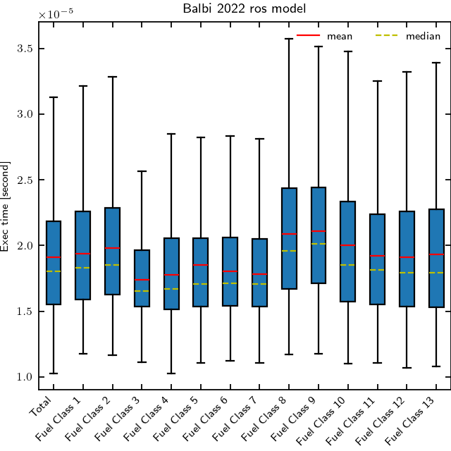

# Balbi_2022

## Workflow information

- Documentation page:
- Version: 1.0
- Date of record creation: 2024-12-03
- Date of upload to firebench: 2024-12-03
- Version/tag/commit firebench: 0.3.1a0

## Configuration

- Rate of spread model: Rothermel using `firebench.ros_models.Balbi_2022_fixed_SFIRE` implementation.
- Number of point Sobol: 2^10

## Specific inputs
<!-- Add specific input details for the model/data you are using -->
- The environmental variables chosen for this test are:
  - `WIND_SPEED` from -15 m s-1 to 15 m s-1,
  - `SLOPE_ANGLE` from -45 deg to 45 deg,
  - `FUEL_MOISTURE_CONTENT` from 1% to 50%.
- Default values are used for optional inputs.

## Hardware/software description

- Apple M2, macOS 14.7.1
- Python 3.10.8

## Results

<!-- Fill in with your results -->
**Fig.1**  shows the execution time aggregated for all fuel classes (total) and for each fuel class.
Minor discrepancies can be observed across fuel categories, mostly due to differences in the average number of iterations needed to converge.
Overall, the performance is very similar for each fuel category, and a mean execution time of 19.11 $\mu$s over 106,496 samples.

    <strong>
        Fig. 1
    </strong>
    :
    <em>
        Execution time boxplot for Balbi 2022 rate of spread model using Anderson13 fuel model. Fliers points not shown on the figure. 
    </em>

## Data
<!-- Add path or source of the record used for the test and its record -->
- path to data:
<!-- firebench-hash-list -->
- **01_generate_data.py**: `f239568a63427ebb83fb00cfa955088e2b1d35abdb063794b08303f4a7cdcef8`
- **02_plot_data.py**: `3252272615d568451b75cc700b6afd6b3b939904fe370cb3f4dd6fdd8129caec`
- **03_create_record.py**: `cf7544abadcf6ccd0497e11a87e674d594c1500fe3c212e76177650372c6ba0f`
- **firebench.log**: `d5104db25bf477348f8da4dd1f520a9c48a6ecd329c274478e7d45f56db9c683`
- **output_data.h5**: `75673400b6ae742a9b5e11ddd7340e68e216f872057c638f899d9cd0afc05e1f`
- **efficiency_box.png**: `6cdbb667bfb4a345c5f7597104d9db17af1432e9b061c404a8496c159f8a8552`
<!-- end of firebench-hash-list -->
