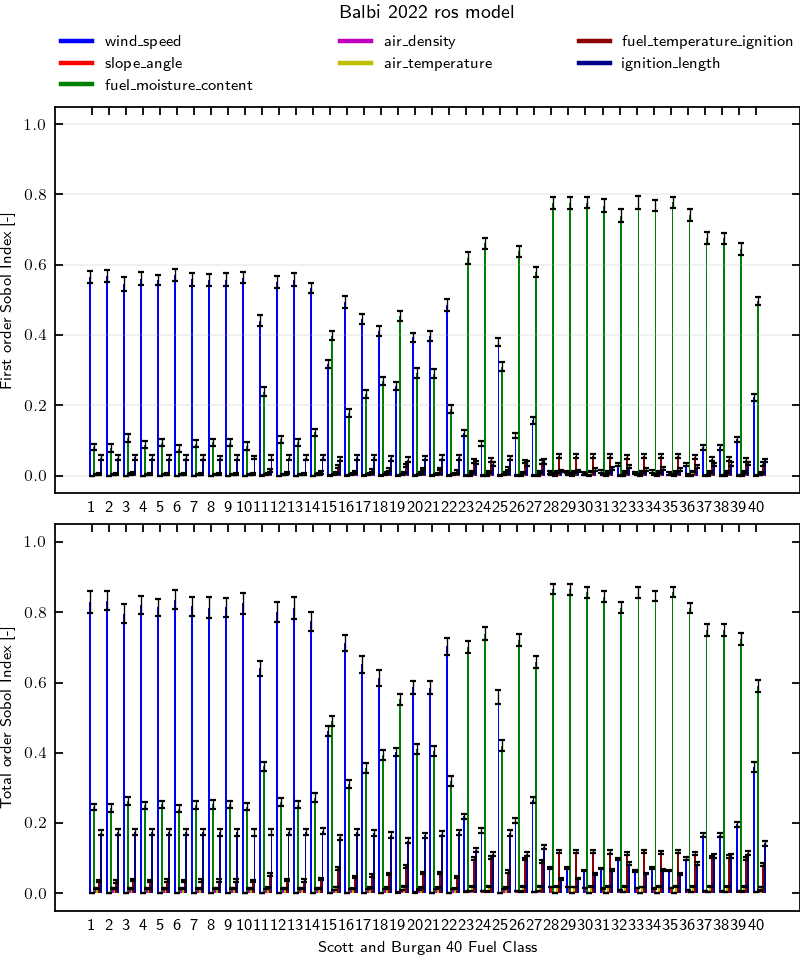

# Balbi 2022 using Scott and Burgan fuel model

## Workflow information

- Documentation page:
- Version: 1.0
- Date of record creation: 2024-11-24
- Date of upload to firebench: 2024-11-24
- Version/tag/commit firebench: 0.3.0a1

## Configuration

- Rate of spread model: Balbi 2022 using `firebench.ros_models.Balbi_2022_fixed_SFIRE` implementation.
- Number of point Sobol: 2^15

## Specific inputs
<!-- Add specific input details for the model/data you are using -->
The environmental variables chosen for this test are:
- Number of point Sobol: 32,768 = 2^15
- The environmental variables chosen for this test are:
  - `WIND_SPEED` from -15 to 15 m s-1,
  - `SLOPE_ANGLE` from -45 to 45 deg,
  - `FUEL_MOISTURE_CONTENT` from 1% to 50%.
  - `AIR_DENSITY` from 0.9 to 1.3 kg m-3.
  - `AIR_TEMPERATURE` from -20 to 45 celsius.
  - `FUEL_TEMPERATURE_IGNITION` from 450 to 700 K.
  - `IGNITION_LENGTH` from 10 to 50 m.
## Results

<!-- Fill in with your results -->
**Fig.1** shows first and total order Sobol indices for Balbi_2022_fixed_SFIRE rate of spread model for each class of the Anderson 13 fuel model.
The fuel moisture (green) is clearly the most influencial parameter for each fuel category with 40 to 80% of the variance explained.
The wind (blue) is the second most important parameter for each fuel category except 8 and 9 where it has negligible impact on the rate of spread.
The slope (red), air density (magenta), and air temperature (yellow) have a marginal influence on the rate of spread. Using default values for these parameters is recommended.
The ignition temperature (dark red) and the ignition length (dark blue) are of low importance.

    <strong>
        Fig. 1
    </strong>
    :
    <em>
        Sensitivity analysis of Balbi 2022 rate of spread model for Anderson fuel model. 
    </em>

## Data
<!-- Add path or source of the record used for the test and its record -->
<!-- firebench-hash-list -->
- **01_generate_data.py**: `cef2793330ffe09c9f580748098f8256b54b0f1f71302d1c1106de11c02472a8`
- **02_plot_data.py**: `741201c83734d3058b2f6039381608b1dbc457f60653f8481701cda29f6158ce`
- **03_create_record.py**: `1517e71d68efa090e01952a3c7e483289d01d26bb8b8001abc55c50d02a17b10`
- **firebench.log**: `7ed87a33c0e3639d04d836025f2ac21423906c8ca19a1c438bfe9eed705ce091`
- **output_data.h5**: `67a2f4e5a3271d68445578eb3a53f9a99f2b48e3ca25a0eea8172eb979414176`
- **sobol_index.png**: `4def0deff37d4b91b05fe4f2f1a2d339c3eea70771499bba96e5cf89e9ccf60d`
<!-- end of firebench-hash-list -->