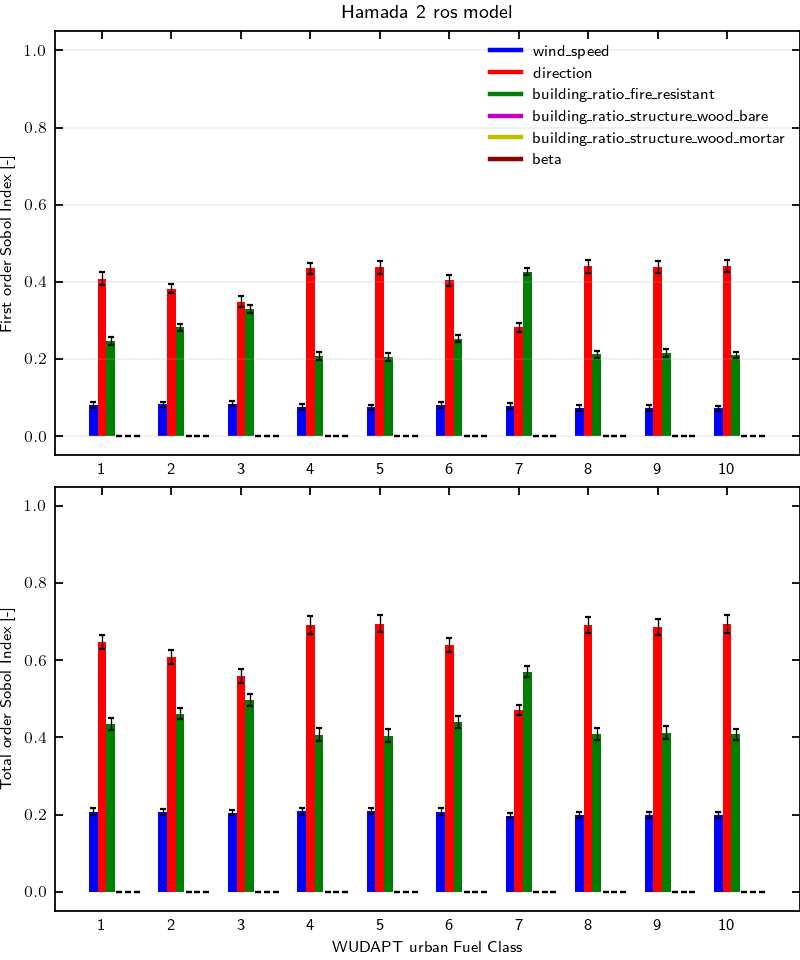

# Hamada 2 model validation using WUDAPT urban fuel model

## Workflow information

- Documentation page:
- Version: 1.0
- Date of record creation: 2024-12-05
- Date of upload to firebench: 2024-12-05
- Version/tag/commit firebench: 0.3.1

## Configuration

- Rate of spread model: Hamada 2 using `firebench.ros_models.Hamada_2` implementation.
- Number of point Sobol: 2^15
- The spread direction is fixed with (`NORMAL_SPREAD_DIR_X`, `NORMAL_SPREAD_DIR_Y`) = (1, 0)
- The wind speed and wind direction with change in the Sobol sequence and then be projected to get the necessary input for Hamada model `WIND_SPEED_U` and `WIND_SPEED_V`.

## Specific inputs
<!-- Add specific input details for the model/data you are using -->
- Number of point Sobol: 32,768 = 2^15
- The environmental variables chosen for this test are:
  - `WIND_SPEED` from 0 to 15 m s-1,
  - `DIRECTION` from 0 to 360 deg,
  - `BUILDING_RATIO_FIRE_RESISTANT` from 0 to 1.
  - `BUILDING_RATIO_STRUCTURE_WOOD_BARE` from 0 to 1.
  - `BUILDING_RATIO_STRUCTURE_WOOD_MORTAR` from 0 to 1.
  - `BETA` from 2 to 20.
  
## Results

<!-- Fill in with your results -->
**Fig.1** shows Sobol indices for Hamada 2 model for each fuel class of WUDAPT urban fuel model.
The wind direction and ratio of fire resistant buildings are the two most important parameters.
For class 3 they both represent around 35% of the variance.
For class 7, the ratio of fire resistance building is the most important paramter with 40% of the variance explained and less than 30% for wind direction.
For the other classes, the wind direction is the dominant parameter with around 40% of the variance explained and 20% for the ratio of fire resistant building.
The wind speed account for 10% of the variance for each fuel class.
The model is insensitive to the other three parameter.
Therefore, using the default value for them is recommended as their value does not change the output of the model. The model parameter `beta` can be set to 2 (but not less than 2 for stability reasons).
The total order analysis shows an even interaction between input variables as the total order is not changing the order of importance of the input variables.

    <strong>
        Fig. 1
    </strong>
    :
    <em>
        Sensitivity analysis of Hamada 2 rate of spread model for WUDAPT urban fuel model. 
    </em>

## Data
<!-- Add path or source of the record used for the test and its record -->
- path to data:
<!-- firebench-hash-list -->
- **01_generate_data.py**: `e4008e7b0297b57674703c5b4887f2c501c486657547bbbd4ea69a0802b51b67`
- **02_plot_data.py**: `1eea6af0baf8f7c2185578753f90a5ba7d953ead325fb3ad384ad5d97f3a4c34`
- **03_create_record.py**: `ab6f3b883dff750e808ccd9bda0e9e653547bfdf9800dedde89d6ae7ee02e3f2`
- **firebench.log**: `e3b0c44298fc1c149afbf4c8996fb92427ae41e4649b934ca495991b7852b855`
- **output_data.h5**: `84b65879cb24b049fc9bf84990e5837e2ae43714c5be127e2dd3efefec992efb`
- **sobol_index.png**: `91db08d0dc91203f8cf7c56d5f42471175959837bf88efbee3d3ed828afb09da`
<!-- end of firebench-hash-list -->
