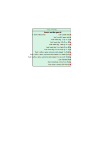

# Scott and Burgan fuel model
## Description
The Scott and Burgan 40 fuel model is an expanded classification system developed to enhance and refine the original Anderson 13 fuel models. This system, created by Joe H. Scott and Robert E. Burgan in 2005 [1], introduces 40 different fuel models to better capture the variety of vegetation types and fuel conditions found in wildland and wildland-urban interface areas across North America. These models address limitations of the Anderson system by incorporating a wider range of fuel characteristics, such as dynamic grass models that account for seasonal changes in fuel moisture. The Scott and Burgan models categorize fuel types into several groups: grass, shrub, timber understory, timber litter, and slash-blowdown. This improved classification allows for more precise fire behavior predictions, supporting better fire management and risk assessment in diverse landscapes.

## Firebench dataset content

Variable name in dataset    | Unit  | Standard Variable Name    | type      | Source
------------------------    | ----  | ----------------------    | ----      | ------
dead_fuel_extinction_moisture| ft     | fuel_moisture_extinction| float64   | [1]
fuel_bed_depth              | ft    | fuel_height               | float64   | [1]
fuel_load_1h                | ton acre-1| fuel_load_dry_1h      | float64   | [1]
fuel_load_10h               | ton acre-1| fuel_load_dry_10h     | float64   | [1]
fuel_load_100h              | ton acre-1| fuel_load_dry_100h    | float64   | [1]
fuel_load_live_herb         | ton acre-1| fuel_load_dry_live_herb | float64 | [1]
fuel_load_live_woody        | ton acre-1| fuel_load_dry_live_woody| float64 | [1]
fuel_model_code             |       |                           | object    | [1]
fuel_model_type             |       |                           | object    | [1]
heat_content                | BTU lb-1| fuel_heat_content       | float64   | [1]
sav_ratio_dead_1h           | ft-1  | fuel_surface_area_volume_ratio_dead_1h   | float64 | [1]
sav_ratio_live_herb         | ft-1  | fuel_surface_area_volume_ratio_live_herb | float64 | [1]
sav_ratio_live_woody        | ft-1  | fuel_surface_area_volume_ratio_live_woody| float64 | [1]

## Usage

Import the Anderson fuel model data using `FireBench` with:
```python
import firebench.tools as ft
fuel_data = ft.read_fuel_data_file("ScottandBurgan40")
```
The data is stored in the dictionnary `fuel_data`. The keys are the standard variable names and the values are numpy array associated with pint unit.

<div style="text-align: center;">
    
</div>

## Compatibility with fire models

Compatibility levels:
- **Full**: The data contained in the fuel model covers *all* the fuel input needed by the fire model
- **Partial**: The data contained in the fuel model covers *some* of the fuel input needed by the fire model
- **None**: The data contained in the fuel model covers *none* of the fuel input needed by the fire model


Fire model              | Category          | Compatibility level
----------              | --------          | -----------------
Rothermel_SFIRE         | ROS vegetation    | Full
Balbi_2022_fixed_SFIRE  | ROS vegetation    | Partial
Hamada_1                | ROS urban         | None
Hamada_2                | ROS urban         | None


## References

[1] [Scott, J. H. (2005). Standard fire behavior fuel models: a comprehensive set for use with Rothermel's surface fire spread model. US Department of Agriculture, Forest Service, Rocky Mountain Research Station.](https://www.fs.usda.gov/rm/pubs_series/rmrs/gtr/rmrs_gtr153.pdf)