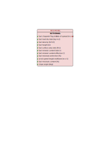

# Rothermel_SFIRE
## Description

The Rothermel rate of spread model is a widely used empirical model for predicting the spread rate of surface fires.
Developed by Richard C. Rothermel in 1972 [1], it calculates the forward rate of fire spread based on fuel characteristics, environmental conditions, and topography.
The model integrates parameters like fuel load, moisture, wind speed, and slope to estimate how quickly a fire will move across a landscape [2].
While primarily used for grass, shrub, and forested areas, the Rothermel model is the foundation for many fire behavior prediction systems, such as BEHAVE and FARSITE, providing essential insights for wildfire management and planning.

## Parameters
### Input table

Variable name in model      | Unit  | Standard Variable Name    | type      | Bounds
------------------------    | ----  | ----------------------    | ----      | ------
fgi                         | kg m-2| fuel_load_dry_total       | float64   | $$]0, \infty[$$
fueldens                    | lb ft-3| fuel_density             | float64   | $$]0, \infty[$$
fueldepthm                  | m     | fuel_height               | float64   | $$]0, \infty[$$
fuelmce                     | %     | fuel_moisture_extinction  | float64   | $$]0, \infty[$$
fmc                         | %     | fuel_moisture_content     | float64   | $$[0, 200]$$
ichap                       | -     | fuel_chaparral_flag       | int32     | $$[0, 1]$$
savr                        | ft-1  | fuel_surface_area_volume_ratio| float64| $$]0, \infty[$$
se                          | -     | fuel_mineral_content_effective| float64| $$[0, 1]$$
slope                       | deg   | slope_angle               | float64   | $$]-90, 90[$$
st                          | -     | fuel_mineral_content_total| float64   | $$[0, 1]$$
wind                        | -     | wind_speed                | float64   | $$]-\infty, \infty[$$
windrf                      | -     | fuel_wind_reduction_factor| float64   | $$[0, 1]$$

### Outputs

Variable name in model      | Unit  | Standard Variable Name    | type      | Bounds
------------------------    | ----  | ----------------------    | ----      | ------
ros                         | m s-1 | rate_of_spread            | float64   | $$[0, 6]$$

### Internal parameters

Name in model   | Description               | Unit      | Value
--------------- | ------------------------- | --------- | ---------
cmbcnst         | Combustion enthalpy       | J kg-1    | $$17.433 \cdot 10^6$$

<!-- ### Internal unit conversion coefficient

From        | To        | Value
----------- | --------- | -----
J kg-1      | BTU lb-1  | $$4.30 \cdot 10^{4}$$
kg m-2      | lb ft-2   | $$0.3048^2 \times 2.205$$
m           | ft        | $$1 / 0.3048$$
m s-1       | ft min-1  | $$196.850$$
ft min-1    | m s-1     | $$0.00508$$ -->

## Usage

### General use
The Rothermel_SFIRE model is a class derived from `firebench.ros_models.RateOfSpreadModel`.
```python
# Import rate of spread package from firebench
import firebench.ros_models as rm
# create the input dictionnary with the inputs listed above
model_inputs = {...}
# compute the rate of spread
ros = rm.Rothermel_SFIRE.compute_ros(model_inputs)
# compute the rate of spread with fuel category
ros = rm.Rothermel_SFIRE.compute_ros(model_inputs, fuel_cat = 1)
```
<div style="text-align: center;">
    
</div>

### Use with Anderson13 fuel model

The [Anderson13](../21_fuel_models/02_Anderson.md) fuel model provides a set of fuel properties that can be linked to Rothermel_SFIRE's inputs. The following diagram shows the workflow that can be used to connect Anderson fuel model and Rothermel rate of spread model.

**Fig. 1** shows an example of usage with Anderson’s fuel model.
It uses constant environmental inputs for wind, slope, and fuel moisture. 
It also uses the wind reduction factor from the Anderson fuel model, considering the wind input height to be *20ft above vegetation level*.
All fuel properties are contained within the Anderson Fuel Model, which makes it fully compatible with Rothermel’s rate of spread model.

<div style="text-align: center;">
    
</div>
<p style="text-align: center;">
    <strong>
        Fig. 1
    </strong>
    :
    <em>
        Usage of Anderson fuel model for Rothermel_SFIRE rate of spread model. 
    </em>
</p>

An example of use of Anderson fuel model with Rothermel_SFIRE, corresponding the **Fig. 1** diagram:
```python
import firebench as fb

# Define constant values as fb.Quantity (not pint.Quantity that does not share the same unit registry)
wind_speed_20ft = fb.Quantity(3.0, "m/s")
fuel_moisture = fb.Quantity(12, "percent")
slope = fb.Quantity(0, "degree")
fuel_class = 3  # one based index of the fuel class

# Select the rate of spread model class
ros_model = fb.ros_models.Rothermel_SFIRE

# Import Anderson data
fuel_data = fb.tools.read_fuel_data_file("Anderson13")

# Use wind reduction factor from fuel model
wind_speed_midflame = fb.wind_interpolation.apply_wind_reduction_factor(
    wind_speed=wind_speed_20ft,
    wind_reduction_factor=fuel_data[fb.svn.FUEL_WIND_REDUCTION_FACTOR],
    fuel_cat=fuel_class,
)

# Merge the fuel dict and the constant inputs
input_dict = fb.tools.merge_dictionaries(
    {
        fb.svn.WIND_SPEED: wind_speed_midflame,
        fb.svn.FUEL_MOISTURE_CONTENT: fuel_moisture,
        fb.svn.SLOPE_ANGLE: slope,
    },
    fuel_data,
)

# perform checks, conversion and magnitude extraction
final_input = fb.tools.check_data_quality_ros_model(input_dict, ros_model)

# compute the rate of spread
ros = ros_model.compute_ros_with_units(final_input, fuel_cat=fuel_class)
```

### Use with Scott and Burgan fuel model


The [Scott and Burgan](../21_fuel_models/03_SB40.md) fuel model provides a set of fuel properties that can be linked to Rothermel_SFIRE's inputs. The following diagram shows the workflow that can be used to connect Scott and Burgan fuel model and Rothermel rate of spread model.

**Fig. 2** shows an example of usage with the Scott and Burgan fuel model.
It uses constant environmental inputs for wind, slope, and fuel moisture. 
All the inputs needed for Rothermel_SFIRE are not directly present in SB40.
The total surface area to volume ratio and the total fuel load are obtained using the weighted average (already implemented in `add_scott_and_burgan_total_savr`, and `add_scott_and_burgan_total_fuel_load`).
The wind reduction factor is computed using the `Baughman_generalized_wind_reduction_factor_unsheltered` scheme, regardless of the input wind height (considered above ground level in this example).
The missing fuel properties (fuel density, total and effective mineral content) are considered constant.
These values are not present in SB40 but are constant for each fuel class in A13.
Therefore, the same values are used, and the compatibility with Rothermel_SFIRE model is considered as full.

<div style="text-align: center;">
    
</div>
<p style="text-align: center;">
    <strong>
        Fig. 2
    </strong>
    :
    <em>
        Usage of Scott and Burgan fuel model for Rothermel_SFIRE rate of spread model. 
    </em>
</p>

An example of use of Scott and Burgan fuel model with Rothermel_SFIRE, corresponding the **Fig. 2** diagram:
```python
import firebench as fb

# Define constant values as fb.Quantity (not pint.Quantity that does not share the same unit registry)
wind_speed_height = fb.Quantity(10, "m")
is_source_wind_height_above_vegetation = False  # wind is given above ground level, set to True for wind height above vegetation level
wind_speed = fb.Quantity(3.0, "m/s")
fuel_density = fb.Quantity(32, "lb/ft^3")
fuel_mineral_content_total = fb.Quantity(0.055, "dimensionless")
fuel_mineral_content_effective = fb.Quantity(0.01, "dimensionless")
fuel_moisture = fb.Quantity(12, "percent")
slope = fb.Quantity(0, "degree")
fuel_class = 3  # one based index of the fuel class

# Select the rate of spread model class
ros_model = fb.ros_models.Rothermel_SFIRE

# Import Anderson data
fuel_data = fb.tools.read_fuel_data_file("ScottandBurgan40")

# Add total fuel load and savr
fb.tools.add_scott_and_burgan_total_fuel_load(fuel_data)
fb.tools.add_scott_and_burgan_total_savr(fuel_data)

# Convert fuel height to meter
fuel_data[fb.svn.FUEL_HEIGHT] = fuel_data[fb.svn.FUEL_HEIGHT].to("m")

# Create and apply wind reduction factor
## Assume flame height to vegetation height ratio is 1 (as in Baughman et al. 1979)
vegetation_height = fb.tools.get_value_by_category(fuel_data[fb.svn.FUEL_HEIGHT], fuel_class)

## calculate the wind reduction factor for the configuration
wind_red_factor = fb.wind_interpolation.Baughman_generalized_wind_reduction_factor_unsheltered(
    input_wind_height=wind_speed_height,
    flame_height=vegetation_height,
    vegetation_height=vegetation_height,
    is_source_wind_height_above_veg=is_source_wind_height_above_vegetation,
)

## Apply it to wind input
wind_speed_midflame = fb.wind_interpolation.apply_wind_reduction_factor(wind_speed, wind_red_factor)

# Merge the fuel dict and the constant inputs
input_dict = fb.tools.merge_dictionaries(
    {
        fb.svn.WIND_SPEED: wind_speed_midflame,
        fb.svn.FUEL_MOISTURE_CONTENT: fuel_moisture,
        fb.svn.SLOPE_ANGLE: slope,
        fb.svn.FUEL_CHAPARRAL_FLAG: fb.Quantity(0, "dimensionless"),
        fb.svn.FUEL_DENSITY: fb.Quantity(32, "lb/ft^3"),
        fb.svn.FUEL_MINERAL_CONTENT_TOTAL: fb.Quantity(0.055, "dimensionless"),
        fb.svn.FUEL_MINERAL_CONTENT_EFFECTIVE: fb.Quantity(0.01, "dimensionless"),
    },
    fuel_data,
)

# perform checks, conversion and magnitude extraction
final_input = fb.tools.check_data_quality_ros_model(input_dict, ros_model)

# compute the rate of spread
ros = ros_model.compute_ros_with_units(final_input, fuel_cat=fuel_class)
```

## Compatibility with fire models

Compatibility levels for **fuel models**:
- **Full**: The data contained in the fuel model covers *all* the fuel input needed by the fire model
- **Partial**: The data contained in the fuel model covers *some* of the fuel input needed by the fire model
- **None**: The data contained in the fuel model covers *none* of the fuel input needed by the fire model


Fire model              | Category          | Compatibility level
----------              | --------          | -----------------
Anderson13              | Fuel model        | Full
ScottandBurgan40        | Fuel model        | Full

## Benchmarks and workflows

- [Sensitivity to environmental variables for Anderson 13 categories](/worflows_0D_models/rate_of_spread_models/sensitivity/Rothermel/Rothermel.html)

## References

[1] Rothermel, R. C. (1972). A mathematical model for predicting fire spread in wildland fuels (Vol. 115). Intermountain Forest & Range Experiment Station, Forest Service, US Department of Agriculture.

[2] [Andrews, P. L. (2018). The Rothermel surface fire spread model and associated developments: A comprehensive explanation. Gen. Tech. Rep. RMRS-GTR-371. Fort
Collins, CO: U.S. Department of Agriculture, Forest Service, Rocky Mountain Research
Station. 121 p.](https://www.fs.usda.gov/rm/pubs_series/rmrs/gtr/rmrs_gtr371.pdf)