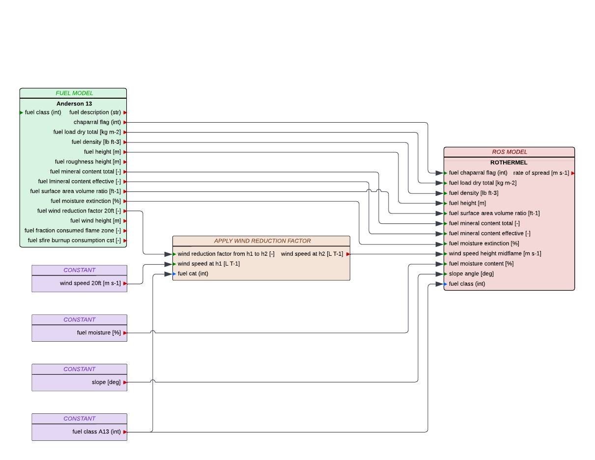

# Balbi_2022_fixed_SFIRE
## Description

The Balbi rate of spread model [1], recently extended by Chatellon et al. in 2022 [2, 3], is a physical-based model designed to predict the rate at which wildfires spread, particularly within shrubland ecosystems. Unlike empirical models, the Balbi model accounts for detailed physical interactions between fuel characteristics, atmospheric conditions, and fire behavior, offering a robust framework for modeling fire spread in complex vegetation types. The 2022 extension specifically adapts the model for field-scale shrubland fires, incorporating the effects of environmental variables such as wind and slope on flame dynamics and heat transfer processes. This version refines the model's application to heterogeneous fuel beds, enhancing its predictive accuracy and reliability for real-world fire conditions.

## Parameters
### Input table

Variable name in model      | Unit  | Standard Variable Name    | type      | Bounds
------------------------    | ----  | ----------------------    | ----      | ------
fgi                         | kg m-2| fuel_load_dry_total       | float64   | $$]0, \infty[$$
fueldens                    | kg m-3| fuel_density             | float64   | $$]0, \infty[$$
fueldepthm                  | m     | fuel_height               | float64   | $$]0, \infty[$$
fuelmce                     | %     | fuel_moisture_extinction  | float64   | $$]0, \infty[$$
fmc                         | %     | fuel_moisture_content     | float64   | $$[0, 200]$$
savr                        | m-1   | fuel_surface_area_volume_ratio| float64| $$]0, \infty[$$
slope                       | deg   | slope_angle               | float64   | $$]-90, 90[$$
wind                        | -     | wind_speed                | float64   | $$]-\infty, \infty[$$
windrf                      | -     | fuel_wind_reduction_factor| float64   | $$[0, 1]$$

### Outputs

Variable name in model      | Unit  | Standard Variable Name    | type      | Bounds
------------------------    | ----  | ----------------------    | ----      | ------
ros                         | m s-1 | rate_of_spread            | float64   | $$[0, 6]$$

### Optional input table

Name in model   | Description               | Unit      | Value
--------------- | ------------------------- | --------- | ---------
chi0            | Radiative factor          | -         | $$0.3$$
rhoa            | Far-field air density     | kg m-3    | $$1.125$$
Ta              | Far-field air temperature | K         | $$300$$
Ti              | Fuel ignition temperature | K         | $$600$$
w0              | Ignition line width       | m         | $$50$$

### Internal parameters

Name in model   | Description               | Unit      | Value
--------------- | ------------------------- | --------- | ---------
boltz           | Stefan-Boltzman constant  | W m-2 K-4 | $$5.670373 \cdot 10^{-8}$$
Cp              | Specific heat of fuel     | J kg-1 K-1| $$1200$$
Cpa             | Specific heat of air      | J kg-1 K-1| $$1150$$
Cpw             | Specific heat of liquid water| J kg-1 K-1| $$4180$$
delta_h         | Heat of latent evaporation| J kg-1    | $$2.3 \cdot 10^6$$
delta_H         | Heat of combustion        | J kg-1    | $$1.7433 \cdot 10^7$$
g               | Gravitational acceleration| m s-2     | $$9.81$$
r00             | Model parameter           |           | $$2.5 \cdot 10^{-5}$$
scal_am         | scaling factor $$a_m$$    | -         | $$0.025$$
st              | Stoichiometric coefficient| -         | $$17$$
tol             | tolerance for fixed point method | -  | $$10^{-4}$$
Tvap            | Liquid water evaporation temperature| K | $$373.15$$
tau0            | Anderson's residence time coefficient| s m-1 | $$75591$$

## Usage

### General use
The Balbi_2022_fixed_SFIRE model is a class derived from `firebench.ros_models.RateOfSpreadModel`.
```python
# Import rate of spread package from firebench
import firebench.ros_models as rm
# create the input dictionnary with the inputs listed above
model_inputs = {...}
# compute the rate of spread
ros = rm.Balbi_2022_fixed_SFIRE.compute_ros(model_inputs)
```

### Use with Anderson13 fuel model

The [Anderson13](../21_fuel_models/02_Anderson.md) fuel model provides a set of fuel properties that can be linked to Balbi's inputs. The following diagram shows the workflow that can be used to connect Anderson fuel model and Balbi rate of spread model.

Fig. 1 shows an example of usage with Anderson fuel model.
It uses constant environemental inputs for wind, slope and fuel moisture. 
It also uses the wind reduction factor from Anderson fuel model.

<!-- <div style="text-align: center;">
    
</div>
<p style="text-align: center;">
    <strong>
        Fig. 1
    </strong>
    :
    <em>
        Usage of Anderson fuel model for Rothermel_SFIRE rate of spread model. 
    </em>
</p> -->

### Use with Scott and Burgan fuel model

The [Scott and Burgan](../21_fuel_models/03_SB40.md) fuel model provides a set of fuel properties that can be linked to Balbi's inputs. The following diagram shows the workflow that can be used to connect Scott and Burgan fuel model and Balbi rate of spread model.

Fig. 2 shows an example of usage with Scott and Burgan fuel model.
It uses constant environemental inputs for wind, slope and fuel moisture. 
As all the inputs needed for Rothermel_SFIRE are not directly present in SB40, we need to complement the inputs from another source of information or to combine SB40 properties together.
For example, the fuel load input for Rothermel is the sum of the fuel loads for the different fuel sizes in Scott and Burgan.
As Scott and Burgan dataset does not contain the fuel density and wind reduction factors, we can use a correspodance table to get this information from Anderson fuel model instead.
It also uses the wind reduction factor from Anderson fuel model.

<!-- <div style="text-align: center;">
    
</div>
<p style="text-align: center;">
    <strong>
        Fig. 2
    </strong>
    :
    <em>
        Usage of Scott and Burgan fuel model for Rothermel_SFIRE rate of spread model. 
    </em>
</p> -->

## Compatibility with fire models

Compatibility levels for **fuel models**:
- **Full**: The data contained in the fuel model covers *all* the fuel input needed by the fire model
- **Partial**: The data contained in the fuel model covers *some* of the fuel input needed by the fire model
- **None**: The data contained in the fuel model covers *none* of the fuel input needed by the fire model


Fire model              | Category          | Compatibility level
----------              | --------          | -----------------
Anderson13              | Fuel model        | Full
ScottandBurgan40        | Fuel model        | Partial

## Benchmarks and workflows

## References

[1] [Balbi, J. H., Morandini, F., Silvani, X., Filippi, J. B., & Rinieri, F. (2009). A physical model for wildland fires. Combustion and Flame, 156(12), 2217-2230.](https://doi.org/10.1016/j.combustflame.2009.07.010)

[2] [Balbi, J. H., Chatelon, F. J., Morvan, D., Rossi, J. L., Marcelli, T., & Morandini, F. (2020). A convective–radiative propagation model for wildland fires. International journal of wildland fire, 29(8), 723-738.](https://doi.org/10.1071/WF19103)

[3] [Chatelon, F. J., Balbi, J. H., Cruz, M. G., Morvan, D., Rossi, J. L., Awad, C., ... & Marcelli, T. (2022). Extension of the Balbi fire spread model to include the field scale conditions of shrubland fires. International journal of wildland fire, 31(2), 176-192.](https://doi.org/10.1071/WF21082)
