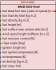

# Balbi_2022_fixed_SFIRE
## Description

The Balbi rate of spread model [1], recently extended by Chatellon et al. in 2022 [2, 3], is a physical-based model designed to predict the rate at which wildfires spread, particularly within shrubland ecosystems. Unlike empirical models, the Balbi model accounts for detailed physical interactions between fuel characteristics, atmospheric conditions, and fire behavior, offering a robust framework for modeling fire spread in complex vegetation types. The 2022 extension specifically adapts the model for field-scale shrubland fires, incorporating the effects of environmental variables such as wind and slope on flame dynamics and heat transfer processes. This version refines the model's application to heterogeneous fuel beds, enhancing its predictive accuracy and reliability for real-world fire conditions.

## Parameters
### Input table

Variable name in model      | Unit  | Standard Variable Name    | type      | Bounds
------------------------    | ----  | ----------------------    | ----      | ------
dead_fuel_ratio             | -     | fuel_load_dead_ratio      | float64   | $$]0, 1]$$
fgi                         | kg m-2| fuel_load_dry_total       | float64   | $$]0, \infty[$$
fueldens                    | kg m-3| fuel_density              | float64   | $$]0, \infty[$$
fueldepthm                  | m     | fuel_height               | float64   | $$]0, \infty[$$
fmc                         | %     | fuel_moisture_content     | float64   | $$[0, 200]$$
savr                        | m-1   | fuel_surface_area_volume_ratio| float64| $$]0, \infty[$$
slope                       | deg   | slope_angle               | float64   | $$]-90, 90[$$
wind                        | -     | wind_speed                | float64   | $$]-\infty, \infty[$$

### Outputs

Variable name in model      | Unit  | Standard Variable Name    | type      | Bounds
------------------------    | ----  | ----------------------    | ----      | ------
ros                         | m s-1 | rate_of_spread            | float64   | $$[0, 6]$$

### Optional input table

Name in model   | Standard Variable Name    | Unit      | Value
--------------- | ------------------------- | --------- | ---------
rhoa            | air_density               | kg m-3    | $$1.125$$
Ta              | air_temperature           | K         | $$300$$
Ti              | fuel_temperature_ignition | K         | $$600$$
w0              | ignition_length           | m         | $$50$$

### Internal parameters

Name in model   | Description               | Unit      | Value
--------------- | ------------------------- | --------- | ---------
boltz           | Stefan-Boltzman constant  | W m-2 K-4 | $$5.670373 \cdot 10^{-8}$$
chi0            | Radiative factor          | -         | $$0.3$$
Cp              | Specific heat of fuel     | J kg-1 K-1| $$1200$$
Cpa             | Specific heat of air      | J kg-1 K-1| $$1150$$
Cpw             | Specific heat of liquid water| J kg-1 K-1| $$4180$$
delta_h         | Heat of latent evaporation| J kg-1    | $$2.3 \cdot 10^6$$
delta_H         | Heat of combustion        | J kg-1    | $$1.7433 \cdot 10^7$$
g               | Gravitational acceleration| m s-2     | $$9.81$$
r00             | Model parameter           |           | $$2.5 \cdot 10^{-5}$$
scal_am         | scaling factor $$a_m$$    | -         | $$0.025$$
st              | Stoichiometric coefficient| -         | $$17$$
tol             | tolerance for fixed point method | -  | $$10^{-4}$$
Tvap            | Liquid water evaporation temperature| K | $$373.15$$
tau0            | Anderson's residence time coefficient| s m-1 | $$75591$$

## Usage

### General use
The Balbi_2022_fixed_SFIRE model is a class derived from `firebench.ros_models.RateOfSpreadModel`.
```python
# Import rate of spread package from firebench
import firebench.ros_models as rm
# create the input dictionnary with the inputs listed above
model_inputs = {...}
# compute the rate of spread
ros = rm.Balbi_2022_fixed_SFIRE.compute_ros(model_inputs)
# compute the rate of spread with fuel category
ros = rm.Balbi_2022_fixed_SFIRE.compute_ros(model_inputs, fuel_cat = 1)
```


### Use with Anderson13 fuel model

The [Anderson13](../21_fuel_models/02_Anderson.md) fuel model provides a set of fuel properties that can be linked to Balbi's inputs. The following diagram shows the workflow that can be used to connect Anderson fuel model and Balbi rate of spread model.

**Fig. 1** shows an example of usage with Anderson’s fuel model.
It uses constant environmental inputs for wind, slope, and fuel moisture. 
It also uses the wind reduction factor from the Anderson fuel model, considering the wind input height to be *20ft above vegetation level*.
All fuel properties are contained within the Anderson Fuel Model, which makes it fully compatible with Rothermel’s rate of spread model.


<p style="text-align: center;">
    <strong>
        Fig. 1
    </strong>
    :
    <em>
        Usage of Anderson fuel model for Balbi_2022_fixed_SFIRE rate of spread model. 
    </em>
</p>


An example of use of Anderson fuel model with Balbi_2022_fixed_SFIRE, corresponding the **Fig. 1** diagram:
```python
import firebench as fb

# Define constant values as fb.Quantity (not pint.Quantity that does not share the same unit registry)
dead_fuel_ratio = fb.Quantity(1, "dimensionless")
wind_speed_20ft = fb.Quantity(3.0, "m/s")
fuel_moisture = fb.Quantity(12, "percent")
slope = fb.Quantity(0, "degree")
fuel_class = 3  # one based index of the fuel class

# Select the rate of spread model class
ros_model = fb.ros_models.Balbi_2022_fixed_SFIRE

# Import Anderson data
fuel_data = fb.tools.read_fuel_data_file("Anderson13")

# Use wind reduction factor from fuel model
wind_speed_midflame = fb.wind_interpolation.apply_wind_reduction_factor(
    wind_speed=wind_speed_20ft,
    wind_reduction_factor=fuel_data[fb.svn.FUEL_WIND_REDUCTION_FACTOR],
    fuel_cat=fuel_class,
)

# Merge the fuel dict and the constant inputs
input_dict = fb.tools.merge_dictionaries(
    {
        fb.svn.FUEL_LOAD_DEAD_RATIO: dead_fuel_ratio,
        fb.svn.WIND_SPEED: wind_speed_midflame,
        fb.svn.FUEL_MOISTURE_CONTENT: fuel_moisture,
        fb.svn.SLOPE_ANGLE: slope,
    },
    fuel_data,
)

# perform checks, conversion and magnitude extraction
final_input = fb.tools.check_data_quality_ros_model(input_dict, ros_model)

# compute the rate of spread
ros = ros_model.compute_ros_with_units(final_input, fuel_cat=fuel_class)
```

### Use with Scott and Burgan fuel model

The [Scott and Burgan](../21_fuel_models/03_SB40.md) fuel model provides a set of fuel properties that can be linked to Balbi's inputs. The following diagram shows the workflow that can be used to connect Scott and Burgan fuel model and Balbi rate of spread model.

**Fig. 2** shows an example of usage with the Scott and Burgan fuel model.
It uses constant environmental inputs for wind, slope, and fuel moisture. 
All the inputs needed for Balbi_2022_fixed_SFIRE are not directly present in SB40.
The total surface area to volume ratio and the total fuel load are obtained using the weighted average (already implemented in `add_scott_and_burgan_total_savr`, `add_scott_and_burgan_total_fuel_load`, and `add_scott_and_burgan_dead_fuel_ratio`).
The wind reduction factor is computed using the `Baughman_generalized_wind_reduction_factor_unsheltered` scheme, regardless of the input wind height (considered above ground level in this example).
The missing fuel properties (fuel density) are considered constant.
These values are not present in SB40 but are constant for each fuel class in A13.
Therefore, the same values are used, and the compatibility with Balbi_2022_fixed_SFIRE model is considered as full.


<p style="text-align: center;">
    <strong>
        Fig. 2
    </strong>
    :
    <em>
        Usage of Scott and Burgan fuel model for Balbi_2022_fixed_SFIRE rate of spread model. 
    </em>
</p>

An example of use of Scott and Burgan fuel model with Rothermel_SFIRE, corresponding the **Fig. 2** diagram:
```python
import firebench as fb

# Define constant values as fb.Quantity (not pint.Quantity that does not share the same unit registry)
wind_speed_height = fb.Quantity(10, "m")
is_source_wind_height_above_vegetation = (
    False  # wind is given above ground level, set to True for wind height above vegetation level
)
wind_speed = fb.Quantity(3.0, "m/s")
fuel_density = fb.Quantity(32, "lb/ft^3")
fuel_moisture = fb.Quantity(12, "percent")
slope = fb.Quantity(0, "degree")
fuel_class = 3  # one based index of the fuel class

# Select the rate of spread model class
ros_model = fb.ros_models.Balbi_2022_fixed_SFIRE

# Import Anderson data
fuel_data = fb.tools.read_fuel_data_file("ScottandBurgan40")

# Add total fuel load and savr
fb.tools.add_scott_and_burgan_total_fuel_load(fuel_data)
fb.tools.add_scott_and_burgan_total_savr(fuel_data)
fb.tools.add_scott_and_burgan_dead_fuel_ratio(fuel_data)

# Convert fuel height to meter
fuel_data[fb.svn.FUEL_HEIGHT] = fuel_data[fb.svn.FUEL_HEIGHT].to("m")

# Create and apply wind reduction factor
## Assume flame height to vegetation height ratio is 1 (as in Baughman et al. 1979)
vegetation_height = fb.tools.get_value_by_category(fuel_data[fb.svn.FUEL_HEIGHT], fuel_class)

## calculate the wind reduction factor for the configuration
wind_red_factor = fb.wind_interpolation.Baughman_generalized_wind_reduction_factor_unsheltered(
    input_wind_height=wind_speed_height,
    flame_height=vegetation_height,
    vegetation_height=vegetation_height,
    is_source_wind_height_above_veg=is_source_wind_height_above_vegetation,
)

## Apply it to wind input
wind_speed_midflame = fb.wind_interpolation.apply_wind_reduction_factor(wind_speed, wind_red_factor)

# Merge the fuel dict and the constant inputs
input_dict = fb.tools.merge_dictionaries(
    {
        fb.svn.WIND_SPEED: wind_speed_midflame,
        fb.svn.FUEL_MOISTURE_CONTENT: fuel_moisture,
        fb.svn.SLOPE_ANGLE: slope,
        fb.svn.FUEL_DENSITY: fb.Quantity(32, "lb/ft^3"),
    },
    fuel_data,
)

# perform checks, conversion and magnitude extraction
final_input = fb.tools.check_data_quality_ros_model(input_dict, ros_model)

# compute the rate of spread
ros = ros_model.compute_ros_with_units(final_input, fuel_cat=fuel_class)
```

## Compatibility with fire models

Compatibility levels for **fuel models**:
- **Full**: The data contained in the fuel model covers *all* the fuel input needed by the fire model
- **Partial**: The data contained in the fuel model covers *some* of the fuel input needed by the fire model
- **None**: The data contained in the fuel model covers *none* of the fuel input needed by the fire model


Fire model              | Category          | Compatibility level
----------              | --------          | -----------------
Anderson13              | Fuel model        | Full
ScottandBurgan40        | Fuel model        | Full

## Benchmarks and workflows

## References

[1] [Balbi, J. H., Morandini, F., Silvani, X., Filippi, J. B., & Rinieri, F. (2009). A physical model for wildland fires. Combustion and Flame, 156(12), 2217-2230.](https://doi.org/10.1016/j.combustflame.2009.07.010)

[2] [Balbi, J. H., Chatelon, F. J., Morvan, D., Rossi, J. L., Marcelli, T., & Morandini, F. (2020). A convective–radiative propagation model for wildland fires. International journal of wildland fire, 29(8), 723-738.](https://doi.org/10.1071/WF19103)

[3] [Chatelon, F. J., Balbi, J. H., Cruz, M. G., Morvan, D., Rossi, J. L., Awad, C., ... & Marcelli, T. (2022). Extension of the Balbi fire spread model to include the field scale conditions of shrubland fires. International journal of wildland fire, 31(2), 176-192.](https://doi.org/10.1071/WF21082)
