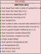

# Santoni2011
## Description

The Santoni wildfire spread model, presented by Santoni et al. in 2011 [1], is a physics-based approach developed to simulate wildfire dynamics in Mediterranean shrubland and forest fuels. The model distinguishes between dead and live fuels, a feature uncommon in typical rate of spread models, and integrates fundamental heat transfer mechanisms, such as radiation, to describe flame geometry, fuel consumption, and fire front propagation. By explicitly accounting for these physical processes, the Santoni model reliably predicts fire behavior in heterogeneous vegetation scenarios. The FireBench implementation follows [2].

## Parameters
### Input table

Variable name in model      | Unit  | Standard Variable Name    | type      | Bounds
------------------------    | ----  | ----------------------    | ----      | ------
dead_fuel_ratio             | -     | fuel_load_dead_ratio      | float64   | $$]0, 1]$$
fuel_dens_dead              | kg m-3| fuel_density_dead         | float64   | $$]0, \infty[$$
fueldens_live               | kg m-3| fuel_density_live         | float64   | $$]0, \infty[$$
fueldepth                   | m     | fuel_height               | float64   | $$]0, \infty[$$
fuel_load_dry_total         | kg m-2| fuel_load_dry_total       | float64   | $$]0, \infty[$$
fmc_dead                    | %     | fuel_moisture_content_dead| float64   | $$[0, 200]$$
fmc_live                    | %     | fuel_moisture_content_live| float64   | $$[0, 500]$$
savr_dead                   | m-1   | fuel_surface_area_volume_ratio_dead| float64| $$]0, \infty[$$
savr_live                   | m-1   | fuel_surface_area_volume_ratio_live| float64| $$]0, \infty[$$
slope                       | deg   | slope_angle               | float64   | $$]-90, 90[$$
wind                        | -     | wind_speed                | float64   | $$]-\infty, \infty[$$

### Outputs

Variable name in model      | Unit  | Standard Variable Name    | type      | Bounds
------------------------    | ----  | ----------------------    | ----      | ------
ros                         | m s-1 | rate_of_spread            | float64   | $$[0, 6]$$

### Optional input table

Name in model   | Standard Variable Name    | Unit      | Value
--------------- | ------------------------- | --------- | ---------
dens_air        | air_density               | kg m-3    | $$1.125$$
temp_air        | air_temperature           | K         | $$300$$
temp_ign        | fuel_temperature_ignition | K         | $$600$$

### Internal parameters

Name in model   | Description               | Unit      | Value
--------------- | ------------------------- | --------- | ---------
base_LAI        | Base leaf area index      | -         | $$4$$
boltz           | Stefan-Boltzman constant  | W m-2 K-4 | $$5.670373 \cdot 10^{-8}$$
chi0            | Radiative factor          | -         | $$0.3$$
Cp              | Specific heat of fuel     | J kg-1 K-1| $$1200$$
Cpa             | Specific heat of air      | J kg-1 K-1| $$1150$$
delta_h         | Heat of latent evaporation| J kg-1    | $$2.3 \cdot 10^6$$
delta_H         | Heat of combustion        | J kg-1    | $$1.7433 \cdot 10^7$$
r00             | Model parameter           |           | $$2.5 \cdot 10^{-5}$$
stoich_coeff    | Stoichiometric coefficient| -         | $$8.3$$
tau0            | Anderson's residence time coefficient| s m-1 | $$75591$$

## Usage

### General use
The Santoni_2011 model is a class derived from `firebench.ros_models.RateOfSpreadModel`.
```python
# Import rate of spread package from firebench
import firebench.ros_models as rm
# create the input dictionnary with the inputs listed above
model_inputs = {...}
# compute the rate of spread
ros = rm.Santoni_2011.compute_ros(model_inputs)
# compute the rate of spread with fuel category
ros = rm.Santoni_2011.compute_ros(model_inputs, fuel_cat = 1)
```

### Use with Anderson13 fuel model

The [Anderson13](../21_fuel_models/02_Anderson.md) fuel model provides a set of fuel properties that can be linked to Santoni's inputs. 
An example of use of Anderson fuel model with Santoni_2011:
```python
import firebench as fb

# Define constant values as fb.Quantity (not pint.Quantity that does not share the same unit registry)
wind_speed_20ft = fb.Quantity(3.0, "m/s")
fuel_moisture_dead = fb.Quantity(12, "percent")
fuel_moisture_live = fb.Quantity(120, "percent")
slope = fb.Quantity(0, "degree")
fuel_class = 3  # one based index of the fuel class

# Select the rate of spread model class
ros_model = fb.ros_models.Santoni_2011

# Import Anderson data
fuel_data = fb.tools.import_anderson_13_fuel_model(add_complementary_fields=True)

# Use wind reduction factor from fuel model
wind_speed_midflame = fb.wind_interpolation.apply_wind_reduction_factor(
    wind_speed=wind_speed_20ft,
    wind_reduction_factor=fuel_data[fb.svn.FUEL_WIND_REDUCTION_FACTOR],
    fuel_cat=fuel_class,
)

# assume dead and live surface area to volume ratio is the same
savr_dead = fb.tools.get_value_by_category(fuel_data[fb.svn.FUEL_SURFACE_AREA_VOLUME_RATIO], fuel_class)
savr_live = fb.tools.get_value_by_category(fuel_data[fb.svn.FUEL_SURFACE_AREA_VOLUME_RATIO], fuel_class)

# assume dead and live fuel density ratio is the same
fuel_density_dead = fb.tools.get_value_by_category(fuel_data[fb.svn.FUEL_DENSITY], fuel_class)
fuel_density_live = fb.tools.get_value_by_category(fuel_data[fb.svn.FUEL_DENSITY], fuel_class)

# Merge the fuel dict and the constant inputs
input_dict = fb.tools.merge_dictionaries(
    {
        fb.svn.WIND_SPEED: wind_speed_midflame,
        fb.svn.FUEL_MOISTURE_CONTENT_DEAD: fuel_moisture_dead,
        fb.svn.FUEL_MOISTURE_CONTENT_LIVE: fuel_moisture_live,
        fb.svn.FUEL_SURFACE_AREA_VOLUME_RATIO_DEAD: savr_dead,
        fb.svn.FUEL_SURFACE_AREA_VOLUME_RATIO_LIVE: savr_live,
        fb.svn.FUEL_DENSITY_DEAD: fuel_density_dead,
        fb.svn.FUEL_DENSITY_LIVE: fuel_density_live,
        fb.svn.SLOPE_ANGLE: slope,
    },
    fuel_data,
)

# perform checks, conversion and magnitude extraction
final_input = fb.tools.check_data_quality_ros_model(input_dict, ros_model)

# compute the rate of spread
ros = ros_model.compute_ros_with_units(final_input, fuel_cat=fuel_class)

print(ros)
```

## Compatibility with fire models

Compatibility levels for **fuel models**:
- **Full**: The data contained in the fuel model covers *all* the fuel input needed by the fire model
- **Partial**: The data contained in the fuel model covers *some* of the fuel input needed by the fire model
- **None**: The data contained in the fuel model covers *none* of the fuel input needed by the fire model


Fire model              | Category          | Compatibility level
----------              | --------          | -----------------
Anderson13              | Fuel model        | Full
ScottandBurgan40        | Fuel model        | Full

## Benchmarks and workflows

## References

[1] [Santoni, P. A., Filippi, J. B., Balbi, J. H., & Bosseur, F. (2011). Wildland Fire Behaviour Case Studies and Fuel Models for Landscape‐Scale Fire Modeling. Journal of Combustion, 2011(1), 613424.](https://doi.org/10.1155/2011/613424)

[2] [Costes, A., Rochoux, M. C., Lac, C., & Masson, V. (2021). Subgrid-scale fire front reconstruction for ensemble coupled atmosphere-fire simulations of the FireFlux I experiment. Fire Safety Journal, 126, 103475.](https://doi.org/10.1016/j.firesaf.2021.103475)