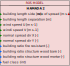

# Hamada version 2
## Description

The Hamada 2 model is an empirical urban rate of spread model, modified by WIRC-SJSU to account for wind directionality.

## Parameters
### Input table

Variable name in model      | Unit  | Standard Variable Name    | type      | Bounds
------------------------    | ----  | ----------------------    | ----      | ------
side_length                 | m     | building_length_side      | float64   | $$]0, \infty[$$
separation                  | m     | building_length_separation| float64   | $$]0, \infty[$$
wind_u                      | m s-1 | wind_speed_u              | float64   | $$]0, \infty[$$
wind_v                      | m s-1 | wind_speed_v              | float64   | $$]0, \infty[$$
normal_vector_x             | -     | normal_spread_dir_x       | float64   | $$[-1, 1]$$
normal_vector_y             | -     | normal_spread_dir_y       | float64   | $$[-1, 1]$$

### Outputs

Variable name in model      | Unit  | Standard Variable Name    | type      | Bounds
------------------------    | ----  | ----------------------    | ----      | ------
ros                         | m s-1 | rate_of_spread            | float64   | $$]0, \infty[$$

### Optional input table

Name in model   | Standard Variable Name    | Unit      | Value
--------------- | ------------------------- | --------- | ---------
fire_resistant_ratio | building_ratio_fire_resistant    | -    | $$0.6$$
bare_structure_ratio | building_ratio_structure_wood_bare     | -    | $$0.2$$
mortar_structure_ratio | building_ratio_structure_wood_mortar | -    | $$0.2$$

## Usage

### General use
The Hamada_2 model is a class derived from `firebench.ros_models.RateOfSpreadModel`.
```python
# Import rate of spread package from firebench
import firebench.ros_models as rm
# create the input dictionnary with the inputs listed above
model_inputs = {...}
# compute the rate of spread
ros = rm.Hamada_2.compute_ros(model_inputs)
# compute the rate of spread with fuel category
ros = rm.Hamada_2.compute_ros(model_inputs, fuel_cat = 1)
```


### Use with WUDAPT fuel model

The [WUDAPT urban](../21_fuel_models/50_WUDAPT.md) fuel model provides a set of fuel properties that can be linked to Hamada's inputs. The following diagram shows the workflow that can be used to connect Anderson fuel model and Balbi rate of spread model.

**Fig. 1** shows an example of usage with WUDAPT urban fuel model.
The wind input is separated by zonal and meridian components (u and v, respectively).
The direction of spread, corresponding to the components of the fire front normal unit vector, is separated by west-east and south-north components (x and y, respectively).
The default value of the building fire resistant ratio is used.


<p style="text-align: center;">
    <strong>
        Fig. 1
    </strong>
    :
    <em>
        Usage of WUDAPT urban fuel model for Hamada_2 rate of spread model. 
    </em>
</p>


An example of use of Anderson fuel model with Hamada_2, corresponding the **Fig. 1** diagram:
```python
import firebench as fb

# Define constant values as fb.Quantity (not pint.Quantity that does not share the same unit registry)
wind_speed_u = fb.Quantity(2, "m/s")
wind_speed_v = fb.Quantity(0, "m/s")
normal_spread_dir_x = fb.Quantity(1, "dimensionless")
normal_spread_dir_y = fb.Quantity(0, "dimensionless")
fuel_class = 1  # one based index of the fuel class

# Select the rate of spread model class
ros_model = fb.ros_models.Hamada_2

# Import Anderson data
fuel_data = fb.tools.read_fuel_data_file("WUDAPT_urban")

# Merge the fuel dict and the constant inputs
input_dict = fb.tools.merge_dictionaries(
    {
        fb.svn.WIND_SPEED_U: wind_speed_u,
        fb.svn.WIND_SPEED_V: wind_speed_v,
        fb.svn.NORMAL_SPREAD_DIR_X: normal_spread_dir_x,
        fb.svn.NORMAL_SPREAD_DIR_Y: normal_spread_dir_y,
    },
    fuel_data,
)

# perform checks, conversion and magnitude extraction
final_input = fb.tools.check_data_quality_ros_model(input_dict, ros_model)

# compute the rate of spread
ros = ros_model.compute_ros_with_units(final_input, fuel_cat=fuel_class)
```

## Compatibility with fire models

Compatibility levels for **fuel models**:
- **Full**: The data contained in the fuel model covers *all* the fuel input needed by the fire model
- **Partial**: The data contained in the fuel model covers *some* of the fuel input needed by the fire model
- **None**: The data contained in the fuel model covers *none* of the fuel input needed by the fire model


Fire model              | Category          | Compatibility level
----------              | --------          | -----------------
WUDAPT_urban            | Fuel model        | Full

## Benchmarks and workflows

## References
