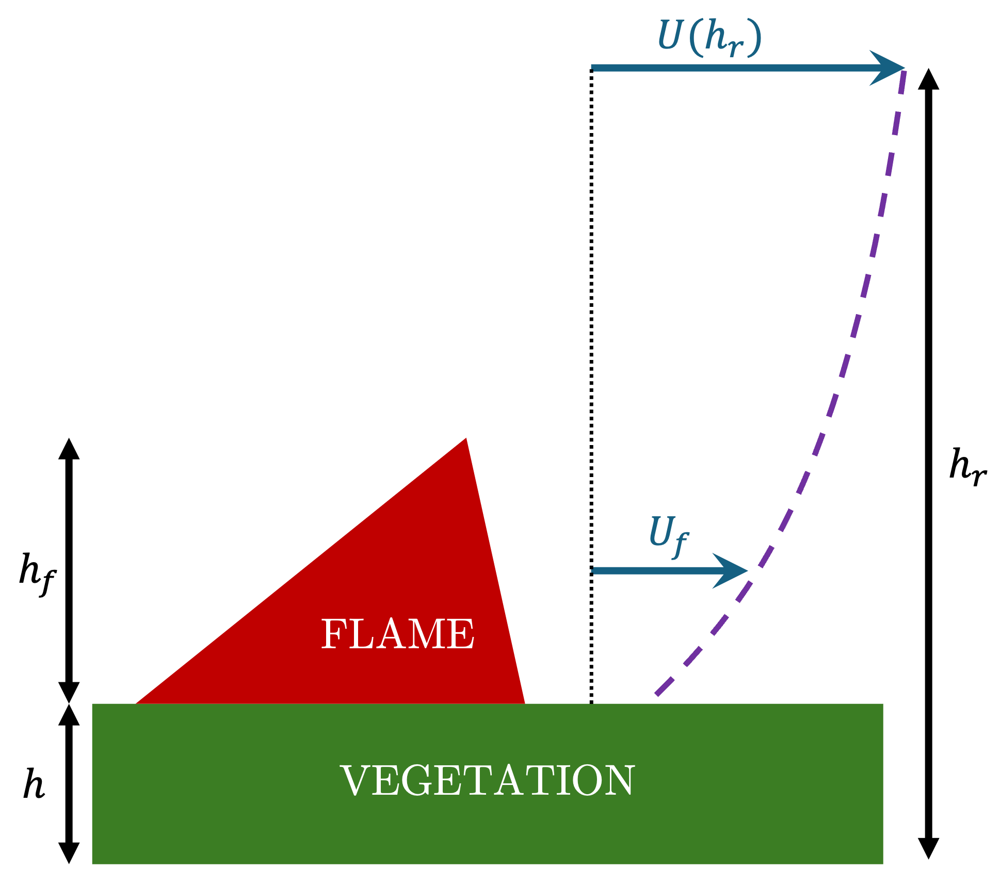

# Wind Reduction Factor

The rate of spread models often require a wind input at a certain height.
Generally, they need the wind of mid-flame height, representing the average influence of the wind on the flame.
However, it is only sometimes possible to get this information.
The wind information can come from stations at a specific height (20 ft, 10 m) or an atmospheric model.
The latter vertical resolution is often larger than the midflame height itself.
Therefore, a method is needed to estimate the midflame wind speed from wind speed information at a different height.

The wind reduction factor, noted $$\alpha$$ [-], is introduced to get the wind at the midflame height $U_f$ from the wind at a different height $U_i$:

\\[ U_f = \alpha \, U_i.\\]

To compute the wind reduction factor, the method is generally based on a specific vertical profile that describe the wind speed as a function of height, considering the vegetation cover.
The following sections describe methods to compute the wind reduction factors from a vertical profile and vegetaiton properties.

## Baughman and Albini (1980)

This section is based on [1, 2].
The wind profile above the vegetation cover is given by:
\\[ U (z) = \frac{U_*}{\kappa} \ln \left ( \frac{z - D_0}{z_0} \right ), \\]
where $$U(z)$$ is the wind speed at the height above ground level $$z$$, $$U_*$$ is the friction velocity, $$\kappa$$ is the Von Karman constant, $$D_0$$ is the zero-plane displacement, and $$z_0$$ is the reoughness length.
[1] sets $$D_0 = 0.64\,h$$, and $$z_0 = 0.13\,h$$, where $$h$$ is the vegetation height.

### Unsheltered wind reduction factor for 20-ft reference wind

When considering that the reference wind speed is 20 ft above the fuel top, the wind reduction factor is given by:
\\[ \alpha (h, h_f) = \frac{1 + 0.36 h / h_f}{\ln \left ( \frac{20 + 0.36h}{0.13h} \right )} \left [ \ln \left ( \frac{h_f/h + 0.36}{0.13} \right ) -1 \right ],\\]
where $$h$$ is the fuel height [ft], and $$h_f$$ is the flame height [ft].
This wind reduction factor does not interpolate the value to midflame height but allows to calculate the average wind speed over the flame length.

**Note**
This formula, can be applied to [Anderson](../21_fuel_models/02_Anderson.md) fuel model, considering $$h_f/h=1$$, to retrieve the wind reduction factor contained in the dataset. However, the values for fuel category 7 and 8 are different from the values in [1], where the value 0.36 is given in [1] whereas the formula gives 0.28. 

### Generalized unsheltered wind reduction factor

The methodology described in [1, 2] can be applied to any reference height for the input wind, noted $$h_r$$.
The advantage of this formulation is that is does not force the input wind to a certain height and it works with any units (m or ft) as long as they are the same for all input variables.
The definition of $$h_r$$ can be different depending on the context, explicited in the following paragraphes.
In any case, the following integral needs to be computed:

\\[ \int_h^{h+h_f} U(z) dz = \mathcal F (h+h_f) - \mathcal F (h), \\]

where

\\[ \mathcal F (z) = (z - D_0) \ln \left( \frac{z - D_0}{z_0} \right ) - z.\\]

#### Reference height is defined above the ground level

When the reference wind height $$h_r$$ is given from the ground level, the wind reduction factor is given by:

\\[ \alpha (h, h_f, h_r) = \frac{1}{h_f U (h_r)} \int_h^{h+h_f} U(z) dz. \\]

    

    <strong>
        Fig. 1
    </strong>
    :
    <em>
        Interpolation of midflame wind from a wind at height defined above ground level. 
    </em>

#### Reference height is defined above the vegetation level

When the reference wind height $$h_r$$ is given from the top of the vegetation layer, the wind reduction factor is given by:

\\[ \alpha (h, h_f, h_r) = \frac{1}{h_f U (h+h_r)} \int_h^{h+h_f} U(z) dz. \\]

    

    <strong>
        Fig. 2
    </strong>
    :
    <em>
        Interpolation of midflame wind from a wind at height defined above vegetation top. 
    </em>

## References

[1] [Baughman, R. G., & Albini, F. A. (1980, April). Estimating midflame windspeeds. In Proceedings, Sixth Conference on Fire and Forest Meteorology, Seattle, WA (pp. 88-92).](https://www.frames.gov/catalog/8151)

[2] [Albini, F. A. (1979). Estimating windspeeds for predicting wildland fire behavior (Vol. 221). Intermountain Forest and Range Experiment Station, Forest Service, US Department of Agriculture.](https://www.frames.gov/catalog/8152)