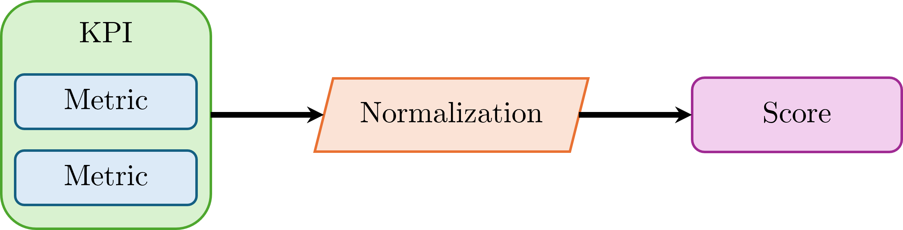

# 5. Metrics and Scores information
This section describes the high-level metrics available in `FireBench`, listed as `Key Performance Indicator` (KPI). Each KPI represents one, and only one, quantitative evaluation of performance.
KPIs are based on metrics that correspond to the generalization of quantitative comparison of multiple datasets.
The KPI value can be normalized and multiple KPIs can be aggregated to construct a score.

We introduce the following definition:
- Metric is a quantifiable measure used to evaluate the performance.
- Key Performance Indicator (KPI) is derived from one or several metrics and describes one quantitative evaluation associated to specific variables (1 number out).
- Score is a number between 0 and 100, with 100 being best performance, allowing for comparison and aggregation.
- Normalization is the process to convert a KPI value (not necessarily bounded) to a Score (bounded between 0 and 100).
- Aggregation is the weighted combination of multiple Scores to form one Score reflecting global performance. Aggregation is done at group of KPIs level (Group Score) and global level (Total Score)
- Benchmark is the group KPI + Normalization.

**More information about the components in the following pages**
```{toctree}
:maxdepth: 1

score.md
metrics.md
kpis.md
normalization.md
```


Figure 1 shows the relationship between the different quantitative components. Each KPI is form by using one or several metrics. The output from the KPI can be normalized using a normalization function to form a score.


<p style="text-align: center;">
    <strong>
        Fig. 1
    </strong>
    :
    <em>
        Relationship between Metrics, KPI, Normalization and Score
    </em>
</p>

For implementation details, refer to the [API references](../api/index.rst).
A full list of metrics is also available on the [Content page](../content.md).
