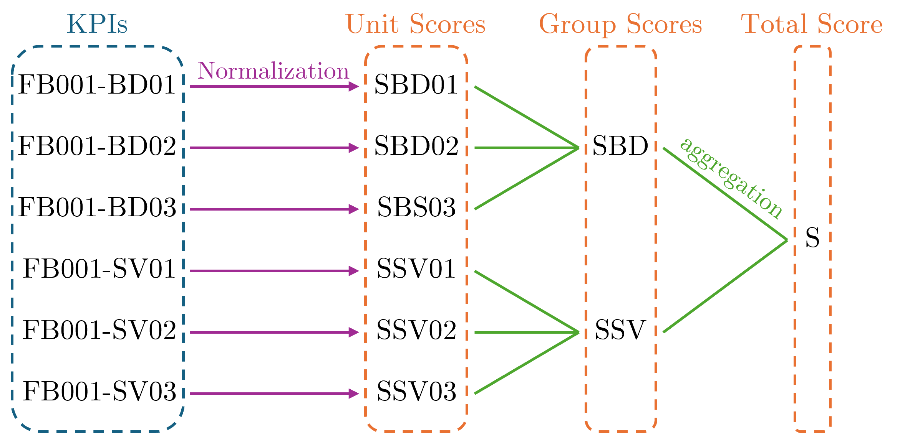
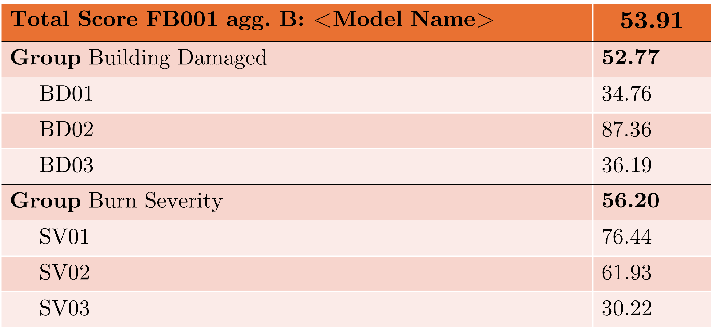

# 5. Metrics and Scores information
This section describes the high-level metrics available in `FireBench`, listed as `Key Performance Indicator` (KPI). Each KPI represents one, and only one, quantitative evaluation of performance.
The KPI value can be normalized and multiple KPIs can be aggregated to construct a score.

For implementation details, refer to the [API references](../api/index.rst).

A full list of metrics is also available on the [Content page](../content.md).

## Scores

This section details the processes used to construct a unique score for each benchmark case from the set of KPIs contained in the benchmark case.
A `Score` is defined as a real number, with 4 significant digit, between 0.000 (worst) and 100.0 (best).
Scores are derived from KPI values and allow the comparison of models and benchmark results.
As a KPI value is not necessarily a number that is compliant with the score definition, a `normalization` process is required to convert a KPI value to a score, called `Unit Score`.

$$
KPI \overset{Normalization}{\longmapsto} Unit Score
$$

The different normalization functions available are described in Section `KPI Normalization`.

Each KPI is transformed into a `Unit Score`, corresponding to one, and only one, KPI. 
To further simplify the interpretation the result of multiple benchmarks, these Unit Scores can be aggregated to form `Group Scores`. They represent the overall performance accross multiple indicators, generally evaluating the model for similar physical processes or on the same data.
The `Total Score` is the aggregation of all group scores into one, and only one, score, representing the overall performance of the model for the studied case.

Figure 1 shows an example of normalization of each KPI for the case *FB001*. Each KPI is normalized into a Unit Score. Then Unit Scores are aggregated into two Group Scores representing the overall performance for *Building Damaged* benchmarks and *Burn Severity* benchmarks. Finally, both Group Scores are aggregated to form the Total Score.

<p style="text-align: center;">
    <strong>
        Fig. 1
    </strong>
    :
    <em>
        Diagram of Scores construction from KPIs using two categories of KPI (BD: Building Damaged, SV: Burn Severity).
    </em>
</p>

The aggregation can be performed using multiple aggregation schemes. The simplest scheme is to aggregate score using a mean function. This gives the same weight to each KPI in the Total Score. We can also develop more complex aggregation schemes to give more weight to certain benchmarks/KPIs. Therefore, for each benchmarking case (collection of dataset and KPIs), we can define multiple aggregation schemes to evaluate different classes of models. Each aggregation scheme will be noted using a letter. For example `FB001-A`, `FB001-B`.


Figure 2 shows exmaple of KPI values and their correspond range between brackets. The KPI FB001-BD01 has a value of 0.34763 and a range of [0, 1] (FB001-BD01 can represent a binary confusion matrix index), whereas the KPI FB001-SV03 has a value of 3.489 and a range of [0, $+\infty$[ (FB001-SV03 can represent an absolute bias). All KPI with a limited range of values are normaized using the linear normalization function (see next Section). The KPI FB001-SV03 is normalized using the linear semi bounded normization function with a parameter $M=5$, which means that if the KPI value is above 5, the score will be 0.
Then, Unit Scores are aggregated using uniform weights (represented by the green numbers above aggregation lines) to form Group Scores.
Finally, a weighted aggregation is performed to calculate the Total Score of the case, giving an double importance to benchmarks related to **Building Damaged*.
The list of aggregation scheme and their weights are explicitely defined in the case documentation.


<p style="text-align: center;">
    <strong>
        Fig. 2
    </strong>
    :
    <em>
        Example of Scores construction from KPIs using two categories of KPI.
    </em>
</p>

Figure 3 displays an `Score Card` that is a table representing the data showed in Figure 2. This type of score card can become the standard of presentation for case results. The first row shows the total score and contains the case that has been run (FB001), the aggregation scheme used (B, defined in the case documentation), the model name, and the total score calculated in Figure 2.
The rest of the table is organized as:
- one group row that describes the name of the group and the associated score. A keyword **Group** is added to emphasis the row.
- All the benchmark scores related to the group are displayed after. The name of the benchmark is added as a reference. Here the case id (FB001) is omitted for clarity as it is already displayed in the first row.



<p style="text-align: center;">
    <strong>
        Fig. 3
    </strong>
    :
    <em>
        Example of Score card layout
    </em>
</p>

```{note}
Note: The example here above are not related to the real case FB001 (Caldor Fire) and all KPI names and
values are given as examples.
```

## KPI Normalization

This section describes several normalization schemes used to convert KPI values into a score in the range ([0, 100]).
Throughout, $x$ denotes the KPI value.

### Linear Bounded Normalization

For KPIs with a **bounded acceptable range** $[a, b]$, with $a < b$, the normalization function is defined as:

$$
\mathcal N(x, a, b) = 100 \, \left( \frac{x - a}{b - a} \right)
$$

Here,
- $a$ corresponds to the **worst** score (0),
- $b$ corresponds to the **best** score (100).

### Linear Half-Open Normalization

For KPIs that have a **minimum acceptable value** $a$ but no finite upper limit, i.e. values in $[a, +\infty[$, we define:

$$
\mathcal N(x, a, m) = 100 \, \max \left(0,  1 - \frac{x-a}{m-a} \right)
$$

where $m > a$ is a parameter specifying the value of $x$ at which the score reaches **0**.

Here,
- $a$ corresponds to the **best** score (100),
- $m$ corresponds to the **worst** score (0).

### Exponential Half-Open Normalization

For KPIs with a minimum acceptable value $a$ and domain $[a, +\infty[$, we define an exponentially decaying score:

$$
\mathcal N(x, a, m) =100 \, \exp \left( - \frac{\ln 2(x-a)}{m-a} \right).
$$

This formulation ensures:

$$
\mathcal N(a,a,m) = 100, \qquad
\mathcal N(m,a,m) = 50.
$$

Thus, $m$ is the KPI value at which the score is exactly **50**.
Here,
- $a$ corresponds to the **best** possible score (100),
- $m$ corresponds to the value at which the score has decreased to **50**,
- scores decay smoothly toward 0 as $x \to +\infty$.

## Key Performance Indicator Definitions

### Burn Severity KPIs

#### Binary High Severity Accuracy

*Category*: Burn Severity <br>
*Name used in result files*: Binary High Severity Accuracy <br>
*Best Score*: 1 <br>
*Lowest Score*: 0

Measure how accurately the model predicts which point are identified as high severity, based on binary (high severity / not high severity) observations.

The measure of [accuracy](https://en.wikipedia.org/wiki/Accuracy_and_precision#In_classification) is based on the [Binary confusion matrix](https://en.wikipedia.org/wiki/Confusion_matrix#Table_of_confusion) generated from an observational dataset and a model output dataset.

$$
Accuracy = \frac{TP + TN}{TP + TN + FP + FN},
$$
where $TP$ = True positive (high severity in both datasets); $FP$ = False positive (high severity only in model dataset); $TN$ = True negative (not high severity in both datasets); $FN$ = False negative (high severity only in observational datasets)

The implementation of this KPI is done using the `firebench.metrics.confusion_matrix.binary_cm` function and `firebench.metrics.confusion_matrix.binary_accurary` functions (see API documentation for implementation). If some data processing (e.g., for category aggregation) is required, this process is described at the case level.

#### Binary High Severity Precision

*Category*: Burn Severity <br>
*Name used in result files*: Binary High Severity Precision <br>
*Best Score*: 1 <br>
*Lowest Score*: 0

Measures how accurately the model predicts which cells are high severity, by evaluating the proportion of predicted high severity points that were actually high severity.

The measure of [precision](https://en.wikipedia.org/wiki/Positive_and_negative_predictive_values#Definition) is based on the [Binary confusion matrix](https://en.wikipedia.org/wiki/Confusion_matrix#Table_of_confusion) generated from an observational dataset and a model output dataset.

$$
Precision = \frac{TP}{TP + FP},
$$
where $TP$ = True positive (high severity in both datasets); $FP$ = False positive (high severity only in model dataset)

The implementation of this KPI is done using the `firebench.metrics.confusion_matrix.binary_cm` function and `firebench.metrics.confusion_matrix.binary_precision` functions (see API documentation for implementation). If some data processing (e.g., for category aggregation) is required, this process is described at the case level.

#### Binary High Severity Recall

*Category*: Burn Severity <br>
*Name used in result files*: Binary High Severity Recall <br>
*Best Score*: 1 <br>
*Lowest Score*: 0

Measures how completely the model captures the cells with a high severity index, indicating the fraction of truly high severity cells that the model successfully identifies.

The measure of [recall](https://en.wikipedia.org/wiki/Precision_and_recall) is based on the [Binary confusion matrix](https://en.wikipedia.org/wiki/Confusion_matrix#Table_of_confusion) generated from an observational dataset and a model output dataset.

$$
Recall = \frac{TP}{TP + FN},
$$
where $TP$ = True positive (high severity in both datasets); $FN$ = False negative (high severity only in observational datasets)

The implementation of this KPI is done using the `firebench.metrics.confusion_matrix.binary_cm` function and `firebench.metrics.confusion_matrix.binary_recall_rate` functions (see API documentation for implementation). If some data processing (e.g., for category aggregation) is required, this process is described at the case level.

#### Binary High Severity Specificity

*Category*: Burn Severity <br>
*Name used in result files*: Binary High Severity Specificity <br>
*Best Score*: 1 <br>
*Lowest Score*: 0

Measures how accurately the model identifies cells with another severity index than high, by quantifying the fraction of other indices correctly predicted as other (not high).

The measure of [specificity](https://en.wikipedia.org/wiki/Sensitivity_and_specificity) is based on the [Binary confusion matrix](https://en.wikipedia.org/wiki/Confusion_matrix#Table_of_confusion) generated from an observational dataset and a model output dataset.

$$
Specificity = \frac{TN}{TN + FP}
$$
where $FP$ = False positive (high severity only in model dataset); $TN$ = True negative (not high severity in both datasets)

The implementation of this KPI is done using the `firebench.metrics.confusion_matrix.binary_cm` function and `firebench.metrics.confusion_matrix.binary_specificity` functions (see API documentation for implementation). If some data processing (e.g., for category aggregation) is required, this process is described at the case level.

#### Binary High Severity Negative Predictive Value

*Category*: Burn Severity <br>
*Name used in result files*: Binary High Severity Negative Predictive Value <br>
*Best Score*: 1 <br>
*Lowest Score*: 0

Measures the reliability of the model’s predictions for cells identified with another severuty index than high, indicating the proportion of points predicted index as other (not high) that were indeed observed as other.

The measure of [Negative Predictive Value](https://en.wikipedia.org/wiki/Positive_and_negative_predictive_values) is based on the [Binary confusion matrix](https://en.wikipedia.org/wiki/Confusion_matrix#Table_of_confusion) generated from an observational dataset and a model output dataset.

$$
Negative Predictive Value = \frac{TN}{TN + FN}
$$
where $TN$ = True negative (not high severity in both datasets); $FN$ = False negative (high severity only in observational datasets)

The implementation of this KPI is done using the `firebench.metrics.confusion_matrix.binary_cm` function and `firebench.metrics.confusion_matrix.binary_negative_predicted_value` functions (see API documentation for implementation). If some data processing (e.g., for category aggregation) is required, this process is described at the case level.

#### Binary High Severity F1 Score

*Category*: Burn Severity <br>
*Name used in result files*: Binary High Severity F1 Score <br>
*Best Score*: 1 <br>
*Lowest Score*: 0

Provides a balanced measure of model performance by combining precision and recall, capturing how well the model identifies high severity cells while limiting false alarms.

The measure of [F1 Score](https://en.wikipedia.org/wiki/F-score) is based on the [Binary confusion matrix](https://en.wikipedia.org/wiki/Confusion_matrix#Table_of_confusion) generated from an observational dataset and a model output dataset.

$$
F1 Score =  \frac{2 \times Precision \times Recall}{Precision + Recall}
$$

The implementation of this KPI is done using the `firebench.metrics.confusion_matrix.binary_cm` function and `firebench.metrics.confusion_matrix.binary_f_score` functions (see API documentation for implementation). If some data processing (e.g., for category aggregation) is required, this process is described at the case level.

### Structure Loss KPIs

#### Binary Structure Loss Accuracy

*Category*: Structure Damage <br>
*Name used in result files*: Binary Structure Loss Accuracy <br>
*Best Score*: 1 <br>
*Lowest Score*: 0

Measure how accurately the model predicts which structures are destroyed or not destroyed by the fire, based on binary (burned / not burned) observations.

The measure of [accuracy](https://en.wikipedia.org/wiki/Accuracy_and_precision#In_classification) is based on the [Binary confusion matrix](https://en.wikipedia.org/wiki/Confusion_matrix#Table_of_confusion) generated from an observational dataset and a model output dataset.

$$
Accuracy = \frac{TP + TN}{TP + TN + FP + FN},
$$
where $TP$ = True positive (buildings destroyed in both datasets); $FP$ = False positive (buildings destroyed only in model dataset); $TN$ = True negative (buildings not damaged in both datasets); $FN$ = False negative (buildings destroyed only in observational datasets)

The implementation of this KPI is done using the `firebench.metrics.confusion_matrix.binary_cm` function and `firebench.metrics.confusion_matrix.binary_accurary` functions (see API documentation for implementation). If some data processing (e.g., for category aggregation) is required, this process is described at the case level.

#### Binary Structure Loss Precision

*Category*: Structure Damage <br>
*Name used in result files*: Binary Structure Loss Precision <br>
*Best Score*: 1 <br>
*Lowest Score*: 0

Measures how accurately the model predicts which structures are destroyed, by evaluating the proportion of predicted-destroyed buildings that were actually destroyed.

The measure of [precision](https://en.wikipedia.org/wiki/Positive_and_negative_predictive_values#Definition) is based on the [Binary confusion matrix](https://en.wikipedia.org/wiki/Confusion_matrix#Table_of_confusion) generated from an observational dataset and a model output dataset.

$$
Precision = \frac{TP}{TP + FP},
$$
where $TP$ = True positive (buildings destroyed in both datasets); $FP$ = False positive (buildings destroyed only in model dataset).

The implementation of this KPI is done using the `firebench.metrics.confusion_matrix.binary_cm` function and `firebench.metrics.confusion_matrix.binary_precision` functions (see API documentation for implementation). If some data processing (e.g., for category aggregation) is required, this process is described at the case level.


#### Binary Structure Loss Recall

*Category*: Structure Damage <br>
*Name used in result files*: Binary Structure Loss Recall <br>
*Best Score*: 1 <br>
*Lowest Score*: 0

Measures how completely the model captures the buildings that were actually destroyed, indicating the fraction of truly destroyed structures that the model successfully identifies.

The measure of [recall](https://en.wikipedia.org/wiki/Precision_and_recall) is based on the [Binary confusion matrix](https://en.wikipedia.org/wiki/Confusion_matrix#Table_of_confusion) generated from an observational dataset and a model output dataset.

$$
Recall = \frac{TP}{TP + FN},
$$
where $TP$ = True positive (buildings destroyed in both datasets); $FN$ = False negative (buildings destroyed only in observational datasets)

The implementation of this KPI is done using the `firebench.metrics.confusion_matrix.binary_cm` function and `firebench.metrics.confusion_matrix.binary_recall_rate` functions (see API documentation for implementation). If some data processing (e.g., for category aggregation) is required, this process is described at the case level.

#### Binary Structure Loss Specificity

*Category*: Structure Damage <br>
*Name used in result files*: Binary Structure Loss Specificity <br>
*Best Score*: 1 <br>
*Lowest Score*: 0

Measures how accurately the model identifies buildings that survived, by quantifying the fraction of intact structures correctly predicted as not destroyed.

The measure of [specificity](https://en.wikipedia.org/wiki/Sensitivity_and_specificity) is based on the [Binary confusion matrix](https://en.wikipedia.org/wiki/Confusion_matrix#Table_of_confusion) generated from an observational dataset and a model output dataset.

$$
Specificity = \frac{TN}{TN + FP}
$$
where $FP$ = False positive (buildings destroyed only in model dataset); $TN$ = True negative (buildings not damaged in both datasets).

The implementation of this KPI is done using the `firebench.metrics.confusion_matrix.binary_cm` function and `firebench.metrics.confusion_matrix.binary_specificity` functions (see API documentation for implementation). If some data processing (e.g., for category aggregation) is required, this process is described at the case level.

#### Binary Structure Loss Negative Predictive Value

*Category*: Structure Damage <br>
*Name used in result files*: Binary Structure Loss Negative Predictive Value <br>
*Best Score*: 1 <br>
*Lowest Score*: 0

Measures the reliability of the model’s predictions for surviving structures, indicating the proportion of predicted-intact buildings that were indeed not destroyed.

The measure of [Negative Predictive Value](https://en.wikipedia.org/wiki/Positive_and_negative_predictive_values) is based on the [Binary confusion matrix](https://en.wikipedia.org/wiki/Confusion_matrix#Table_of_confusion) generated from an observational dataset and a model output dataset.

$$
Negative Predictive Value = \frac{TN}{TN + FN}
$$
where $TN$ = True negative (buildings not damaged in both datasets); $FN$ = False negative (buildings destroyed only in observational datasets).

The implementation of this KPI is done using the `firebench.metrics.confusion_matrix.binary_cm` function and `firebench.metrics.confusion_matrix.binary_negative_predicted_value` functions (see API documentation for implementation). If some data processing (e.g., for category aggregation) is required, this process is described at the case level.

#### Binary Structure Loss F1 Score

*Category*: Structure Damage <br>
*Name used in result files*: Binary Structure Loss F1 Score <br>
*Best Score*: 1 <br>
*Lowest Score*: 0

Provides a balanced measure of model performance by combining precision and recall, capturing how well the model identifies destroyed buildings while limiting false alarms.

The measure of [F1 Score](https://en.wikipedia.org/wiki/F-score) is based on the [Binary confusion matrix](https://en.wikipedia.org/wiki/Confusion_matrix#Table_of_confusion) generated from an observational dataset and a model output dataset.

$$
F1 Score =  \frac{2 \times Precision \times Recall}{Precision + Recall}
$$

The implementation of this KPI is done using the `firebench.metrics.confusion_matrix.binary_cm` function and `firebench.metrics.confusion_matrix.binary_f_score` functions (see API documentation for implementation). If some data processing (e.g., for category aggregation) is required, this process is described at the case level.