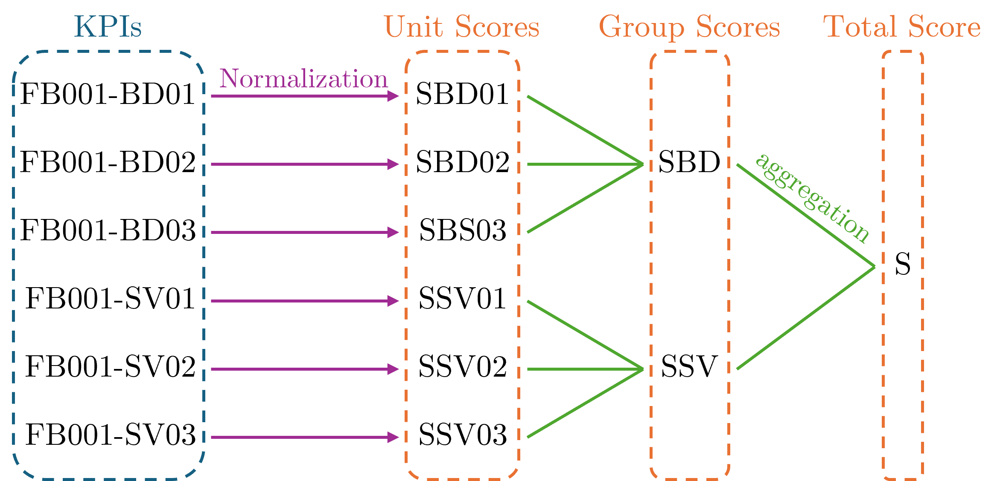
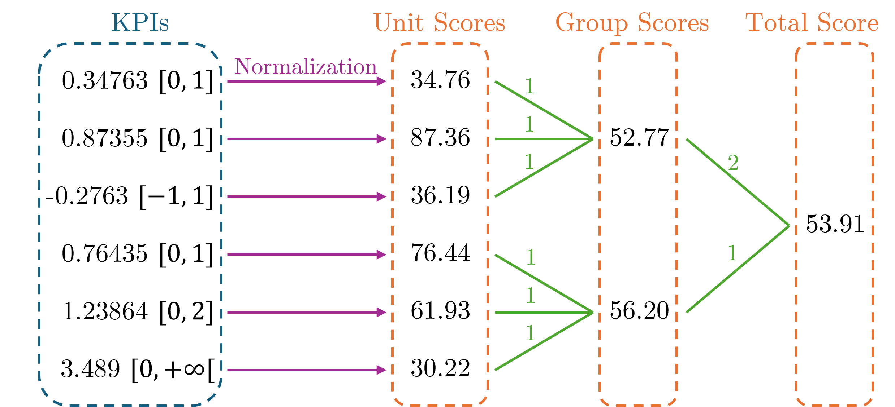
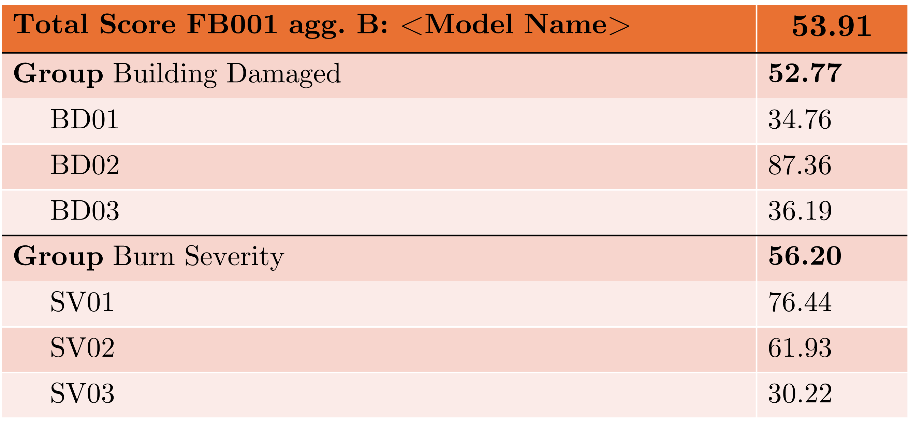

# Scores

This section details the processes used to construct a unique score for each benchmark case from the set of KPIs contained in the benchmark case.
A `Score` is a real number with four significant digits between 0.000 (worst) and 100.0 (best).
Scores are derived from KPI values and allow the comparison of models and benchmark results.
As a KPI value is not necessarily a number that is compliant with the score definition, a `normalization` process is required to convert a KPI value to a score, called `Unit Score`.

$$
KPI \overset{Normalization}{\longmapsto} Unit Score
$$

The different normalization functions available are described in Section `KPI Normalization`.

Each KPI is transformed into a `Unit Score`, corresponding to one, and only one, KPI. 
To simplify interpretation across multiple benchmarks, Unit Scores can be aggregated into `Group
Scores`. They represent performance across multiple indicators that generally evaluate similar
physical processes or use the same data.
The `Total Score` is the aggregation of all group scores into one, and only one, score, representing the overall performance of the model for the studied case.

Figure 1 shows an example of normalization of each KPI for the case *FB001*. Each KPI is normalized into a Unit Score. Then Unit Scores are aggregated into two Group Scores representing the overall performance for *Building Damaged* benchmarks and *Burn Severity* benchmarks. Finally, both Group Scores are aggregated to form the Total Score.

<p style="text-align: center;">
    <strong>
        Fig. 1
    </strong>
    :
    <em>
        Diagram of Scores construction from KPIs using two categories of KPI (BD: Building Damaged, SV: Burn Severity).
    </em>
</p>

The aggregation can be performed using multiple aggregation schemes. The simplest scheme is to aggregate score using a mean function. This gives the same weight to each KPI in the Total Score. We can also develop more complex aggregation schemes to give more weight to certain benchmarks/KPIs. Therefore, for each benchmarking case (collection of dataset and KPIs), we can define multiple aggregation schemes to evaluate different classes of models. Each aggregation scheme will be noted using a letter. For example `FB001-A`, `FB001-B`.


Figure 2 shows example KPI values and their corresponding ranges in brackets. KPI FB001-BD01 has
a value of 0.34763 and a range of [0, 1], as expected for a binary confusion-matrix index. KPI
FB001-SV03 has a value of 3.489 and a range of [0, $+\infty$[, as expected for an absolute bias.
KPIs with a limited range use linear normalization. FB001-SV03 uses half-open linear normalization
with $M=5$, so values above 5 receive a score of 0.
Then, Unit Scores are aggregated using uniform weights (represented by the green numbers above aggregation lines) to form Group Scores.
Finally, weighted aggregation calculates the case Total Score, giving twice the weight to
benchmarks related to **Building Damage**. Aggregation schemes and weights are defined explicitly
in the case documentation.


<p style="text-align: center;">
    <strong>
        Fig. 2
    </strong>
    :
    <em>
        Example of Scores construction from KPIs using two categories of KPI.
    </em>
</p>

Figure 3 displays a scorecard representing the data in Figure 2. The first row identifies the case
(FB001), aggregation scheme (B), model, and Total Score.
The rest of the table is organized as:
- one group row that describes the name of the group and the associated score. A keyword **Group** is added to emphasis the row.
- All the benchmark scores related to the group are displayed after. The name of the benchmark is added as a reference. Here the case id (FB001) is omitted for clarity as it is already displayed in the first row.



<p style="text-align: center;">
    <strong>
        Fig. 3
    </strong>
    :
    <em>
        Example scorecard layout
    </em>
</p>

```{note}
This example is not related to the real FB001 Caldor case; all KPI names and values are illustrative.
```
