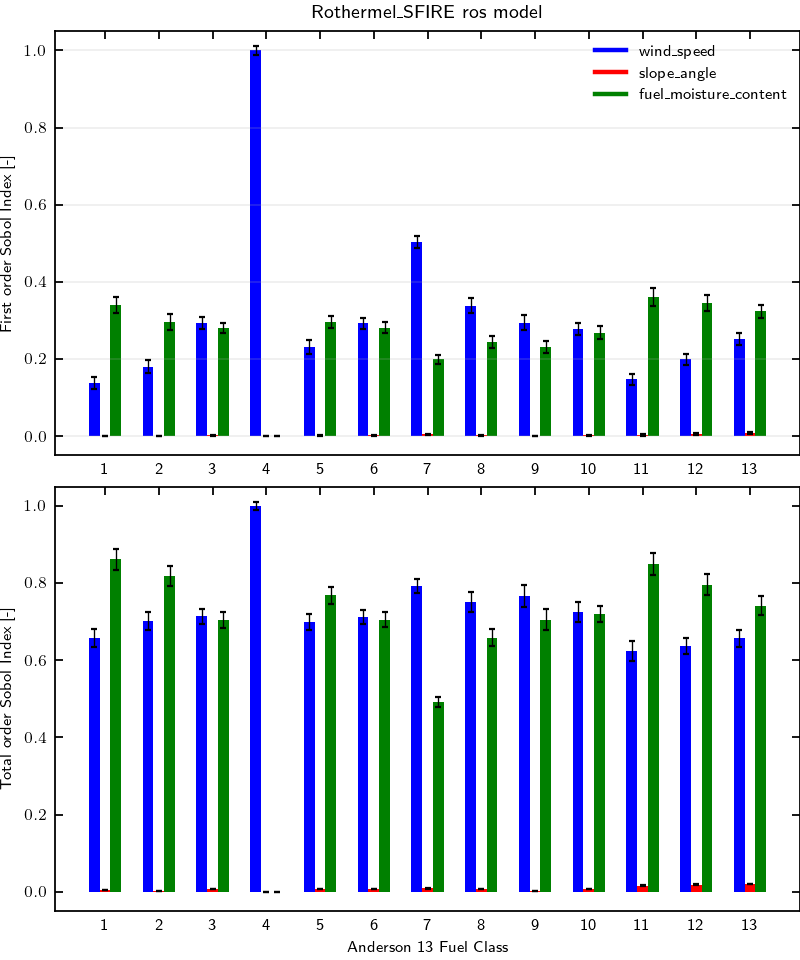

# Rate of spread model sensitivity to environmental inputs for Anderson 13 fuel model

## Workflow information

- Documentation page:
- Version: 1.0
- Date of record creation: 2024-11-22
- Date of upload to firebench: 2024-11-22
- Version/tag/commit firebench: 0.3.0a1

## Configuration
<!-- Add specific input details for the model/data you are using -->

- Rate of spread model: Rothermel using `firebench.ros_models.Rothermel_SFIRE` implementation.
- Number of point Sobol: 32,768 = 2^15
- The environmental variables chosen for this test are:
  - `WIND_SPEED` from -15 m s-1 to 15 m s-1,
  - `SLOPE_ANGLE` from -45 deg to 45 deg,
  - `FUEL_MOISTURE_CONTENT` from 1% to 50%.

## Results

<!-- Fill in with your results -->
**Fig.1** shows first and total order Sobol indices for Rothermel_SFIRE rate of spread model for each class of the Anderson 13 fuel model.
The wind (blue bars) significantly affects for categories 4, 7, 8, and 9. 
As Fuel Category 4 has its own submodel for the rate of spread using only wind as an environmental variable, it is expected to get 100% of the variance explained by the wind parameter.
The fuel moisture (green bars) is the most important parameter for categories 1, 2, 5, 11, 12, and 13.
Wind and slope are equally important for fuel categories 3, 6, and 10. 
The slope (red bars) is negligible across all categories.

The total order indices are higher than the first order indices, indicating coupling effects between variables.

    

    <strong>
        Fig. 1
    </strong>
    :
    <em>
        Sensitivity analysis of Rothermel_SFIRE rate of spread model for Anderson 13 fuel model. 
    </em>

## Data
<!-- Add path or source of the record used for the test and its record -->
- path to data: `firebench/data/workflow_results/0D_models/rate_of_spread/sensitivity_anderson13/Rothermel_SFIRE.zip`
<!-- firebench-hash-list -->
- **01_generate_data.py**: `35465abd1b8503c7782131805cc8923bbcf2bae447ca685955e41a9570951ab4`
- **02_plot_data.py**: `26f50288582c32274544245aae4f64fe78724068c016b60f0ac4f4db59ce2dc4`
- **03_create_record.py**: `082b06e8c5ee55ed2c2c5993a5ec0c18f00fbd0e7efdb77ceda44f96783ab53c`
- **firebench.log**: `f65c6f65f41e51f013bb1469e1af5d6f69169a25ce8f91e144fd7b8122df4350`
- **output_data.h5**: `c95b776ba17aacbf52d1ddcdf0a5fe8830125ad04c48db2cb4e7947ac3ff7ac3`
- **sobol_index.png**: `e1e949bcd4e5fc484a69d1d48d7cbdc6e90ba8e05d83deae8dd4bd4081af2686`
<!-- end of firebench-hash-list -->