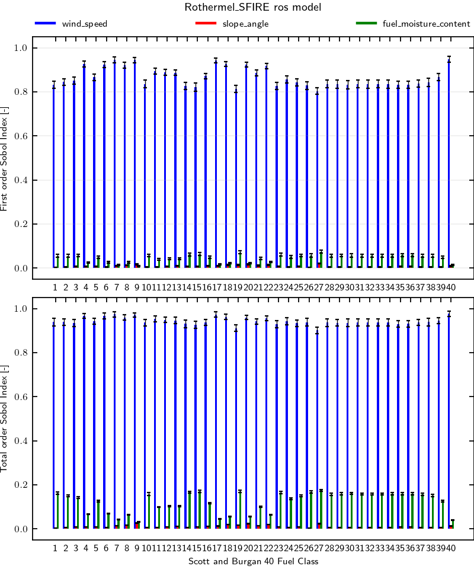

# Rate of spread model sensitivity to environmental inputs for Scott and Burgan 40 fuel model

## Workflow information

- Documentation page:
- Version: 1.0
- Date of record creation: 2024-12-12
- Date of upload to firebench: 2024-12-12
- Version/tag/commit firebench: 0.3.2a1

## Configuration

- Rate of spread model: Rothermel using `firebench.ros_models.Rothermel_SFIRE` implementation.
- Number of point Sobol: 2^15
- The environmental variables chosen for this test are:
  - `WIND_SPEED` from -15 m s-1 to 15 m s-1,
  - `SLOPE_ANGLE` from -45 deg to 45 deg,
  - `FUEL_MOISTURE_CONTENT` from 1% to 50%.

## Results

<!-- Fill in with your results -->
**Fig.1** shows the first and total order Sobol indices for the Rothermel_SFIRE rate of the spread model for each class of the Scott and Burgan 40 fuel model.
The wind (blue bars) is the most important parameter, with more than 80% of the variance explained.
Then, the fuel moisture content (green bars) is important for fuel categories representing coarser fuels, which explains less 10% of the rate of spread variance.
The slope (red bars) is of relatively minor importance for Rothermel and does not significantly affect the rate of spread in the range of input chosen.

    

    <strong>
        Fig. 1
    </strong>
    :
    <em>
        Sensitivity analysis of Rothermel_SFIRE rate of spread model for Scott and Burgan 40 fuel model. 
    </em>

## Data
<!-- Add path or source of the record used for the test and its record -->
- path to data:
<!-- firebench-hash-list -->
- **01_generate_data.py**: `483ddb3ac49bbb1453e8938ffa6065d9183fdb33d45cbe8d44a772a5d23e423b`
- **02_plot_data.py**: `2961a53a877380e2fea2b1be6d918632c1a7665cfbdef1592b277673915cc672`
- **03_create_record.py**: `13743adf21a532fa08399ba4bcf0f148dad5ef463af37bdadf40895a8932657b`
- **firebench.log**: `c04ed1c0599b6fb9d054e11941f0d3e117b37cc1ce2ab43e37d7f286fa8533bf`
- **output_data.h5**: `c79bf37086476071f66ca9aabdc0243e9b7d10f2d8e053818c9b73a790a6790d`
- **sobol_index.png**: `af8f44355b76beb55b2a7d0da4ca4172c08ef286dab6cfaadca0949b8ea9f948`
<!-- end of firebench-hash-list -->
